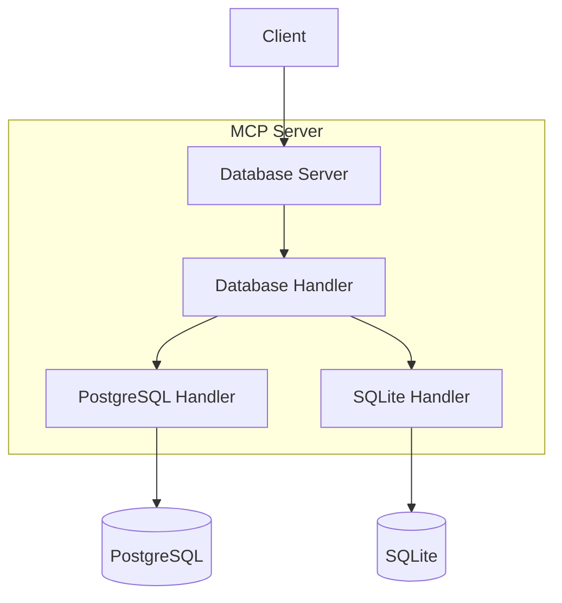

# MCP Database Utilities


[中文文档](README_CN.md)

## Overview
MCP Database Utilities is a unified database access service that supports multiple database types (PostgreSQL and SQLite). Through its abstraction layer design, it provides a simple and unified database operation interface for MCP servers.

## Features
- Unified database access interface
- Support for multiple database configurations
- Secure read-only query execution
- Table structure and schema information retrieval
- Intelligent connection management and resource cleanup
- Debug mode support

## Installation and Configuration

### Installation Methods

#### Using uvx (Recommended)
No installation required, run directly using `uvx`:
```bash
uvx mcp-dbutils --config /path/to/config.yaml
```

Add to Claude configuration:
```json
"mcpServers": {
  "dbutils": {
    "command": "uvx",
    "args": [
      "mcp-dbutils",
      "--config",
      "/path/to/config.yaml"
    ],
    "env": {
      "MCP_DEBUG": "1"  // Optional: Enable debug mode
    }
  }
}
```

#### Using pip
```bash
pip install mcp-dbutils
```

Add to Claude configuration:
```json
"mcpServers": {
  "dbutils": {
    "command": "python",
    "args": [
      "-m",
      "mcp_dbutils",
      "--config",
      "/path/to/config.yaml"
    ],
    "env": {
      "MCP_DEBUG": "1"  // Optional: Enable debug mode
    }
  }
}
```

#### Using Docker
```bash
docker run -i --rm \
  -v /path/to/config.yaml:/app/config.yaml \
  -e MCP_DEBUG=1 \  # Optional: Enable debug mode
  mcp/dbutils --config /app/config.yaml
```

Add to Claude configuration:
```json
"mcpServers": {
  "dbutils": {
    "command": "docker",
    "args": [
      "run",
      "-i",
      "--rm",
      "-v",
      "/path/to/config.yaml:/app/config.yaml",
      "mcp/dbutils",
      "--config",
      "/app/config.yaml"
    ],
    "env": {
      "MCP_DEBUG": "1"  // Optional: Enable debug mode
    }
  }
}
```

### Requirements
- Python 3.10+
- PostgreSQL (optional)
- SQLite3 (optional)

### Configuration File
The project requires a YAML configuration file, specified via the `--config` parameter. Configuration example:

```yaml
databases:
  # PostgreSQL example
  my_postgres:
    type: postgres
    dbname: test_db
    user: postgres
    password: secret
    host: localhost
    port: 5432

  # SQLite example
  my_sqlite:
    type: sqlite
    path: /path/to/database.db
    password: optional_password  # optional
```

### Debug Mode
Set environment variable `MCP_DEBUG=1` to enable debug mode for detailed logging output.

## Architecture Design

### Core Concept: Abstraction Layer



The abstraction layer design is the core architectural concept in MCP Database Utilities. Just like a universal remote control that works with different devices, users only need to know the basic operations without understanding the underlying complexities.

#### 1. Simplified User Interaction
- Users only need to know the database configuration name (e.g., "my_postgres")
- No need to deal with connection parameters and implementation details
- MCP server automatically handles database connections and queries

#### 2. Unified Interface Design
- DatabaseHandler abstract class defines unified operation interfaces
- All specific database implementations (PostgreSQL/SQLite) follow the same interface
- Users interact with different databases in the same way

#### 3. Configuration and Implementation Separation
- Complex database configuration parameters are encapsulated in configuration files
- Runtime access through simple database names
- Easy management and modification of database configurations without affecting business code

### System Components
1. DatabaseServer
   - Core component of the MCP server
   - Handles resource and tool requests
   - Manages database connection lifecycle

2. DatabaseHandler
   - Abstract base class defining unified interface
   - Includes get_tables(), get_schema(), execute_query(), etc.
   - Implemented by PostgreSQL and SQLite handlers

3. Configuration System
   - YAML-based configuration file
   - Support for multiple database configurations
   - Type-safe configuration validation

4. Error Handling and Logging
   - Unified error handling mechanism
   - Detailed logging output
   - Sensitive information masking

## Usage Examples

### Basic Query
```python
# Access through database name
async with server.get_handler("my_postgres") as handler:
    # Execute SQL query
    result = await handler.execute_query("SELECT * FROM users")
```

### View Table Structure
```python
# Get all tables
tables = await handler.get_tables()

# Get specific table schema
schema = await handler.get_schema("users")
```

### Error Handling
```python
try:
    async with server.get_handler("my_db") as handler:
        result = await handler.execute_query("SELECT * FROM users")
except ValueError as e:
    print(f"Configuration error: {e}")
except Exception as e:
    print(f"Query error: {e}")
```

## Security Notes
- Supports SELECT queries only to protect database security
- Automatically masks sensitive information (like passwords) in logs
- Executes queries in read-only transactions

## API Documentation

### DatabaseServer
Core server class providing:
- Resource list retrieval
- Tool call handling
- Database handler management

### DatabaseHandler
Abstract base class defining interfaces:
- get_tables(): Get table resource list
- get_schema(): Get table structure
- execute_query(): Execute SQL query
- cleanup(): Resource cleanup

### PostgreSQL Implementation
Provides PostgreSQL-specific features:
- Remote connection support
- Table description information
- Constraint queries

### SQLite Implementation
Provides SQLite-specific features:
- File path handling
- URI scheme support
- Password protection support (optional)

## Contributing
Contributions are welcome! Here's how you can help:

1. 🐛 Report bugs: Open an issue describing the bug and how to reproduce it
2. 💡 Suggest features: Open an issue to propose new features
3. 🛠️ Submit PRs: Fork the repo and create a pull request with your changes

### Development Setup
1. Clone the repository
2. Create a virtual environment using `uv venv`
3. Install dependencies with `uv sync --all-extras`
4. Run tests with `pytest`

For detailed guidelines, see [CONTRIBUTING.md](.github/CONTRIBUTING.md)

## Acknowledgments
- [MCP Servers](https://github.com/modelcontextprotocol/servers) for inspiration and demonstration
- AI Editors:
  * [Claude Desktop](https://claude.ai/download)
  * [5ire](https://5ire.app/)
  * [Cline](https://cline.bot)
- [Model Context Protocol](https://modelcontextprotocol.io/) for comprehensive interfaces
