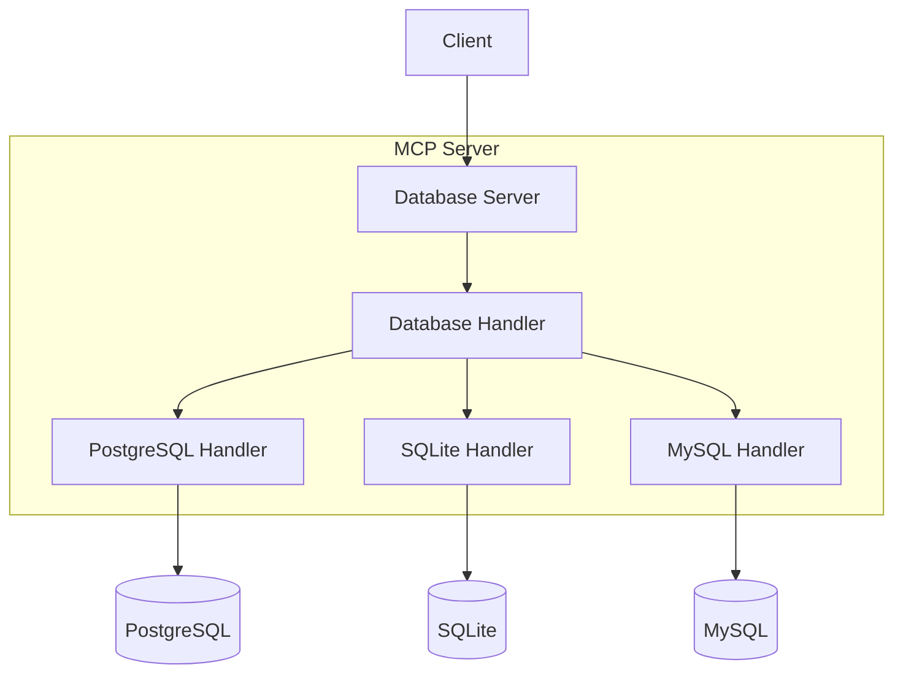

# MCP Database Utilities


[](https://github.com/donghao1393/mcp-dbutils/actions)


[](https://smithery.ai/server/@donghao1393/mcp-dbutils)

[中文文档](README_CN.md)

## Overview
MCP Database Utilities is a unified database access service that supports multiple database types (PostgreSQL, SQLite, and MySQL). Through its abstraction layer design, it provides a simple and unified database operation interface for MCP servers.

## Features
- Unified database access interface
- Support for multiple database configurations
- Secure read-only query execution
- Table structure and schema information retrieval
- Database tables listing via MCP tools
- Intelligent connection management and resource cleanup
- Debug mode support
- SSL/TLS connection support for PostgreSQL and MySQL

## Installation and Configuration

### Installation Methods
#### Installing via Smithery

To install Database Utilities for Claude Desktop automatically via [Smithery](https://smithery.ai/server/@donghao1393/mcp-dbutils):

```bash
npx -y @smithery/cli install @donghao1393/mcp-dbutils --client claude
```

#### Using uvx (Recommended)
No installation required, run directly using `uvx`:
```bash
uvx mcp-dbutils --config /path/to/config.yaml
```

Add to Claude configuration:
```json
"mcpServers": {
  "mcp-dbutils": {
    "command": "uvx",
    "args": [
      "mcp-dbutils",
      "--config",
      "/path/to/config.yaml"
    ],
    "env": {
      "MCP_DEBUG": "1"  // Optional: Enable debug mode
    }
  }
}
```

#### Using pip
```bash
pip install mcp-dbutils
```

Add to Claude configuration:
```json
"mcpServers": {
  "mcp-dbutils": {
    "command": "python",
    "args": [
      "-m",
      "mcp_dbutils",
      "--config",
      "/path/to/config.yaml"
    ],
    "env": {
      "MCP_DEBUG": "1"  // Optional: Enable debug mode
    }
  }
}
```

#### Using Docker
```bash
docker run -i --rm \
  -v /path/to/config.yaml:/app/config.yaml \
  -v /path/to/sqlite.db:/app/sqlite.db \  # Optional: for SQLite database
  -e MCP_DEBUG=1 \  # Optional: Enable debug mode
  mcp/dbutils --config /app/config.yaml
```

Add to Claude configuration:
```json
"mcpServers": {
  "mcp-dbutils": {
    "command": "docker",
    "args": [
      "run",
      "-i",
      "--rm",
      "-v",
      "/path/to/config.yaml:/app/config.yaml",
      "-v",
      "/path/to/sqlite.db:/app/sqlite.db",  // Optional: for SQLite database
      "mcp/dbutils",
      "--config",
      "/app/config.yaml"
    ],
    "env": {
      "MCP_DEBUG": "1"  // Optional: Enable debug mode
    }
  }
}
```

> **Note for Docker database connections:**
> - For SQLite: Mount your database file using `-v /path/to/sqlite.db:/app/sqlite.db`
> - For PostgreSQL running on host:
>   - On Mac/Windows: Use `host.docker.internal` as host in config
>   - On Linux: Use `172.17.0.1` (docker0 IP) or run with `--network="host"`

### Requirements
- Python 3.10+
- PostgreSQL (optional)
- SQLite3 (optional)
- MySQL (optional)

### Configuration File
The project requires a YAML configuration file, specified via the `--config` parameter. Configuration examples:

```yaml
connections:
  # SQLite configuration examples
  dev-db:
    type: sqlite
    path: /path/to/dev.db
    # Password is optional
    password: 

  # PostgreSQL standard configuration
  test-db:
    type: postgres
    host: postgres.example.com
    port: 5432
    dbname: test_db
    user: test_user
    password: test_pass

  # PostgreSQL URL configuration with SSL
  prod-db:
    type: postgres
    url: postgresql://postgres.example.com:5432/prod-db?sslmode=verify-full
    user: prod_user
    password: prod_pass
    
  # PostgreSQL full SSL configuration example
  secure-db:
    type: postgres
    host: secure-db.example.com
    port: 5432
    dbname: secure_db
    user: secure_user
    password: secure_pass
    ssl:
      mode: verify-full  # disable/require/verify-ca/verify-full
      cert: /path/to/client-cert.pem
      key: /path/to/client-key.pem
      root: /path/to/root.crt
      
  # MySQL standard configuration
  sandbox-mysql:
    type: mysql
    host: localhost
    port: 3306
    database: sandbox_db
    user: sandbox_user
    password: sandbox_pass
    charset: utf8mb4

  # MySQL URL configuration
  integration-mysql:
    type: mysql
    url: mysql://mysql.example.com:3306/integration_db?charset=utf8mb4
    user: integration_user
    password: integration_pass
    
  # MySQL with SSL configuration
  secure-mysql:
    type: mysql
    host: secure-mysql.example.com
    port: 3306
    database: secure_db
    user: secure_user
    password: secure_pass
    charset: utf8mb4
    ssl:
      mode: verify_identity
      ca: /path/to/ca.pem
      cert: /path/to/client-cert.pem
      key: /path/to/client-key.pem
```

Database SSL Configuration Options:

PostgreSQL SSL Configuration:
1. Using URL parameters:
   ```
   postgresql://host:port/dbname?sslmode=verify-full&sslcert=/path/to/cert.pem
   ```
2. Using dedicated SSL configuration section:
   ```yaml
   ssl:
     mode: verify-full  # SSL verification mode
     cert: /path/to/cert.pem      # Client certificate
     key: /path/to/key.pem        # Client private key
     root: /path/to/root.crt      # CA certificate
   ```

PostgreSQL SSL Modes:
- disable: No SSL
- require: Use SSL but no certificate verification
- verify-ca: Verify server certificate is signed by trusted CA
- verify-full: Verify server certificate and hostname match

MySQL SSL Configuration:
1. Using URL parameters:
   ```
   mysql://host:port/dbname?ssl-mode=verify_identity&ssl-ca=/path/to/ca.pem
   ```
2. Using dedicated SSL configuration section:
   ```yaml
   ssl:
     mode: verify_identity  # SSL verification mode
     ca: /path/to/ca.pem         # CA certificate
     cert: /path/to/cert.pem     # Client certificate
     key: /path/to/key.pem       # Client private key
   ```

MySQL SSL Modes:
- disabled: No SSL
- preferred: Use SSL if available, but allow unencrypted connection
- required: Always use SSL, but don't verify server certificate
- verify_ca: Verify server certificate is signed by trusted CA
- verify_identity: Verify server certificate and hostname match

SQLite Configuration Options:
1. Basic configuration with path:
   ```yaml
   type: sqlite
   path: /path/to/db.sqlite
   password: optional_password  # Optional encryption
   ```
2. Using URI parameters:
   ```yaml
   type: sqlite
   path: /path/to/db.sqlite?mode=ro&cache=shared
   ```

### Debug Mode
Set environment variable `MCP_DEBUG=1` to enable debug mode for detailed logging output.

## Architecture Design

### Core Concept: Abstraction Layer



The abstraction layer design is the core architectural concept in MCP Database Utilities. Just like a universal remote control that works with different devices, users only need to know the basic operations without understanding the underlying complexities.

#### 1. Simplified User Interaction
- Users only need to know the database configuration name (e.g., "my_postgres")
- No need to deal with connection parameters and implementation details
- MCP server automatically handles database connections and queries

#### 2. Unified Interface Design
- DatabaseHandler abstract class defines unified operation interfaces
- All specific database implementations (PostgreSQL/SQLite/MySQL) follow the same interface
- Users interact with different databases in the same way

#### 3. Configuration and Implementation Separation
- Complex database configuration parameters are encapsulated in configuration files
- Runtime access through simple database names
- Easy management and modification of database configurations without affecting business code

### System Components
1. DatabaseServer
   - Core component of the MCP server
   - Handles resource and tool requests
   - Manages database connection lifecycle

2. DatabaseHandler
   - Abstract base class defining unified interface
   - Includes get_tables(), get_schema(), execute_query(), etc.
   - Implemented by PostgreSQL, SQLite, and MySQL handlers

3. Configuration System
   - YAML-based configuration file
   - Support for multiple database configurations
   - Type-safe configuration validation

4. Error Handling and Logging
   - Unified error handling mechanism
   - Detailed logging output
   - Sensitive information masking

## Usage Examples

### Basic Query
```python
# Access through connection name
async with server.get_handler("my_postgres") as handler:
    # Execute SQL query
    result = await handler.execute_query("SELECT * FROM users")
```

### View Table Structure
```python
# Get all tables
tables = await handler.get_tables()

# Get specific table schema
schema = await handler.get_schema("users")
```

### Error Handling
```python
try:
    async with server.get_handler("my_connection") as handler:
        result = await handler.execute_query("SELECT * FROM users")
except ValueError as e:
    print(f"Configuration error: {e}")
except Exception as e:
    print(f"Query error: {e}")
```

## Security Notes
- Supports SELECT queries only to protect database security
- Automatically masks sensitive information (like passwords) in logs
- Executes queries in read-only transactions

## API Documentation

### DatabaseServer
Core server class providing:
- Resource list retrieval
- Tool call handling (list_tables, query)
- Database handler management

### MCP Tools

#### dbutils-list-tables
Lists all tables in the specified database.
- Parameters:
  * connection: Database connection name
- Returns: Text content with a list of table names

#### dbutils-run-query
Executes a SQL query on the specified database.
- Parameters:
  * connection: Database connection name
  * sql: SQL query to execute (SELECT only)
- Returns: Query results in a formatted text

#### dbutils-get-stats
Get table statistics information.
- Parameters:
  * connection: Database connection name
  * table: Table name
- Returns: Statistics including row count, size, column stats

#### dbutils-list-constraints
List table constraints (primary key, foreign keys, etc).
- Parameters:
  * connection: Database connection name
  * table: Table name
- Returns: Detailed constraint information

#### dbutils-explain-query
Get query execution plan with cost estimates.
- Parameters:
  * connection: Database connection name
  * sql: SQL query to explain
- Returns: Formatted execution plan

#### dbutils-get-performance
Get database performance statistics.
- Parameters:
  * connection: Database connection name
- Returns: Detailed performance statistics including query times, query types, error rates, and resource usage

#### dbutils-analyze-query
Analyze a SQL query for performance and provide optimization suggestions.
- Parameters:
  * connection: Database connection name
  * sql: SQL query to analyze
- Returns: Query analysis with execution plan, timing information, and optimization suggestions

### DatabaseHandler
Abstract base class defining interfaces:
- get_tables(): Get table resource list
- get_schema(): Get table structure
- execute_query(): Execute SQL query
- cleanup(): Resource cleanup

### PostgreSQL Implementation
Provides PostgreSQL-specific features:
- Remote connection support
- Table description information
- Constraint queries

### SQLite Implementation
Provides SQLite-specific features:
- File path handling
- URI scheme support
- Password protection support (optional)

### MySQL Implementation
Provides MySQL-specific features:
- Remote connection support
- Character set configuration
- SSL/TLS secure connection
- URL and standard connection methods

## Contributing
Contributions are welcome! Here's how you can help:

1. 🐛 Report bugs: Open an issue describing the bug and how to reproduce it
2. 💡 Suggest features: Open an issue to propose new features
3. 🛠️ Submit PRs: Fork the repo and create a pull request with your changes

### Development Setup
1. Clone the repository
2. Create a virtual environment using `uv venv`
3. Install dependencies with `uv sync --all-extras`
4. Run tests with `pytest`

For detailed guidelines, see [CONTRIBUTING.md](.github/CONTRIBUTING.md)

## Acknowledgments
- [MCP Servers](https://github.com/modelcontextprotocol/servers) for inspiration and demonstration
- AI Editors:
  * [Claude Desktop](https://claude.ai/download)
  * [Cline](https://cline.bot)
- [Model Context Protocol](https://modelcontextprotocol.io/) for comprehensive interfaces

## Star History

[](https://star-history.com/#donghao1393/mcp-dbutils&Date)
