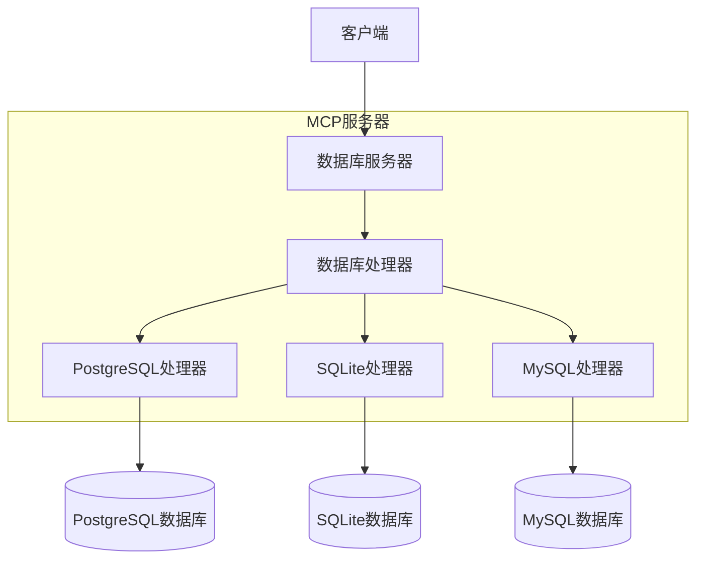

# MCP 数据库服务

## 项目简介
MCP数据库服务是一个统一的数据库访问服务，支持多种数据库类型（PostgreSQL、SQLite和MySQL）。它通过抽象层设计，为MCP服务器提供了简单、统一的数据库操作接口。

## 功能特性
- 统一的数据库访问接口
- 支持多个数据库配置
- 安全的只读查询执行
- 表结构和模式信息查询
- 通过MCP工具列出数据库表
- 智能的连接管理和资源清理
- 支持调试模式
- PostgreSQL和MySQL的SSL/TLS连接支持

## 安装与配置

### 安装方式

#### 使用 uvx 安装（推荐）
不需要专门安装，直接使用 `uvx` 运行：
```bash
uvx mcp-dbutils --config /path/to/config.yaml
```

添加到 Claude 配置：
```json
"mcpServers": {
  "mcp-dbutils": {
    "command": "uvx",
    "args": [
      "mcp-dbutils",
      "--config",
      "/path/to/config.yaml"
    ],
    "env": {
      "MCP_DEBUG": "1"  // 可选：启用调试模式
    }
  }
}
```

#### 使用 pip 安装
```bash
pip install mcp-dbutils
```

添加到 Claude 配置：
```json
"mcpServers": {
  "mcp-dbutils": {
    "command": "python",
    "args": [
      "-m",
      "mcp_dbutils",
      "--config",
      "/path/to/config.yaml"
    ],
    "env": {
      "MCP_DEBUG": "1"  // 可选：启用调试模式
    }
  }
}
```

#### 使用 Docker 安装
```bash
docker run -i --rm \
  -v /path/to/config.yaml:/app/config.yaml \
  -v /path/to/sqlite.db:/app/sqlite.db \  # 可选：用于SQLite数据库
  -e MCP_DEBUG=1 \  # 可选：启用调试模式
  mcp/dbutils --config /app/config.yaml
```

添加到 Claude 配置：
```json
"mcpServers": {
  "mcp-dbutils": {
    "command": "docker",
    "args": [
      "run",
      "-i",
      "--rm",
      "-v",
      "/path/to/config.yaml:/app/config.yaml",
      "-v",
      "/path/to/sqlite.db:/app/sqlite.db",  // 可选：用于SQLite数据库
      "mcp/dbutils",
      "--config",
      "/app/config.yaml"
    ],
    "env": {
      "MCP_DEBUG": "1"  // 可选：启用调试模式
    }
  }
}
```

> **Docker数据库连接说明：**
> - SQLite数据库：使用 `-v /path/to/sqlite.db:/app/sqlite.db` 映射数据库文件
> - 主机上运行的PostgreSQL：
>   - Mac/Windows：配置中使用 `host.docker.internal`
>   - Linux：使用 `172.17.0.1`（docker0网络IP）或使用 `--network="host"` 运行

### 环境要求
- Python 3.10+
- PostgreSQL (可选)
- SQLite3 (可选)
- MySQL (可选)

### 配置文件
项目运行需要一个YAML格式的配置文件，通过 `--config` 参数指定路径。配置示例：

```yaml
connections:
  # SQLite配置示例
  dev-db:
    type: sqlite
    path: /path/to/dev.db
    # 密码是可选的
    password: 

  # PostgreSQL标准配置
  test-db:
    type: postgres
    host: postgres.example.com
    port: 5432
    dbname: test_db
    user: test_user
    password: test_pass

  # PostgreSQL URL配置（带SSL）
  prod-db:
    type: postgres
    url: postgresql://postgres.example.com:5432/prod-db?sslmode=verify-full
    user: prod_user
    password: prod_pass
    
  # PostgreSQL完整SSL配置示例
  secure-db:
    type: postgres
    host: secure-db.example.com
    port: 5432
    dbname: secure_db
    user: secure_user
    password: secure_pass
    ssl:
      mode: verify-full  # disable/require/verify-ca/verify-full
      cert: /path/to/client-cert.pem
      key: /path/to/client-key.pem
      root: /path/to/root.crt
      
  # MySQL标准配置
  sandbox-mysql:
    type: mysql
    host: localhost
    port: 3306
    database: sandbox_db
    user: sandbox_user
    password: sandbox_pass
    charset: utf8mb4

  # MySQL URL配置
  integration-mysql:
    type: mysql
    url: mysql://mysql.example.com:3306/integration_db?charset=utf8mb4
    user: integration_user
    password: integration_pass
    
  # MySQL带SSL配置
  secure-mysql:
    type: mysql
    host: secure-mysql.example.com
    port: 3306
    database: secure_db
    user: secure_user
    password: secure_pass
    charset: utf8mb4
    ssl:
      mode: verify_identity
      ca: /path/to/ca.pem
      cert: /path/to/client-cert.pem
      key: /path/to/client-key.pem
```

PostgreSQL SSL配置选项：
1. 使用URL参数：
   ```
   postgresql://host:port/dbname?sslmode=verify-full&sslcert=/path/to/cert.pem
   ```
2. 使用专门的SSL配置部分：
   ```yaml
   ssl:
     mode: verify-full  # SSL验证模式
     cert: /path/to/cert.pem      # 客户端证书
     key: /path/to/key.pem        # 客户端私钥
     root: /path/to/root.crt      # CA证书
   ```

MySQL SSL配置选项：
1. 使用URL参数：
   ```
   mysql://host:port/dbname?ssl-mode=verify_identity&ssl-ca=/path/to/ca.pem
   ```
2. 使用专门的SSL配置部分：
   ```yaml
   ssl:
     mode: verify_identity  # SSL验证模式
     ca: /path/to/ca.pem         # CA证书
     cert: /path/to/cert.pem     # 客户端证书
     key: /path/to/key.pem       # 客户端私钥
   ```

PostgreSQL SSL模式：
- disable: 不使用SSL
- require: 使用SSL但不验证证书
- verify-ca: 验证服务器证书是由受信任的CA签名
- verify-full: 验证服务器证书和主机名匹配

MySQL SSL模式：
- disabled: 不使用SSL
- preferred: 使用SSL如果可用，但允许非加密连接
- required: 始终使用SSL，但不验证服务器证书
- verify_ca: 验证服务器证书是由受信任的CA签名
- verify_identity: 验证服务器证书和主机名匹配

SQLite配置选项：
1. 基本路径配置：
   ```yaml
   type: sqlite
   path: /path/to/db.sqlite
   password: optional_password  # 可选的加密密码
   ```
2. 使用URI参数：
   ```yaml
   type: sqlite
   path: /path/to/db.sqlite?mode=ro&cache=shared
   ```

### 调试模式
设置环境变量 `MCP_DEBUG=1` 启用调试模式，可以看到详细的日志输出。

## 架构设计

### 核心理念：抽象层设计



在MCP数据库服务中，抽象层设计是最核心的架构思想。它就像一个通用遥控器，不管是控制电视还是空调，用户只需要知道"按下按钮就能完成操作"。

#### 1. 简化用户交互
- 用户只需要知道数据库的配置名称（比如 "my_postgres"）
- 不需要关心具体的连接参数和实现细节
- MCP服务器自动处理正确的数据库连接和查询

#### 2. 统一接口设计
- DatabaseHandler抽象类定义了统一的操作接口
- 所有具体数据库实现（PostgreSQL/SQLite/MySQL）都遵循相同的接口
- 用户使用相同的方式访问不同类型的数据库

#### 3. 配置与实现分离
- 复杂的数据库配置参数封装在配置文件中
- 运行时通过简单的数据库名称引用这些配置
- 便于管理和修改数据库配置而不影响业务代码

### 系统组件
1. DatabaseServer
   - 作为MCP服务器的核心组件
   - 处理资源和工具请求
   - 管理数据库连接生命周期

2. DatabaseHandler
   - 抽象基类，定义统一接口
   - 包含get_tables()、get_schema()、execute_query()等方法
   - PostgreSQL、SQLite和MySQL分别实现这些接口

3. 配置系统
   - 基于YAML的配置文件
   - 支持多数据库配置
   - 类型安全的配置验证

4. 错误处理和日志
   - 统一的错误处理机制
   - 详细的日志输出
   - 敏感信息屏蔽

## 使用示例

### 基本查询
```python
# 通过连接名称访问
async with server.get_handler("my_postgres") as handler:
    # 执行SQL查询
    result = await handler.execute_query("SELECT * FROM users")
```

### 查看表结构
```python
# 获取所有表
tables = await handler.get_tables()

# 获取特定表的结构
schema = await handler.get_schema("users")
```

### 错误处理
```python
try:
    async with server.get_handler("my_connection") as handler:
        result = await handler.execute_query("SELECT * FROM users")
except ValueError as e:
    print(f"配置错误: {e}")
except Exception as e:
    print(f"查询错误: {e}")
```

## 安全说明
- 仅支持SELECT查询，保护数据库安全
- 自动屏蔽日志中的敏感信息（如密码）
- 使用只读事务执行查询

## API文档

### DatabaseServer
核心服务器类，提供:
- 资源列表获取
- 工具调用处理（list_tables、query）
- 数据库处理器管理

### MCP工具

#### dbutils-list-tables
列出指定数据库中的所有表。
- 参数：
  * connection: 数据库连接名称
- 返回：包含表名列表的文本内容

#### dbutils-run-query
在指定数据库上执行SQL查询。
- 参数：
  * connection: 数据库连接名称
  * sql: 要执行的SQL查询（仅支持SELECT）
- 返回：格式化的查询结果文本

#### dbutils-get-stats
获取表的统计信息。
- 参数：
  * connection: 数据库连接名称
  * table: 表名
- 返回：包括行数、大小、列统计等信息

#### dbutils-list-constraints
列出表的约束信息（主键、外键等）。
- 参数：
  * connection: 数据库连接名称
  * table: 表名
- 返回：详细的约束信息

#### dbutils-explain-query
获取查询的执行计划和成本估算。
- 参数：
  * connection: 数据库连接名称
  * sql: 要分析的SQL查询
- 返回：格式化的执行计划

#### dbutils-get-performance
获取数据库性能统计信息。
- 参数：
  * connection: 数据库连接名称
- 返回：详细的性能统计信息，包括查询时间、查询类型、错误率和资源使用情况

#### dbutils-analyze-query
分析SQL查询的性能并提供优化建议。
- 参数：
  * connection: 数据库连接名称
  * sql: 要分析的SQL查询
- 返回：查询分析结果，包括执行计划、时间信息和优化建议

### DatabaseHandler
抽象基类，定义接口:
- get_tables(): 获取表资源列表
- get_schema(): 获取表结构
- execute_query(): 执行SQL查询
- cleanup(): 资源清理

### PostgreSQL实现
提供PostgreSQL特定功能:
- 支持远程连接
- 表描述信息
- 约束查询

### SQLite实现
提供SQLite特定功能:
- 文件路径处理
- URI模式支持
- 密码保护支持（可选）

### MySQL实现
提供MySQL特定功能:
- 支持远程连接
- 字符集配置
- SSL/TLS安全连接
- URL和标准连接方式

## 参与贡献
欢迎贡献！以下是参与项目的方式：

1. 🐛 报告问题：创建 issue 描述bug和复现步骤
2. 💡 提供建议：创建 issue 提出新功能建议
3. 🛠️ 提交PR：fork仓库并创建包含您改动的pull request

### 开发环境设置
1. 克隆仓库
2. 使用 `uv venv` 创建虚拟环境
3. 使用 `uv sync --all-extras` 安装依赖
4. 使用 `pytest` 运行测试

详细指南请参见 [CONTRIBUTING.md](.github/CONTRIBUTING.md)

## 致谢
- 感谢 [MCP Servers](https://github.com/modelcontextprotocol/servers) 提供的启发和演示
- AI编辑器支持：
  * [Claude Desktop](https://claude.ai/download)
  * [Cline](https://cline.bot)
- 感谢 [Model Context Protocol](https://modelcontextprotocol.io/) 提供丰富的接口支持
