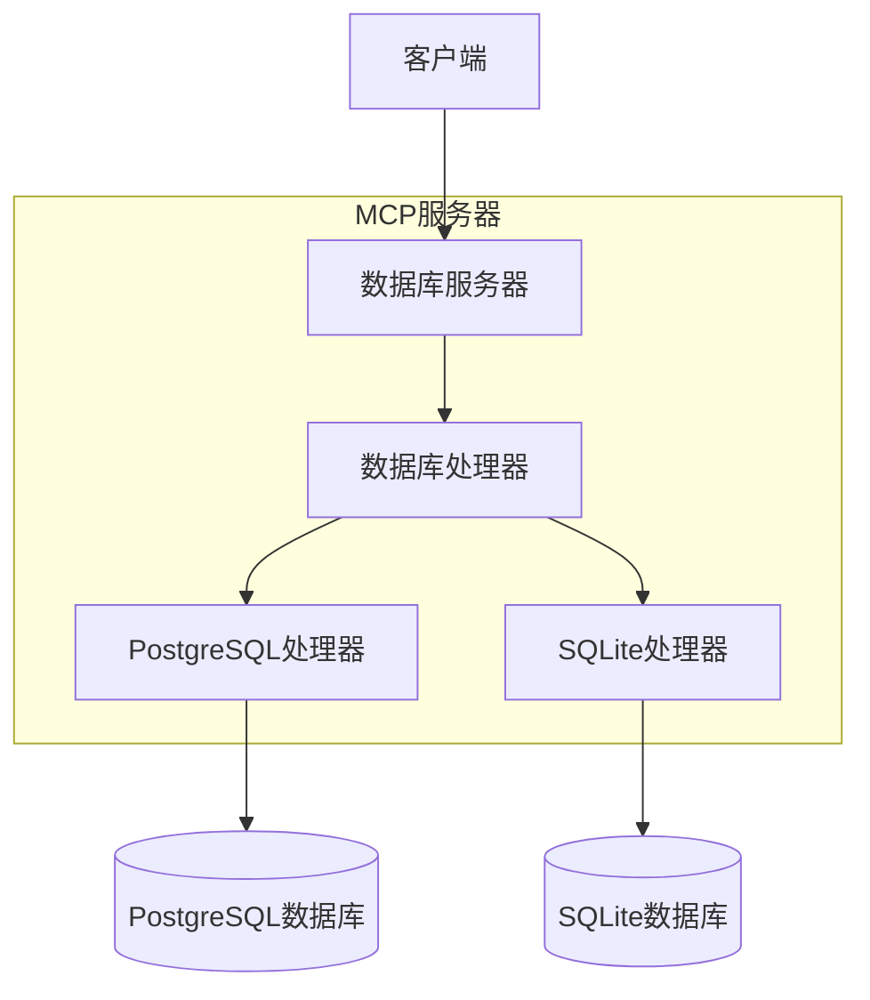

# MCP 数据库服务

## 项目简介
MCP数据库服务是一个统一的数据库访问服务，支持多种数据库类型（PostgreSQL和SQLite）。它通过抽象层设计，为MCP服务器提供了简单、统一的数据库操作接口。

## 功能特性
- 统一的数据库访问接口
- 支持多个数据库配置
- 安全的只读查询执行
- 表结构和模式信息查询
- 智能的连接管理和资源清理
- 支持调试模式

## 安装与配置

### 安装方式

#### 使用 uvx 安装（推荐）
不需要专门安装，直接使用 `uvx` 运行：
```bash
uvx mcp-dbutils --config /path/to/config.yaml
```

添加到 Claude 配置：
```json
"mcpServers": {
  "mcp-dbutils": {
    "command": "uvx",
    "args": [
      "mcp-dbutils",
      "--config",
      "/path/to/config.yaml"
    ],
    "env": {
      "MCP_DEBUG": "1"  // 可选：启用调试模式
    }
  }
}
```

#### 使用 pip 安装
```bash
pip install mcp-dbutils
```

添加到 Claude 配置：
```json
"mcpServers": {
  "mcp-dbutils": {
    "command": "python",
    "args": [
      "-m",
      "mcp_dbutils",
      "--config",
      "/path/to/config.yaml"
    ],
    "env": {
      "MCP_DEBUG": "1"  // 可选：启用调试模式
    }
  }
}
```

#### 使用 Docker 安装
```bash
docker run -i --rm \
  -v /path/to/config.yaml:/app/config.yaml \
  -v /path/to/sqlite.db:/app/sqlite.db \  # 可选：用于SQLite数据库
  -e MCP_DEBUG=1 \  # 可选：启用调试模式
  mcp/dbutils --config /app/config.yaml
```

添加到 Claude 配置：
```json
"mcpServers": {
  "mcp-dbutils": {
    "command": "docker",
    "args": [
      "run",
      "-i",
      "--rm",
      "-v",
      "/path/to/config.yaml:/app/config.yaml",
      "-v",
      "/path/to/sqlite.db:/app/sqlite.db",  // 可选：用于SQLite数据库
      "mcp/dbutils",
      "--config",
      "/app/config.yaml"
    ],
    "env": {
      "MCP_DEBUG": "1"  // 可选：启用调试模式
    }
  }
}
```

> **Docker数据库连接说明：**
> - SQLite数据库：使用 `-v /path/to/sqlite.db:/app/sqlite.db` 映射数据库文件
> - 主机上运行的PostgreSQL：
>   - Mac/Windows：配置中使用 `host.docker.internal`
>   - Linux：使用 `172.17.0.1`（docker0网络IP）或使用 `--network="host"` 运行

### 环境要求
- Python 3.10+
- PostgreSQL (可选)
- SQLite3 (可选)

### 配置文件
项目运行需要一个YAML格式的配置文件，通过 `--config` 参数指定路径。配置示例：

```yaml
databases:
  # PostgreSQL标准配置示例
  my_postgres:
    type: postgres
    dbname: test_db
    user: postgres
    password: secret
    host: host.docker.internal  # Mac/Windows系统使用
    # host: 172.17.0.1         # Linux系统使用（docker0网络IP）
    port: 5432

  # PostgreSQL JDBC URL配置示例
  my_postgres_jdbc:
    type: postgres
    jdbc_url: jdbc:postgresql://host.docker.internal:5432/test_db
    user: postgres            # 认证信息必须单独提供
    password: secret          # 出于安全考虑，不包含在JDBC URL中

  # SQLite标准配置
  my_sqlite:
    type: sqlite
    path: /app/sqlite.db       # 数据库文件路径
    password: optional_password # 可选

  # SQLite JDBC URL配置
  my_sqlite_jdbc:
    type: sqlite
    jdbc_url: jdbc:sqlite:/app/data.db?mode=ro&cache=shared  # 支持查询参数
    password: optional_password    # 出于安全考虑单独提供
```

PostgreSQL和SQLite都支持JDBC URL配置格式：

PostgreSQL配置支持：
1. 标准配置：使用独立的参数配置
2. JDBC URL配置：使用JDBC URL并单独提供认证信息

SQLite配置支持：
1. 标准配置：使用path参数指定数据库文件
2. JDBC URL配置：支持以下查询参数：
   - mode=ro：只读模式
   - cache=shared：共享缓存模式
   - 其他SQLite URI参数

### 调试模式
设置环境变量 `MCP_DEBUG=1` 启用调试模式，可以看到详细的日志输出。

## 架构设计

### 核心理念：抽象层设计



在MCP数据库服务中，抽象层设计是最核心的架构思想。它就像一个通用遥控器，不管是控制电视还是空调，用户只需要知道"按下按钮就能完成操作"。

#### 1. 简化用户交互
- 用户只需要知道数据库的配置名称（比如 "my_postgres"）
- 不需要关心具体的连接参数和实现细节
- MCP服务器自动处理正确的数据库连接和查询

#### 2. 统一接口设计
- DatabaseHandler抽象类定义了统一的操作接口
- 所有具体数据库实现（PostgreSQL/SQLite）都遵循相同的接口
- 用户使用相同的方式访问不同类型的数据库

#### 3. 配置与实现分离
- 复杂的数据库配置参数封装在配置文件中
- 运行时通过简单的数据库名称引用这些配置
- 便于管理和修改数据库配置而不影响业务代码

### 系统组件
1. DatabaseServer
   - 作为MCP服务器的核心组件
   - 处理资源和工具请求
   - 管理数据库连接生命周期

2. DatabaseHandler
   - 抽象基类，定义统一接口
   - 包含get_tables()、get_schema()、execute_query()等方法
   - PostgreSQL和SQLite分别实现这些接口

3. 配置系统
   - 基于YAML的配置文件
   - 支持多数据库配置
   - 类型安全的配置验证

4. 错误处理和日志
   - 统一的错误处理机制
   - 详细的日志输出
   - 敏感信息屏蔽

## 使用示例

### 基本查询
```python
# 通过数据库名称访问
async with server.get_handler("my_postgres") as handler:
    # 执行SQL查询
    result = await handler.execute_query("SELECT * FROM users")
```

### 查看表结构
```python
# 获取所有表
tables = await handler.get_tables()

# 获取特定表的结构
schema = await handler.get_schema("users")
```

### 错误处理
```python
try:
    async with server.get_handler("my_db") as handler:
        result = await handler.execute_query("SELECT * FROM users")
except ValueError as e:
    print(f"配置错误: {e}")
except Exception as e:
    print(f"查询错误: {e}")
```

## 安全说明
- 仅支持SELECT查询，保护数据库安全
- 自动屏蔽日志中的敏感信息（如密码）
- 使用只读事务执行查询

## API文档

### DatabaseServer
核心服务器类，提供:
- 资源列表获取
- 工具调用处理
- 数据库处理器管理

### DatabaseHandler
抽象基类，定义接口:
- get_tables(): 获取表资源列表
- get_schema(): 获取表结构
- execute_query(): 执行SQL查询
- cleanup(): 资源清理

### PostgreSQL实现
提供PostgreSQL特定功能:
- 支持远程连接
- 表描述信息
- 约束查询

### SQLite实现
提供SQLite特定功能:
- 文件路径处理
- URI模式支持
- 密码保护支持（可选）

## 参与贡献
欢迎贡献！以下是参与项目的方式：

1. 🐛 报告问题：创建 issue 描述bug和复现步骤
2. 💡 提供建议：创建 issue 提出新功能建议
3. 🛠️ 提交PR：fork仓库并创建包含您改动的pull request

### 开发环境设置
1. 克隆仓库
2. 使用 `uv venv` 创建虚拟环境
3. 使用 `uv sync --all-extras` 安装依赖
4. 使用 `pytest` 运行测试

详细指南请参见 [CONTRIBUTING.md](.github/CONTRIBUTING.md)

## 致谢
- 感谢 [MCP Servers](https://github.com/modelcontextprotocol/servers) 提供的启发和演示
- AI编辑器支持：
  * [Claude Desktop](https://claude.ai/download)
  * [5ire](https://5ire.app/)
  * [Cline](https://cline.bot)
- 感谢 [Model Context Protocol](https://modelcontextprotocol.io/) 提供丰富的接口支持
