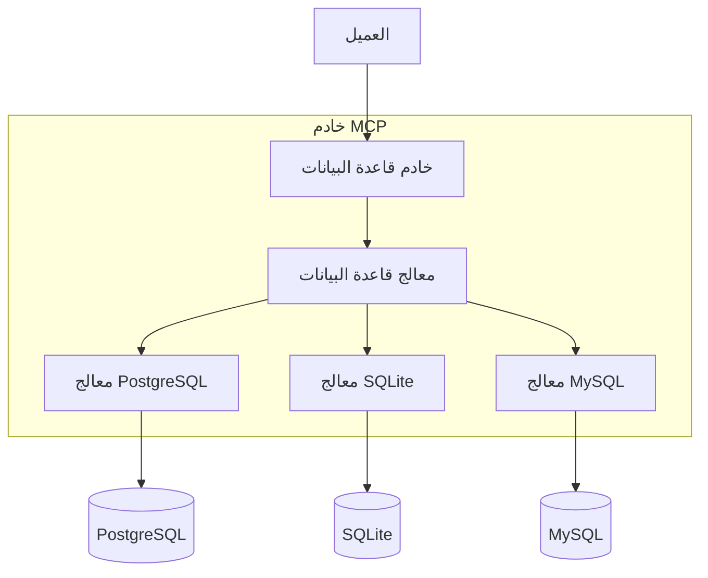

# البنية المعمارية

*[English](../../en/technical/architecture.md) | [中文](../../zh/technical/architecture.md) | [Français](../../fr/technical/architecture.md) | [Español](../../es/technical/architecture.md) | العربية | [Русский](../../ru/technical/architecture.md)*

يصف هذا المستند البنية المعمارية الفنية لـ MCP Database Utilities، موضحًا كيفية تفاعل المكونات المختلفة لتوفير وصول آمن إلى قواعد البيانات للمساعدين الذكاء الاصطناعي.

## نظرة عامة على البنية المعمارية

تم تصميم MCP Database Utilities وفق بنية معمارية وحدات تعطي الأولوية للأمان والعزل والمرونة. يتكون النظام من عدة طبقات متميزة تعمل معًا لتوفير وصول آمن للقراءة فقط إلى قواعد البيانات.

## المفهوم الأساسي: تصميم طبقات التجريد

تصميم طبقات التجريد هو مفهوم أساسي في بنية MCP Database Utilities. تمامًا مثل جهاز التحكم عن بعد العالمي الذي يمكنه التحكم في أجهزة مختلفة، يحتاج المستخدم فقط إلى معرفة العمليات الأساسية، دون فهم التعقيد الأساسي.

## المكونات الرئيسية

### 1. مدير MCP (أدوات API)

هذا المكون مسؤول عن تنفيذ بروتوكول MCP وعرض الأدوات التي يمكن للذكاء الاصطناعي استخدامها.

**المسؤوليات:**
- تنفيذ واجهة MCP للتكامل مع عملاء الذكاء الاصطناعي
- عرض الأدوات المتاحة (list-tables، run-query، إلخ)
- إدارة دورة حياة طلبات MCP
- التحقق من صحة المدخلات وتنسيق المخرجات

**الأدوات المعروضة:**
- `dbutils-list-connections`: سرد الاتصالات المتاحة
- `dbutils-list-tables`: سرد الجداول في قاعدة البيانات
- `dbutils-run-query`: تنفيذ استعلام SQL (SELECT فقط)
- `dbutils-get-stats`: الحصول على إحصائيات حول جدول
- `dbutils-list-constraints`: سرد قيود جدول
- `dbutils-explain-query`: الحصول على خطة تنفيذ استعلام
- `dbutils-get-performance`: الحصول على مقاييس الأداء
- `dbutils-analyze-query`: تحليل الاستعلامات للتحسين

### 2. مدير الاستعلامات

هذا المكون يعالج الاستعلامات الواردة، ويتحقق من صحتها، ويوجهها إلى محولات قاعدة البيانات المناسبة.

**المسؤوليات:**
- تحليل والتحقق من صحة استعلامات SQL
- تطبيق قيود الأمان (SELECT فقط)
- الحد من تعقيد الاستعلامات وحجم النتائج
- إدارة المهل الزمنية وإلغاء الاستعلامات
- تحسين الاستعلامات عند الإمكان

### 3. مدير SQL

هذا المكون مسؤول عن التحليل النحوي والدلالي لاستعلامات SQL.

**المسؤوليات:**
- تحليل بناء جملة SQL
- التحقق من صحة دلالات الاستعلامات
- اكتشاف وحظر العمليات غير المصرح بها (INSERT، UPDATE، DELETE، إلخ)
- تحديد الجداول والأعمدة المشار إليها
- تحسين الاستعلامات عند الإمكان

### 4. مدير الاتصالات

هذا المكون يدير الاتصالات بقواعد البيانات وفقًا للتكوين.

**المسؤوليات:**
- قراءة والتحقق من صحة تكوين الاتصالات
- إنشاء والحفاظ على مجمعات الاتصال
- إدارة دورة حياة الاتصالات
- تطبيق معلمات الأمان (SSL، المهلة الزمنية، إلخ)
- مراقبة حالة الاتصالات

### 5. مدير التخزين المؤقت

هذا المكون يخزن نتائج الاستعلامات المتكررة مؤقتًا لتحسين الأداء.

**المسؤوليات:**
- تخزين نتائج الاستعلامات مؤقتًا
- إبطال التخزين المؤقت عند الضرورة
- إدارة حجم ومدة حياة التخزين المؤقت
- تحسين الأداء للاستعلامات المتكررة

### 6. محولات قاعدة البيانات

توفر هذه المكونات واجهة موحدة لأنواع مختلفة من قواعد البيانات.

**المحولات المدعومة:**
- SQLite
- PostgreSQL
- MySQL

**المسؤوليات:**
- ترجمة الاستعلامات العامة إلى استعلامات خاصة بقاعدة البيانات
- إدارة خصوصيات كل نوع من قواعد البيانات
- تحسين الاستعلامات لكل محرك قاعدة بيانات
- إدارة الأخطاء الخاصة بكل قاعدة بيانات

## تدفق البيانات

1. **التهيئة:**
   - يقرأ الخدمة ملف تكوين YAML
   - يتم تكوين اتصالات قاعدة البيانات ولكن لا يتم إنشاؤها
   - يتم تسجيل وعرض أدوات MCP

2. **معالجة الاستعلامات:**
   - يرسل الذكاء الاصطناعي طلبًا عبر بروتوكول MCP
   - يتلقى مدير MCP الطلب ويمرره إلى مدير الاستعلامات
   - يتحقق مدير الاستعلامات من صحة الاستعلام ويمرره إلى المحول المناسب
   - ينشئ المحول اتصالًا (أو يستخدم اتصالًا موجودًا من المجمع)
   - يتم تنفيذ الاستعلام وإرجاع النتائج
   - يتم تنسيق النتائج وإرجاعها إلى الذكاء الاصطناعي

3. **إدارة الأخطاء:**
   - يتم التقاط الأخطاء على كل مستوى
   - يتم توحيد رسائل الخطأ وجعلها مفهومة
   - يتم تسجيل وحظر أخطاء الأمان
   - تتم إدارة المهل الزمنية لتجنب الاستعلامات اللانهائية

## اعتبارات الأمان

الأمان هو أولوية قصوى في بنية MCP Database Utilities:

1. **الوصول للقراءة فقط:**
   - يتم تحليل جميع الاستعلامات للتأكد من أنها للقراءة فقط
   - يتم حظر عمليات التعديل (INSERT، UPDATE، DELETE، إلخ)
   - يتم حظر أوامر DDL (CREATE، ALTER، DROP، إلخ)

2. **العزل:**
   - كل اتصال معزول
   - المعاملات للقراءة فقط
   - يتم إنشاء الاتصالات عند الطلب وإغلاقها بعد الاستخدام

3. **المصادقة والتفويض:**
   - يتم تخزين بيانات الاعتماد بشكل آمن
   - دعم SSL/TLS للاتصالات المشفرة
   - إمكانية استخدام حسابات قاعدة بيانات للقراءة فقط

4. **الحماية من حقن SQL:**
   - يتم التحقق من صحة جميع المدخلات وتهريبها
   - استخدام الاستعلامات المعلمة
   - تحليل نحوي كامل لاستعلامات SQL

5. **تقييد الموارد:**
   - مهل زمنية لجميع الاستعلامات
   - تقييد حجم النتائج
   - تقييد تعقيد الاستعلامات

## قابلية التوسع

تم تصميم البنية المعمارية لتكون قابلة للتوسع:

1. **محولات جديدة:**
   - يمكن إضافة دعم لأنواع أخرى من قواعد البيانات
   - واجهة مشتركة لجميع المحولات

2. **أدوات جديدة:**
   - يمكن إضافة أدوات MCP جديدة بسهولة
   - واجهة متسقة لجميع الأدوات

3. **ميزات متقدمة:**
   - دعم للعروض المادية
   - تحسين تلقائي للاستعلامات
   - تحليل متقدم للأداء

## التبعيات الخارجية

يعتمد MCP Database Utilities على المكتبات التالية:

- **SQLAlchemy**: ORM وأدوات SQL للتفاعل مع قواعد البيانات
- **PyYAML**: تحليل ملفات YAML للتكوين
- **Psycopg2**: محول PostgreSQL
- **PyMySQL**: محول MySQL
- **Pydantic**: التحقق من صحة البيانات والتسلسل

## القيود المعروفة

- لا يوجد دعم للإجراءات المخزنة
- لا يوجد دعم للمعاملات المعقدة
- لا يوجد دعم لقواعد بيانات NoSQL (في الوقت الحالي)
- لا يوجد دعم للاستعلامات الموزعة بين قواعد بيانات متعددة

## التطورات المستقبلية

- دعم لأنواع أخرى من قواعد البيانات (MongoDB، Oracle، SQL Server، إلخ)
- تحسين قدرات تحليل وتحسين الاستعلامات
- دعم لقواعد البيانات الموحدة
- واجهة إدارة لإدارة الاتصالات
- مقاييس ومراقبة متقدمة
