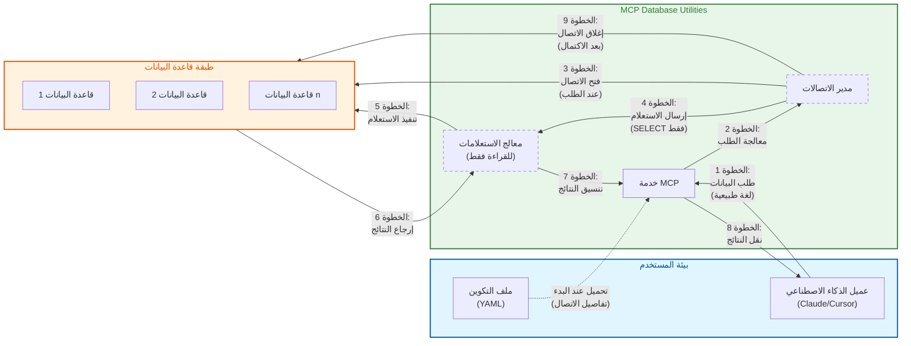

# بنية الأمان

*[English](../../en/technical/security.md) | [中文](../../zh/technical/security.md) | [Français](../../fr/technical/security.md) | [Español](../../es/technical/security.md) | العربية | [Русский](../../ru/technical/security.md)*

يفصل هذا المستند بنية الأمان لـ MCP Database Utilities، موضحًا الآليات والمبادئ التي تضمن وصولًا آمنًا إلى قواعد البيانات لمساعدي الذكاء الاصطناعي.

## نموذج الاتصال وبنية الأمان

ينفذ MCP Database Utilities نموذج اتصال آمن مصمم لحماية بياناتك في كل خطوة. يوضح الرسم البياني التالي كيفية تدفق البيانات بين المكونات مع الحفاظ على الأمان:



## مبادئ الأمان

تم تصميم MCP Database Utilities مع وضع الأمان كأولوية قصوى، باتباع هذه المبادئ الأساسية:

1. **الدفاع في العمق**: طبقات متعددة من الأمان لحماية البيانات
2. **مبدأ الامتياز الأدنى**: الحد الأدنى من الوصول اللازم للعمل
3. **الأمان بالتصميم**: الأمان مدمج منذ البداية، وليس مضافًا لاحقًا
4. **الشفافية**: بنية مفتوحة وقابلة للتحقق
5. **العزل**: فصل صارم للبيئات والاتصالات

## آليات الأمان الرئيسية

### 1. عمليات للقراءة فقط بشكل صارم

جميع التفاعلات مع قواعد البيانات مقيدة بعمليات القراءة فقط:

- **تحليل نحوي كامل**: يتم تحليل كل استعلام SQL بالكامل للتأكد من أنه للقراءة فقط
- **حظر عمليات التعديل**: يتم حظر جميع الأوامر التي تعدل البيانات (INSERT، UPDATE، DELETE، إلخ) تلقائيًا
- **حظر أوامر DDL**: يتم حظر الأوامر التي تعدل بنية قاعدة البيانات (CREATE، ALTER، DROP، إلخ)
- **التحقق على مستويات متعددة**: يتم التحقق من الاستعلامات من خلال محلل SQL وفحوصات خاصة بكل نوع من قواعد البيانات

```python
# مثال على التحقق من صحة الاستعلام (شبه كود)
def validate_query(query):
    # تحليل نحوي للاستعلام
    parsed_query = sql_parser.parse(query)

    # التحقق من نوع الاستعلام
    if not parsed_query.is_select():
        raise SecurityException("يُسمح فقط باستعلامات SELECT")

    # التحقق من البنود الخطرة
    if parsed_query.has_dangerous_clauses():
        raise SecurityException("تم اكتشاف بنود غير مسموح بها")

    # تحقق خاص بقاعدة البيانات
    db_adapter.validate_read_only(query)

    return parsed_query
```

### 2. لا وصول مباشر إلى قاعدة البيانات

تضمن البنية أن الذكاء الاصطناعي لا يملك أبدًا وصولًا مباشرًا إلى قواعد البيانات:

- **طبقة تجريد**: تمر جميع الاستعلامات عبر طبقات تجريد متعددة
- **التحقق من صحة المدخلات**: يتم التحقق من صحة جميع المدخلات وتنظيفها
- **استعلامات معلمة**: استخدام منهجي للاستعلامات المعلمة لمنع حقن SQL
- **عزل الاتصالات**: كل اتصال معزول ويدار من قبل الخدمة

### 3. اتصالات معزولة

اتصالات قواعد البيانات معزولة بشكل صارم:

- **مجمع اتصالات مخصص**: كل تكوين لقاعدة بيانات يستخدم مجمع الاتصالات الخاص به
- **معاملات للقراءة فقط**: جميع المعاملات مكونة صراحة في وضع القراءة فقط
- **مهل زمنية تلقائية**: الاتصالات لها مهل زمنية قابلة للتكوين لتجنب الاتصالات المستمرة
- **إغلاق مناسب**: يتم إغلاق الاتصالات بشكل صحيح بعد الاستخدام

```yaml
# مثال على التكوين مع معلمات الأمان
connections:
  secure-postgres:
    type: postgres
    host: db.example.com
    port: 5432
    dbname: analytics
    user: readonly_user
    password: "********"
    ssl:
      mode: verify-full
      cert: /path/to/cert.pem
      key: /path/to/key.pem
      root: /path/to/root.crt
    pool:
      max_size: 5
      timeout: 30
```

### 4. الاتصال عند الطلب

يتم إنشاء اتصالات قواعد البيانات فقط عند الحاجة:

- **اتصال متأخر**: يتم إنشاء الاتصالات فقط عند تنفيذ استعلام فعليًا
- **فصل سريع**: يتم إعادة الاتصالات إلى المجمع في أقرب وقت ممكن
- **تقييد الاتصالات**: عدد الاتصالات المتزامنة القصوى قابل للتكوين
- **مراقبة الاتصالات**: تتم مراقبة جميع الاتصالات لاكتشاف الشذوذ

### 5. مهل زمنية تلقائية

يتم تطبيق المهل الزمنية على مستويات متعددة لمنع سوء الاستخدام:

- **مهلة الاستعلام**: حد زمني لتنفيذ استعلام
- **مهلة الاتصال**: حد زمني لإنشاء اتصال
- **مهلة الخمول**: إغلاق الاتصالات الخاملة بعد فترة قابلة للتكوين
- **مهلة عامة**: حد زمني إجمالي للجلسة

### 6. حماية بيانات الاعتماد

بيانات اعتماد قواعد البيانات محمية:

- **تخزين آمن**: لا يتم تخزين كلمات المرور أبدًا بشكل نصي في الذاكرة
- **إخفاء في السجلات**: يتم إخفاء المعلومات الحساسة في جميع السجلات
- **دعم لمديري الأسرار**: تكامل ممكن مع حلول مثل HashiCorp Vault، AWS Secrets Manager، إلخ
- **تناوب بيانات الاعتماد**: دعم للتناوب الدوري لبيانات الاعتماد

### 7. أمان الاتصالات

الاتصالات مع قواعد البيانات مؤمنة:

- **دعم SSL/TLS**: اتصالات مشفرة لجميع قواعد البيانات المدعومة
- **التحقق من الشهادات**: خيار للتحقق من شهادات خوادم قواعد البيانات
- **تكوينات SSL متقدمة**: خيارات لتكوين معلمات SSL/TLS بدقة
- **بروتوكولات آمنة**: استخدام إصدارات حديثة وآمنة من البروتوكولات

```yaml
# مثال على تكوين SSL لـ PostgreSQL
connections:
  postgres-ssl:
    type: postgres
    host: secure-db.example.com
    port: 5432
    dbname: analytics
    user: readonly_user
    password: "********"
    ssl:
      mode: verify-full  # الخيارات: disable, allow, prefer, require, verify-ca, verify-full
      cert: /path/to/client-cert.pem
      key: /path/to/client-key.pem
      root: /path/to/root.crt
```

## تدابير حماية الخصوصية

### 1. المعالجة المحلية

تتم جميع العمليات محليًا:

- **لا نقل للبيانات**: البيانات لا تغادر أبدًا البيئة المحلية
- **لا تنزيل للمخطط**: مخططات قاعدة البيانات لا يتم إرسالها إلى خدمات خارجية
- **لا قياس عن بعد**: لا يتم جمع أو إرسال أي بيانات استخدام

### 2. الحد الأدنى من كشف البيانات

تم تصميم الخدمة لتقليل كشف البيانات:

- **تقييد النتائج**: عدد الصفوف القصوى المرجعة قابل للتكوين
- **ترقيم الصفحات التلقائي**: مجموعات النتائج الكبيرة يتم ترقيم صفحاتها
- **تصفية الأعمدة الحساسة**: إمكانية تكوين الأعمدة لاستبعادها من النتائج
- **إخفاء البيانات**: خيار لإخفاء البيانات الحساسة تلقائيًا (PII، إلخ)

### 3. حماية بيانات الاعتماد

بيانات اعتماد الاتصال محمية:

- **لا كشف لبيانات الاعتماد**: بيانات الاعتماد لا يتم كشفها أبدًا للذكاء الاصطناعي
- **تجريد الاتصالات**: يستخدم الذكاء الاصطناعي أسماء اتصال منطقية، وليس التفاصيل الفعلية
- **التحقق من الأذونات**: التحقق من أن الحسابات المستخدمة لها أذونات الحد الأدنى

### 4. إخفاء البيانات الحساسة

يمكن إخفاء البيانات الحساسة تلقائيًا:

- **اكتشاف PII**: خيار لاكتشاف وإخفاء معلومات التعريف الشخصية تلقائيًا
- **قواعد إخفاء قابلة للتكوين**: إمكانية تحديد قواعد إخفاء مخصصة
- **تسجيل آمن**: البيانات الحساسة يتم إخفاؤها في جميع السجلات

## أفضل ممارسات الأمان

### التكوين الآمن

توصيات للتكوين الآمن:

1. **استخدم حسابات للقراءة فقط**:
   ```sql
   -- مثال لـ PostgreSQL
   CREATE ROLE readonly_user WITH LOGIN PASSWORD 'secure_password';
   GRANT CONNECT ON DATABASE analytics TO readonly_user;
   GRANT USAGE ON SCHEMA public TO readonly_user;
   GRANT SELECT ON ALL TABLES IN SCHEMA public TO readonly_user;
   ```

2. **قم بتفعيل SSL/TLS**:
   ```yaml
   connections:
     secure-db:
       # ...
       ssl:
         mode: verify-full
         # ...
   ```

3. **قيد الوصول إلى الجداول**:
   ```yaml
   connections:
     limited-access:
       # ...
       allowed_tables:
         - public.products
         - public.categories
         - analytics.sales
   ```

4. **قم بتكوين مهل زمنية مناسبة**:

   توفر أدوات MCP Database Utilities ثلاثة معلمات للمهلة الزمنية قابلة للتكوين لضمان أمان اتصالات قاعدة البيانات والاستخدام الفعال للموارد:

   **مهلة الاستعلام (query_timeout)**:
   - **الغرض**: تحديد الحد الأقصى لوقت تنفيذ استعلام SQL واحد. سيتم إنهاء الاستعلامات التي تتجاوز هذا الوقت تلقائيًا.
   - **الوحدة**: ثوان
   - **القيمة الافتراضية**: 60 ثانية
   - **حالات الاستخدام**: يمنع الاستعلامات المعقدة أو استعلامات الجداول الكبيرة من استهلاك موارد مفرطة
   - **التوصيات**:
     - الاستعلامات العادية: 30-60 ثانية
     - استعلامات تحليل البيانات: 300-600 ثانية
     - إنشاء التقارير: حتى 1800 ثانية

   **مهلة الاتصال (connection_timeout)**:
   - **الغرض**: تحديد الحد الأقصى لوقت الانتظار لإنشاء اتصال بقاعدة البيانات. سيتم إرجاع أخطاء الاتصال إذا تعذر إنشاء اتصال خلال هذا الوقت.
   - **الوحدة**: ثوان
   - **القيمة الافتراضية**: 10 ثوان
   - **حالات الاستخدام**: مفيد في بيئات الشبكة غير المستقرة أو عندما يكون حمل قاعدة البيانات مرتفعًا
   - **التوصيات**:
     - قواعد البيانات المحلية: 5-10 ثوان
     - قواعد البيانات البعيدة: 15-30 ثانية
     - بيئات الحمل العالي: حتى 60 ثانية

   **مهلة الخمول (idle_timeout)**:
   - **الغرض**: تحديد المدة التي يمكن أن يظل فيها الاتصال خاملاً قبل إغلاقه تلقائيًا. هذا يساعد على تحرير موارد الاتصال غير المستخدمة.
   - **الوحدة**: ثوان
   - **القيمة الافتراضية**: 300 ثانية (5 دقائق)
   - **حالات الاستخدام**: إدارة الاتصالات الخاملة في مجمع الاتصالات
   - **التوصيات**:
     - الاستخدام عالي التردد: 600-1200 ثانية
     - الاستخدام العام: 300-600 ثانية
     - الاستخدام منخفض التردد: 60-180 ثانية

   **العلاقات بين المعلمات**:
   - عادة idle_timeout > query_timeout > connection_timeout
   - إذا كانت استعلاماتك تحتاج إلى التشغيل لفترة طويلة، تأكد من أن query_timeout طويل بما يكفي
   - إذا كان idle_timeout قصيرًا جدًا، فقد يتسبب ذلك في إنشاء وتدمير متكرر للاتصالات، مما يؤثر على الأداء

   **مثال التكوين**:
   ```yaml
   connections:
     analytics-db:
       type: postgres
       host: analytics.example.com
       port: 5432
       dbname: analytics
       user: analyst
       password: secure_password
       # تكوين المهل الزمنية (جميع القيم بالثواني)
       query_timeout: 300     # يسمح باستعلامات تحليلية طويلة المدى
       connection_timeout: 15  # وقت الانتظار لاتصال قاعدة البيانات البعيدة
       idle_timeout: 600      # الحفاظ على الاتصالات نشطة للاستعلامات المتكررة
   ```

   **ملاحظات مهمة**:
   - تعيين مهل زمنية قصيرة جدًا قد يؤدي إلى مقاطعة الاستعلامات المشروعة
   - تعيين مهل زمنية طويلة جدًا قد يؤدي إلى إهدار الموارد وخلق مخاطر أمنية محتملة
   - قم بضبط هذه القيم بناءً على حالة الاستخدام المحددة وأداء قاعدة البيانات الخاصة بك

### المراقبة والتدقيق

توصيات للمراقبة والتدقيق:

1. **قم بتفعيل التسجيل**:
   ```yaml
   logging:
     level: INFO  # الخيارات: DEBUG, INFO, WARNING, ERROR
     file: /path/to/dbutils.log
     format: "%(asctime)s - %(name)s - %(levelname)s - %(message)s"
   ```

2. **راقب الاستعلامات**:
   ```yaml
   monitoring:
     log_queries: true
     log_slow_queries: true
     slow_query_threshold: 5  # ثوان
   ```

3. **قم بتكوين التنبيهات**:
   ```yaml
   alerts:
     failed_connections:
       threshold: 5
       period: 60  # ثوان
       action: "email:admin@example.com"
   ```

## تدقيق الأمان

يخضع MCP Database Utilities بانتظام لتدقيقات أمنية:

1. **تحليل الكود الثابت**: يتم تحليل الكود لاكتشاف الثغرات المحتملة
2. **اختبارات الاختراق**: يتم إجراء اختبارات اختراق لتحديد نقاط الضعف
3. **مراجعة الكود**: يتم مراجعة الكود من قبل خبراء في الأمان
4. **تحليل التبعيات**: يتم تحليل التبعيات لاكتشاف الثغرات المعروفة

## إدارة الثغرات

عملية إدارة الثغرات:

1. **الإبلاغ**: يمكن الإبلاغ عن الثغرات عبر GitHub أو البريد الإلكتروني
2. **التقييم**: يتم تقييم كل ثغرة لتحديد خطورتها
3. **التصحيح**: يتم تصحيح الثغرات في أقرب وقت ممكن
4. **التواصل**: يتم إبلاغ المستخدمين بالثغرات والتصحيحات

## الخلاصة

الأمان هو جوهر MCP Database Utilities. تم تصميم البنية لضمان أن مساعدي الذكاء الاصطناعي يمكنهم الوصول إلى بيانات قواعد البيانات بطريقة آمنة، دون المساس بسرية أو سلامة البيانات. تضمن طبقات الحماية المتعددة، والوصول للقراءة فقط بشكل صارم، وآليات العزل أن البيانات محمية في جميع الأوقات.
