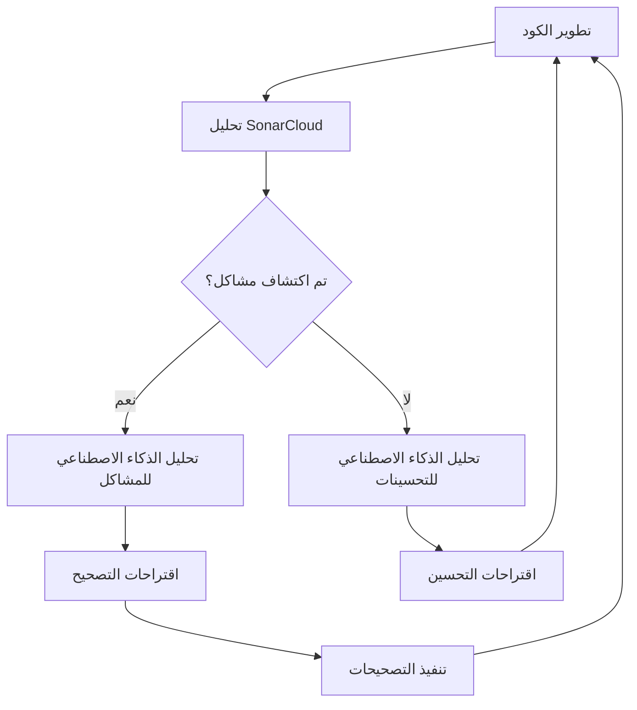

# تكامل SonarCloud والذكاء الاصطناعي

*[English](../../en/technical/sonarcloud-integration.md) | [中文](../../zh/technical/sonarcloud-integration.md) | [Français](../../fr/technical/sonarcloud-integration.md) | [Español](../../es/technical/sonarcloud-integration.md) | العربية | [Русский](../../ru/technical/sonarcloud-integration.md)*

يشرح هذا المستند كيفية استخدام MCP Database Utilities لـ SonarCloud لتحليل الكود وكيفية دمج الذكاء الاصطناعي في هذه العملية لتحسين جودة الكود.

## مقدمة إلى SonarCloud

[SonarCloud](https://sonarcloud.io/) هي منصة تحليل كود عبر الإنترنت تساعد المطورين على اكتشاف الأخطاء والثغرات و"روائح الكود" في الكود الخاص بهم. وهي تدعم العديد من لغات البرمجة، بما في ذلك Python، وتتكامل بسهولة مع سير عمل CI/CD.

## تكوين SonarCloud لـ MCP Database Utilities

### تكامل GitHub

يستخدم MCP Database Utilities SonarCloud من خلال تكامله مع GitHub:

1. تم تكوين المشروع على SonarCloud مع منظمة `donghao1393`
2. يتم تشغيل التحليل تلقائيًا مع كل دفع أو طلب سحب
3. تظهر النتائج على لوحة معلومات SonarCloud وفي طلبات السحب على GitHub

### تكوين المشروع

يتم تحديد تكوين SonarCloud في ملف `sonar-project.properties`:

```properties
# معرف المشروع والمنظمة
sonar.projectKey=donghao1393_mcp-dbutils
sonar.organization=donghao1393

# معلومات المشروع
sonar.projectName=MCP Database Utilities
sonar.projectVersion=1.0

# المسار إلى المصادر
sonar.sources=mcp_dbutils
sonar.python.coverage.reportPaths=coverage.xml
sonar.python.xunit.reportPath=test-results.xml

# الاستثناءات
sonar.exclusions=tests/**/*,docs/**/*,examples/**/*

# ترميز المصدر
sonar.sourceEncoding=UTF-8
```

### سير عمل GitHub Actions

يتم تنفيذ تحليل SonarCloud عبر GitHub Actions:

```yaml
# .github/workflows/sonarcloud.yml
name: SonarCloud Analysis

on:
  push:
    branches: [ main ]
  pull_request:
    branches: [ main ]

jobs:
  sonarcloud:
    name: SonarCloud
    runs-on: ubuntu-latest
    steps:
      - uses: actions/checkout@v3
        with:
          fetch-depth: 0  # يجب تعطيل الاستنساخ السطحي لتحسين الصلة
      
      - name: Set up Python
        uses: actions/setup-python@v4
        with:
          python-version: '3.10'
      
      - name: Install dependencies
        run: |
          python -m pip install --upgrade pip
          pip install -e ".[dev,test]"
      
      - name: Run tests with coverage
        run: |
          pytest --cov=mcp_dbutils --cov-report=xml --junitxml=test-results.xml
      
      - name: SonarCloud Scan
        uses: SonarSource/sonarcloud-github-action@master
        env:
          GITHUB_TOKEN: ${{ secrets.GITHUB_TOKEN }}
          SONAR_TOKEN: ${{ secrets.SONAR_TOKEN }}
```

## المقاييس المراقبة

يراقب SonarCloud عدة مقاييس رئيسية لـ MCP Database Utilities:

### 1. جودة الكود

- **الأخطاء**: مشاكل في الكود يمكن أن تسبب سلوكًا غير صحيح
- **الثغرات**: نقاط ضعف أمنية محتملة
- **روائح الكود**: مشاكل قابلية الصيانة التي تجعل الكود صعب الفهم أو التعديل
- **الدين التقني**: تقدير الوقت اللازم لإصلاح جميع روائح الكود

### 2. تغطية الاختبار

- **تغطية السطر**: نسبة أسطر الكود التي تم تنفيذها بواسطة الاختبارات
- **تغطية الفرع**: نسبة فروع الكود (if/else، إلخ) التي تم تنفيذها بواسطة الاختبارات
- **تغطية الشرط**: نسبة الشروط المنطقية التي تم اختبارها

### 3. التكرار

- **الأسطر المكررة**: نسبة الكود المكرر في المشروع
- **الكتل المكررة**: عدد كتل الكود المكررة

### 4. التعقيد

- **التعقيد الدوري**: قياس لتعقيد الكود بناءً على عدد مسارات التنفيذ
- **التعقيد المعرفي**: قياس لصعوبة فهم الكود

## دمج الذكاء الاصطناعي في تحليل الكود

يستخدم MCP Database Utilities الذكاء الاصطناعي لتحسين تحليل الكود بعدة طرق:

### 1. التحليل التلقائي لطلبات السحب

عندما يتم إنشاء طلب سحب، يقوم روبوت الذكاء الاصطناعي بتحليل نتائج SonarCloud وتقديم تعليقات:

```python
def analyze_sonarcloud_results(pr_number):
    """تحليل نتائج SonarCloud لطلب سحب وإضافة تعليقات."""
    # الحصول على نتائج SonarCloud
    results = get_sonarcloud_results(pr_number)
    
    # تحليل النتائج باستخدام الذكاء الاصطناعي
    analysis = ai_analyze_results(results)
    
    # إضافة تعليقات إلى طلب السحب
    add_pr_comments(pr_number, analysis)
```

يمكن لروبوت الذكاء الاصطناعي:
- شرح المشاكل المكتشفة بلغة طبيعية
- اقتراح تصحيحات للمشاكل الشائعة
- تحديد الأنماط المتكررة في المشاكل
- ترتيب المشاكل حسب تأثيرها

### 2. اقتراحات إعادة الهيكلة

يمكن للذكاء الاصطناعي اقتراح إعادة هيكلة لتحسين جودة الكود:

```python
def suggest_refactoring(file_path, code_smells):
    """اقتراح إعادة هيكلة لحل روائح الكود."""
    # قراءة الملف
    with open(file_path, 'r') as f:
        code = f.read()
    
    # إنشاء اقتراحات إعادة هيكلة باستخدام الذكاء الاصطناعي
    suggestions = ai_generate_refactoring_suggestions(code, code_smells)
    
    return suggestions
```

أمثلة على الاقتراحات:
- استخراج طرق لتقليل التعقيد
- إعادة تسمية المتغيرات لتحسين القابلية للقراءة
- إعادة هيكلة الكود لإزالة التكرار
- تطبيق أنماط تصميم مناسبة

### 3. تحليل الاتجاهات

يحلل الذكاء الاصطناعي اتجاهات جودة الكود بمرور الوقت:

```python
def analyze_quality_trends():
    """تحليل اتجاهات جودة الكود بمرور الوقت."""
    # الحصول على سجل المقاييس
    metrics_history = get_metrics_history()
    
    # تحليل الاتجاهات باستخدام الذكاء الاصطناعي
    trends_analysis = ai_analyze_trends(metrics_history)
    
    return trends_analysis
```

يمكن لهذا التحليل:
- تحديد الاتجاهات الإيجابية أو السلبية
- ربط تغييرات الجودة بأحداث المشروع
- التنبؤ بالمشاكل المحتملة المستقبلية
- التوصية بمجالات التحسين

### 4. إنشاء الاختبارات

يمكن للذكاء الاصطناعي إنشاء اختبارات لتحسين التغطية:

```python
def generate_tests(file_path, coverage_gaps):
    """إنشاء اختبارات لسد فجوات التغطية."""
    # قراءة الملف
    with open(file_path, 'r') as f:
        code = f.read()
    
    # إنشاء اختبارات باستخدام الذكاء الاصطناعي
    tests = ai_generate_tests(code, coverage_gaps)
    
    return tests
```

الاختبارات المنشأة:
- تستهدف تحديدًا أجزاء الكود غير المغطاة
- تتبع اصطلاحات اختبار المشروع
- تتضمن تأكيدات ذات صلة
- مصحوبة بتوثيق

## سير عمل التحسين المستمر

يندرج تكامل SonarCloud والذكاء الاصطناعي ضمن سير عمل التحسين المستمر:



1. **تطوير الكود**: يكتب المطورون أو يعدلون الكود
2. **تحليل SonarCloud**: يتم تحليل الكود تلقائيًا بواسطة SonarCloud
3. **اكتشاف المشاكل**: يحدد SonarCloud المشاكل المحتملة
4. **تحليل الذكاء الاصطناعي**: يحلل الذكاء الاصطناعي المشاكل أو يبحث عن تحسينات
5. **الاقتراحات**: يقدم الذكاء الاصطناعي اقتراحات ملموسة
6. **التنفيذ**: ينفذ المطورون التصحيحات أو التحسينات
7. **الدورة المستمرة**: تتكرر العملية للتحسين المستمر

## أمثلة ملموسة

### مثال 1: تصحيح خطأ مكتشف

**مشكلة اكتشفها SonarCloud**:
```
Bug: "TypeError" will be raised when calling "execute_query" with None as "query" parameter.
```

**تحليل الذكاء الاصطناعي**:
```
يحدث هذا الخطأ لأن طريقة execute_query() ليس لديها تحقق للمعلمة query.
إذا تم تمرير None، سيتم رفع TypeError عند استدعاء query.strip().
```

**اقتراح التصحيح**:
```python
# قبل
def execute_query(self, query):
    """تنفيذ استعلام SQL."""
    query = query.strip()
    # ...

# بعد
def execute_query(self, query):
    """تنفيذ استعلام SQL."""
    if query is None:
        raise ValueError("لا يمكن أن يكون الاستعلام None")
    query = query.strip()
    # ...
```

### مثال 2: تقليل التعقيد

**مشكلة اكتشفها SonarCloud**:
```
Code Smell: Cognitive Complexity of function "parse_config" is 25 which is greater than 15 authorized.
```

**تحليل الذكاء الاصطناعي**:
```
دالة parse_config() معقدة للغاية مع العديد من الشروط المتداخلة.
يمكن تبسيطها باستخراج دوال مساعدة لكل نوع من التكوين.
```

**اقتراح إعادة الهيكلة**:
```python
# قبل
def parse_config(config_dict):
    """تحليل قاموس التكوين."""
    result = {}
    if "connections" in config_dict:
        connections = {}
        for name, conn_config in config_dict["connections"].items():
            if "type" not in conn_config:
                raise ValueError(f"نوع الاتصال مفقود لـ {name}")
            
            conn_type = conn_config["type"]
            if conn_type == "sqlite":
                # منطق خاص بـ SQLite
                if "path" not in conn_config:
                    raise ValueError(f"مسار قاعدة البيانات مفقود لـ {name}")
                # ...
            elif conn_type == "postgres":
                # منطق خاص بـ PostgreSQL
                # ...
            elif conn_type == "mysql":
                # منطق خاص بـ MySQL
                # ...
            else:
                raise ValueError(f"نوع اتصال غير معروف: {conn_type}")
            
            connections[name] = conn_config
        result["connections"] = connections
    # ...
    return result

# بعد
def parse_sqlite_config(name, conn_config):
    """تحليل تكوين SQLite."""
    if "path" not in conn_config:
        raise ValueError(f"مسار قاعدة البيانات مفقود لـ {name}")
    # ...
    return conn_config

def parse_postgres_config(name, conn_config):
    """تحليل تكوين PostgreSQL."""
    # ...
    return conn_config

def parse_mysql_config(name, conn_config):
    """تحليل تكوين MySQL."""
    # ...
    return conn_config

def parse_config(config_dict):
    """تحليل قاموس التكوين."""
    result = {}
    if "connections" in config_dict:
        connections = {}
        for name, conn_config in config_dict["connections"].items():
            if "type" not in conn_config:
                raise ValueError(f"نوع الاتصال مفقود لـ {name}")
            
            conn_type = conn_config["type"]
            if conn_type == "sqlite":
                connections[name] = parse_sqlite_config(name, conn_config)
            elif conn_type == "postgres":
                connections[name] = parse_postgres_config(name, conn_config)
            elif conn_type == "mysql":
                connections[name] = parse_mysql_config(name, conn_config)
            else:
                raise ValueError(f"نوع اتصال غير معروف: {conn_type}")
        
        result["connections"] = connections
    # ...
    return result
```

### مثال 3: تحسين تغطية الاختبار

**مشكلة اكتشفها SonarCloud**:
```
Coverage: Line coverage of file "mcp_dbutils/adapters/mysql.py" is 68.5% which is less than 80% required.
```

**تحليل الذكاء الاصطناعي**:
```
ملف mysql.py يفتقر إلى تغطية الاختبار، خاصة لحالات الخطأ والميزات المتقدمة.
الطرق execute_query() و get_table_stats() لديها تغطية منخفضة بشكل خاص.
```

**اختبارات منشأة بواسطة الذكاء الاصطناعي**:
```python
def test_mysql_adapter_execute_query_error():
    """اختبار أن محول MySQL يتعامل بشكل صحيح مع أخطاء الاستعلام."""
    # إعداد المحاكاة
    mock_connection = MagicMock()
    mock_cursor = MagicMock()
    mock_connection.cursor.return_value = mock_cursor
    mock_cursor.execute.side_effect = pymysql.Error("خطأ اختبار")
    
    # إعداد المحول مع المحاكاة
    adapter = MySQLAdapter({"type": "mysql", "host": "localhost", "database": "test"})
    adapter._connection = mock_connection
    
    # التحقق من أن الخطأ ينتشر بشكل صحيح
    with pytest.raises(DatabaseError):
        adapter.execute_query("SELECT * FROM nonexistent_table")

def test_mysql_adapter_get_table_stats():
    """اختبار طريقة get_table_stats لمحول MySQL."""
    # إعداد المحاكاة
    mock_connection = MagicMock()
    mock_cursor = MagicMock()
    mock_connection.cursor.return_value = mock_cursor
    
    # إعداد النتائج للاستعلامات المختلفة
    mock_cursor.fetchall.side_effect = [
        [(1000,)],  # عدد الصفوف
        [(1024 * 1024,)],  # حجم الجدول
        [("id", "int", "PRI"), ("name", "varchar(100)", "")],  # البنية
        [(10,), (5,)]  # إحصائيات العمود
    ]
    
    # إعداد المحول مع المحاكاة
    adapter = MySQLAdapter({"type": "mysql", "host": "localhost", "database": "test"})
    adapter._connection = mock_connection
    
    # تنفيذ الطريقة
    stats = adapter.get_table_stats("test_table")
    
    # التحقق من النتائج
    assert stats["row_count"] == 1000
    assert stats["size_bytes"] == 1024 * 1024
    assert len(stats["columns"]) == 2
    assert stats["columns"][0]["name"] == "id"
    assert stats["columns"][0]["type"] == "int"
    assert stats["columns"][0]["key"] == "PRI"
```

## شارات SonarCloud

يعرض MCP Database Utilities شارات SonarCloud في ملف README الخاص به لإظهار الحالة الحالية لجودة الكود:

```markdown
[](https://sonarcloud.io/dashboard?id=donghao1393_mcp-dbutils)
[](https://sonarcloud.io/dashboard?id=donghao1393_mcp-dbutils)
[](https://sonarcloud.io/dashboard?id=donghao1393_mcp-dbutils)
[](https://sonarcloud.io/dashboard?id=donghao1393_mcp-dbutils)
[](https://sonarcloud.io/dashboard?id=donghao1393_mcp-dbutils)
```

## الخلاصة

يتيح دمج SonarCloud والذكاء الاصطناعي في عملية تطوير MCP Database Utilities:

1. **الكشف المبكر عن المشاكل**: يتم اكتشاف الأخطاء والثغرات وروائح الكود قبل وصولها إلى الإنتاج
2. **التحسين المستمر**: يتحسن الكود باستمرار بفضل اقتراحات الذكاء الاصطناعي
3. **تقليل الدين التقني**: يتم حل المشاكل بشكل منهجي، مما يقلل الدين التقني
4. **زيادة الجودة**: تتحسن الجودة الإجمالية للكود بمرور الوقت
5. **تعلم المطورين**: يتعلم المطورون من الذكاء الاصطناعي ويحسنون مهاراتهم

يضمن هذا النهج أن MCP Database Utilities يحافظ على مستوى عالٍ من الجودة والأمان وقابلية الصيانة، وهو أمر ضروري لأداة تتفاعل مع قواعد البيانات.
