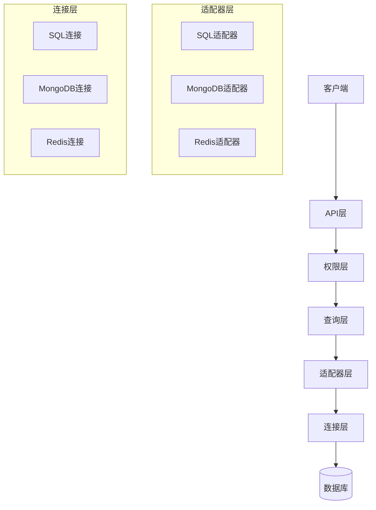
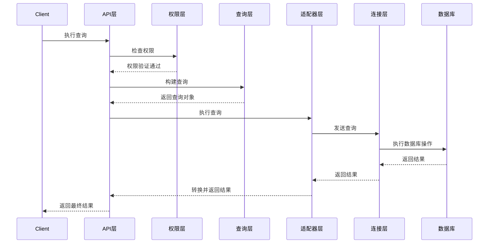
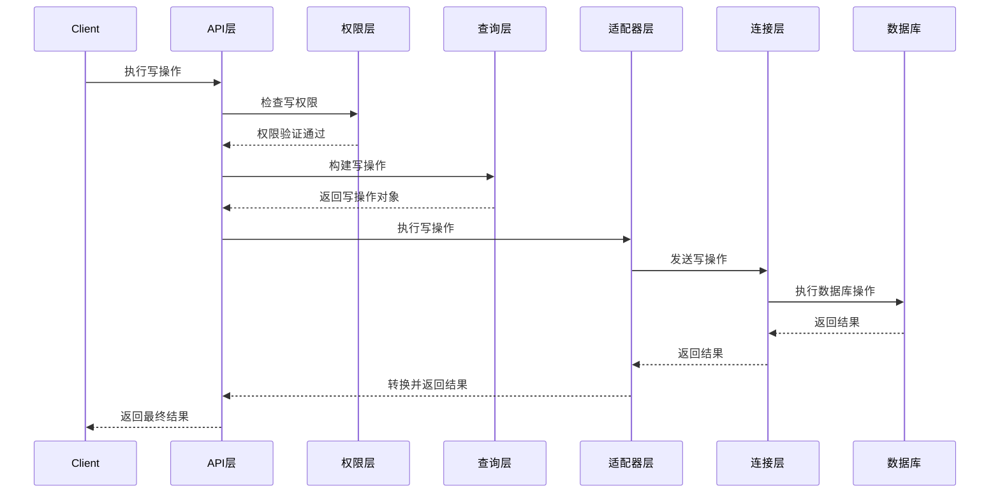

# 多数据库支持架构设计

## 1. 概述

本文档描述了MCP Database Utilities的多数据库支持架构设计，旨在提供一个统一的接口来支持不同类型的数据库，包括关系型数据库（如MySQL、PostgreSQL）和NoSQL数据库（如MongoDB、Redis）。

## 2. 设计目标

- 提供统一的接口，隐藏不同数据库的实现细节
- 支持动态切换数据库类型
- 保持现有功能的兼容性
- 提供灵活的扩展机制，便于添加新的数据库类型
- 维持高性能和可靠性
- 支持统一的权限控制和审计机制

## 3. 架构概览

多数据库支持架构采用分层设计，包括以下几个主要层次：



### 3.1 连接层

连接层负责管理与不同数据库的连接，包括连接池管理、认证和基本连接参数处理。

主要组件：
- `ConnectionFactory`：工厂类，负责创建适当类型的连接
- `BaseConnection`：所有连接类的基类，定义通用接口
- `SQLConnection`：SQL数据库连接类
- `MongoConnection`：MongoDB连接类
- `RedisConnection`：Redis连接类

### 3.2 适配器层

适配器层为每种数据库类型提供一个适配器，实现统一的接口，将通用操作转换为特定数据库的操作。

主要组件：
- `BaseAdapter`：所有适配器的基类，定义通用接口
- `SQLAdapter`：SQL数据库适配器
- `MongoAdapter`：MongoDB适配器
- `RedisAdapter`：Redis适配器

### 3.3 查询层

查询层提供统一的查询构建API，将通用查询转换为特定数据库的查询语言。

主要组件：
- `QueryBuilder`：查询构建器基类
- `SQLQueryBuilder`：SQL查询构建器
- `MongoQueryBuilder`：MongoDB查询构建器
- `RedisCommandBuilder`：Redis命令构建器

### 3.4 权限层

权限层负责统一的权限检查和控制，确保操作符合权限规则。

主要组件：
- `PermissionChecker`：权限检查器
- `OperationValidator`：操作验证器
- `AuditLogger`：审计日志记录器

### 3.5 API层

API层提供统一的对外接口，是客户端与数据库交互的入口点。

主要组件：
- `DatabaseClient`：统一的客户端接口
- `ConnectionManager`：连接管理器
- `TransactionManager`：事务管理器

## 4. 关键接口设计

### 4.1 BaseConnection接口

```python
class BaseConnection:
    """所有数据库连接的基类"""
    
    def connect(self):
        """建立连接"""
        pass
        
    def disconnect(self):
        """断开连接"""
        pass
        
    def is_connected(self):
        """检查连接状态"""
        pass
        
    def execute(self, query, params=None):
        """执行查询"""
        pass
        
    def begin_transaction(self):
        """开始事务"""
        pass
        
    def commit(self):
        """提交事务"""
        pass
        
    def rollback(self):
        """回滚事务"""
        pass
```

### 4.2 BaseAdapter接口

```python
class BaseAdapter:
    """所有数据库适配器的基类"""
    
    def __init__(self, connection):
        """初始化适配器"""
        self.connection = connection
        
    def execute_query(self, query, params=None):
        """执行查询"""
        pass
        
    def execute_write(self, query, params=None):
        """执行写操作"""
        pass
        
    def list_resources(self):
        """列出资源（表/集合/键）"""
        pass
        
    def describe_resource(self, resource_name):
        """描述资源结构"""
        pass
        
    def get_resource_stats(self, resource_name):
        """获取资源统计信息"""
        pass
        
    def extract_resource_name(self, query):
        """从查询中提取资源名称"""
        pass
```

### 4.3 QueryBuilder接口

```python
class QueryBuilder:
    """查询构建器基类"""
    
    def select(self, resource_name, fields=None):
        """构建选择查询"""
        pass
        
    def insert(self, resource_name, data):
        """构建插入查询"""
        pass
        
    def update(self, resource_name, data, condition):
        """构建更新查询"""
        pass
        
    def delete(self, resource_name, condition):
        """构建删除查询"""
        pass
        
    def build(self):
        """构建最终查询"""
        pass
```

### 4.4 PermissionChecker接口

```python
class PermissionChecker:
    """权限检查器"""
    
    def check_permission(self, connection_name, resource_name, operation_type):
        """检查权限"""
        pass
        
    def get_allowed_operations(self, connection_name, resource_name):
        """获取允许的操作"""
        pass
```

## 5. 数据流

以下是典型操作的数据流：

### 5.1 读操作



### 5.2 写操作



## 6. 资源命名和操作类型统一

### 6.1 资源命名

不同数据库使用不同的术语来表示数据存储单元：

| 数据库类型 | 资源类型 |
|----------|---------|
| SQL      | 表（Table） |
| MongoDB  | 集合（Collection） |
| Redis    | 键（Key） |

为了统一这些概念，我们将使用"资源"（Resource）作为通用术语，并在适配器层进行适当的转换。

### 6.2 操作类型统一

不同数据库支持不同的操作类型，我们将定义一组通用的操作类型：

| 通用操作类型 | SQL等价操作 | MongoDB等价操作 | Redis等价操作 |
|------------|-----------|--------------|-------------|
| READ       | SELECT    | find         | GET, HGET等 |
| INSERT     | INSERT    | insertOne    | SET, HSET等 |
| UPDATE     | UPDATE    | updateOne    | SET, HSET等 |
| DELETE     | DELETE    | deleteOne    | DEL, HDEL等 |

## 7. 错误处理和重试机制

### 7.1 错误类型统一

不同数据库产生不同类型的错误，我们将定义一组通用的错误类型：

- `ConnectionError`：连接错误
- `AuthenticationError`：认证错误
- `ResourceNotFoundError`：资源不存在
- `DuplicateKeyError`：重复键错误
- `PermissionError`：权限错误
- `QueryError`：查询错误
- `TransactionError`：事务错误

### 7.2 重试机制

对于临时性错误（如连接超时），我们将实现统一的重试机制：

- 指数退避算法
- 可配置的最大重试次数
- 可配置的重试间隔
- 特定错误类型的重试策略

## 8. 配置管理

配置文件将扩展以支持多数据库类型：

```yaml
connections:
  mysql_conn:
    type: mysql
    host: localhost
    port: 3306
    database: test_db
    username: user
    password: pass
    writable: true
    write_permissions:
      default_policy: read_only
      tables:
        users:
          operations: [INSERT, UPDATE]
  
  mongo_conn:
    type: mongodb
    uri: mongodb://localhost:27017
    database: test_db
    writable: true
    write_permissions:
      default_policy: read_only
      collections:
        users:
          operations: [INSERT, UPDATE]
  
  redis_conn:
    type: redis
    host: localhost
    port: 6379
    database: 0
    writable: true
    write_permissions:
      default_policy: read_only
      keys:
        user:*:
          operations: [SET, DEL]
```

## 9. 实现计划

多数据库支持架构的实现将分为以下几个阶段：

### 阶段1：基础架构设计和实现

- 设计和实现连接层
- 设计和实现适配器层
- 设计和实现基本的查询层
- 更新配置管理

### 阶段2：SQL数据库支持

- 实现SQL连接和适配器
- 实现SQL查询构建器
- 实现SQL权限检查

### 阶段3：MongoDB支持

- 实现MongoDB连接和适配器
- 实现MongoDB查询构建器
- 实现MongoDB权限检查

### 阶段4：Redis支持

- 实现Redis连接和适配器
- 实现Redis命令构建器
- 实现Redis权限检查

### 阶段5：高级功能和优化

- 实现事务支持
- 优化性能
- 完善错误处理和重试机制
- 增强测试覆盖率

## 10. 兼容性考虑

为了保持与现有代码的兼容性，我们将：

- 保持现有API的向后兼容性
- 提供迁移工具和指南
- 在一段时间内同时支持旧API和新API
- 逐步弃用旧API

## 11. 测试策略

测试策略将包括：

- 单元测试：测试各个组件的功能
- 集成测试：测试组件之间的交互
- 端到端测试：测试完整的数据流
- 性能测试：测试系统在不同负载下的性能
- 兼容性测试：测试与不同数据库版本的兼容性

## 12. 文档计划

文档计划将包括：

- 架构设计文档
- API参考文档
- 用户指南
- 迁移指南
- 示例和教程

## 13. 总结

多数据库支持架构将为MCP Database Utilities提供一个灵活、可扩展的基础，支持不同类型的数据库，同时保持统一的接口和一致的用户体验。通过分层设计和适当的抽象，我们可以隔离不同数据库的特性差异，提供统一的接口，同时保持足够的灵活性来支持各种数据库特性。
