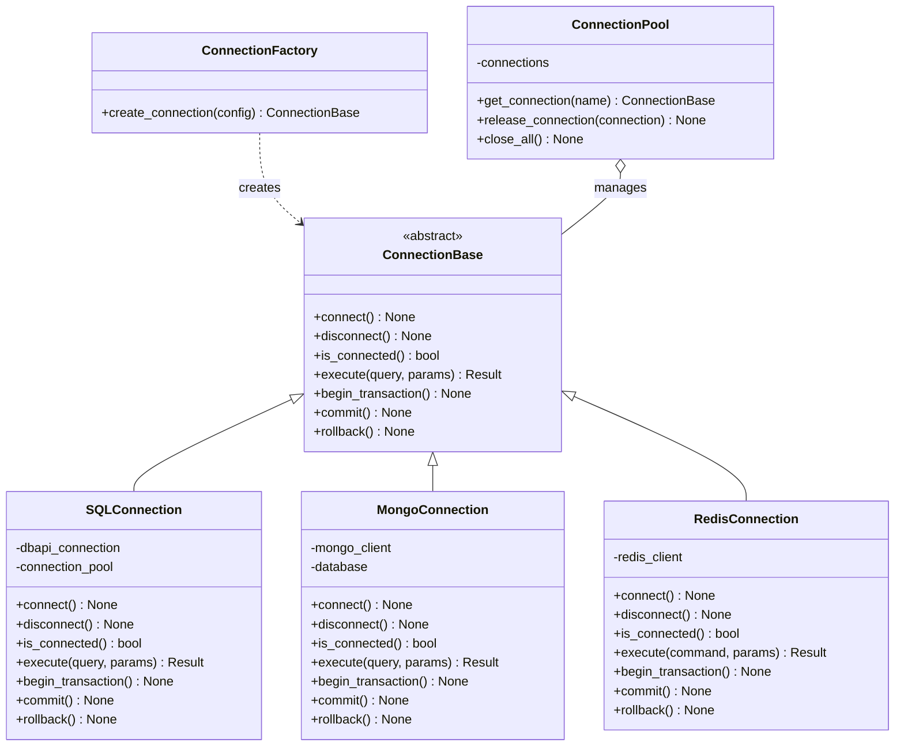
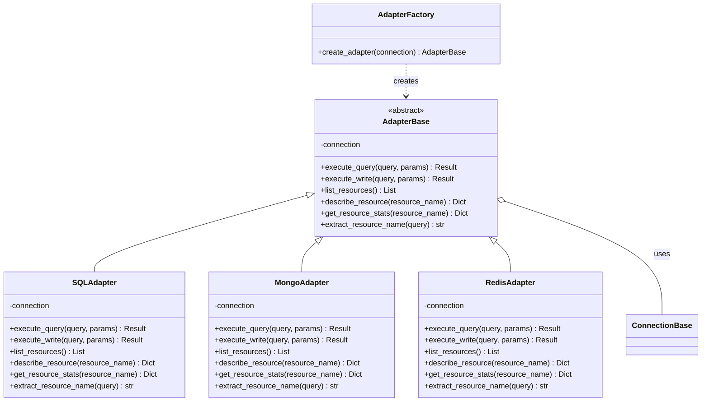
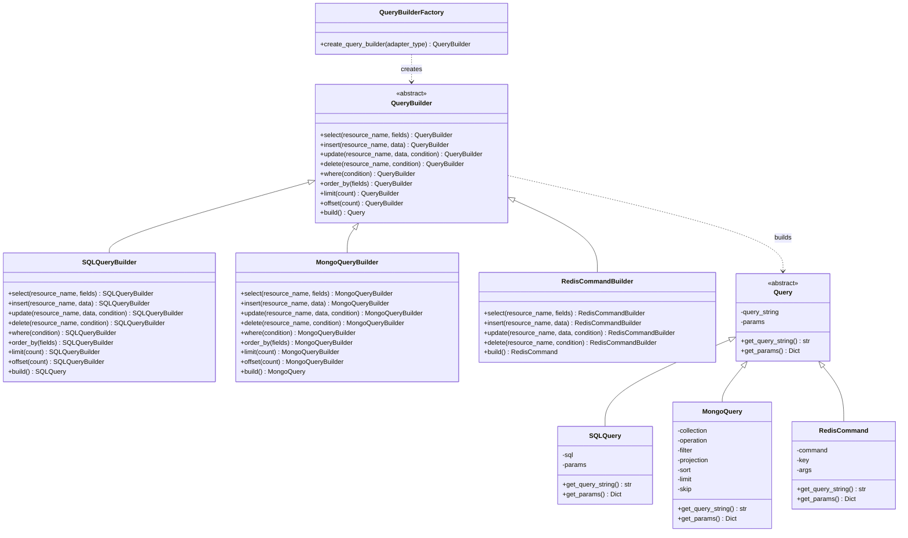
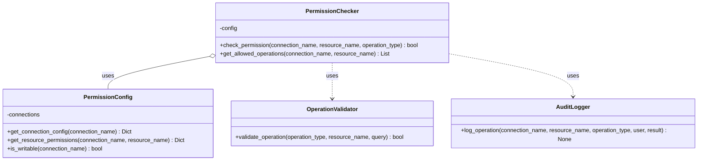
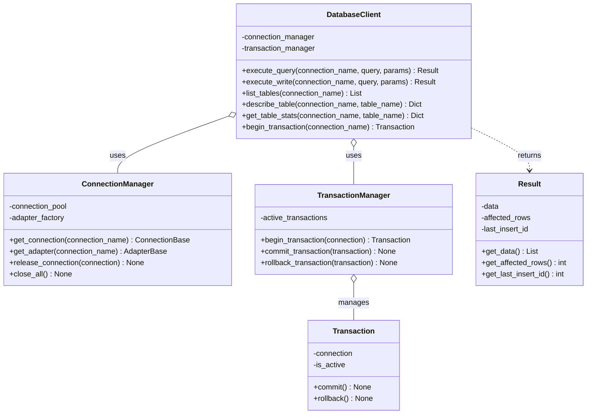
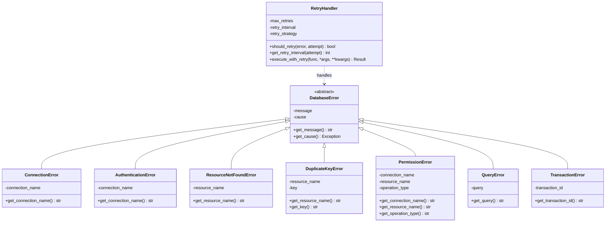
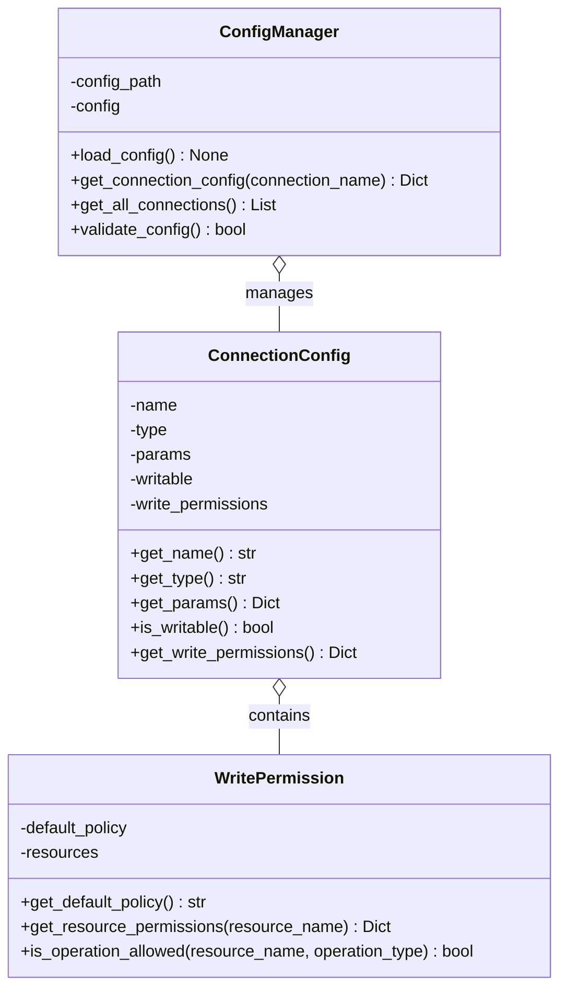
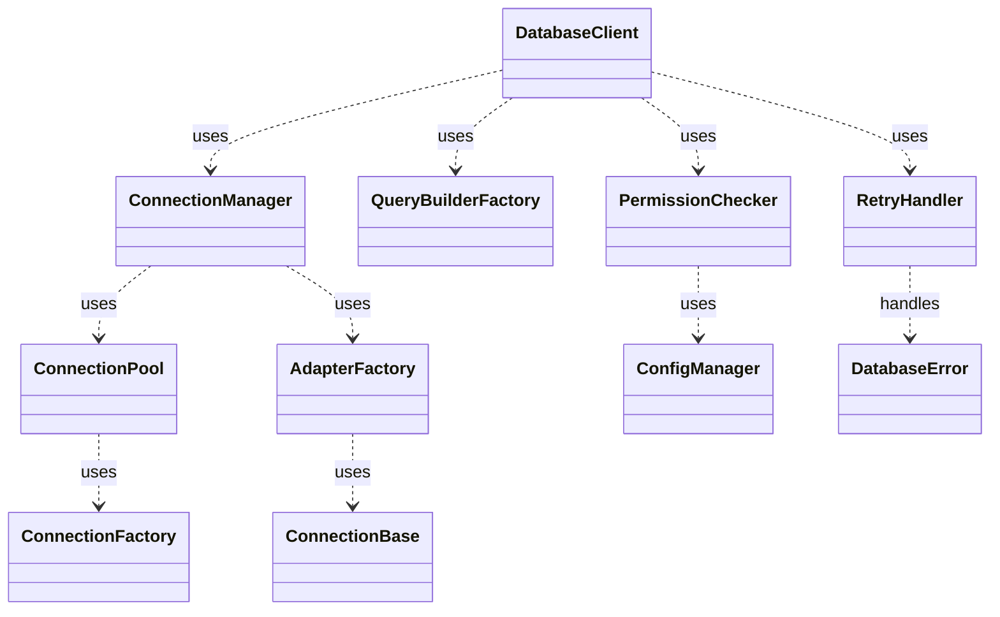

# 多数据库支持架构类图

## 1. 概述

本文档提供了多数据库支持架构的详细类图，展示了各个组件之间的关系和依赖。

## 2. 连接层类图

## 3. 适配器层类图

## 4. 查询层类图

## 5. 权限层类图

## 6. API层类图

## 7. 错误处理类图

## 8. 配置管理类图

## 9. 组件间关系

## 10. 总结

以上类图展示了多数据库支持架构的主要组件和它们之间的关系。这种设计提供了良好的分层和抽象，使得系统可以灵活地支持不同类型的数据库，同时保持统一的接口和一致的用户体验。
