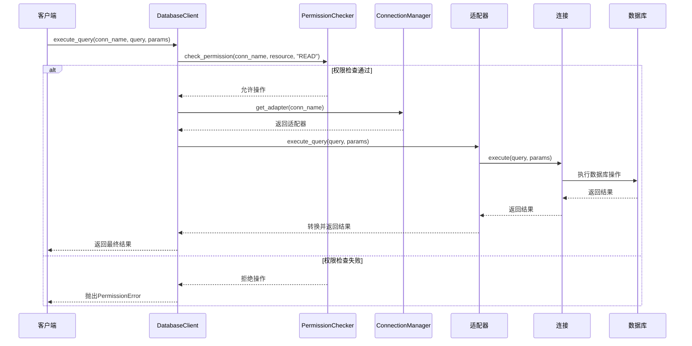
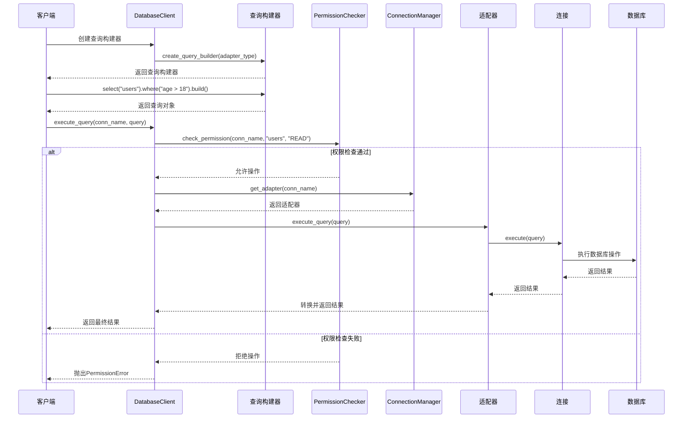
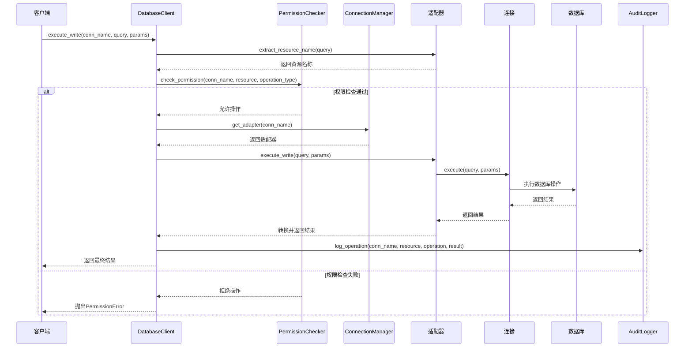
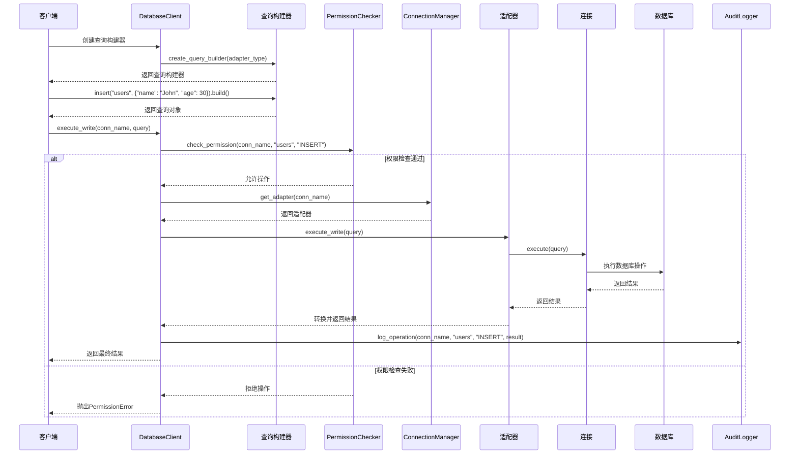
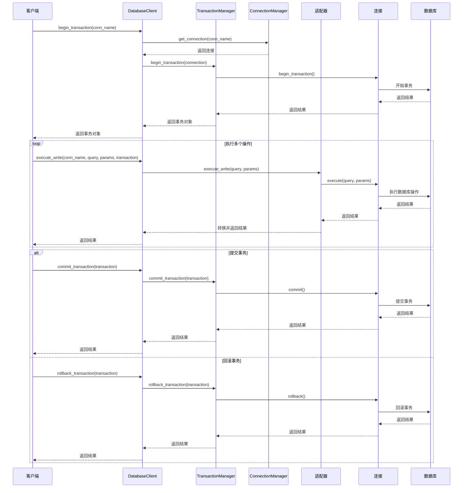
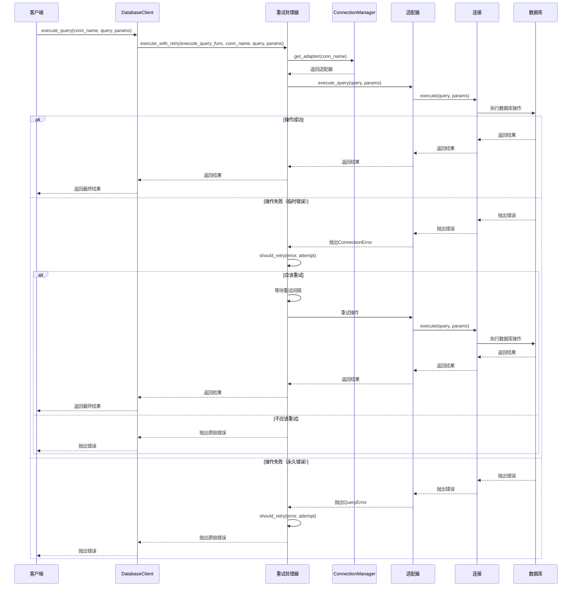
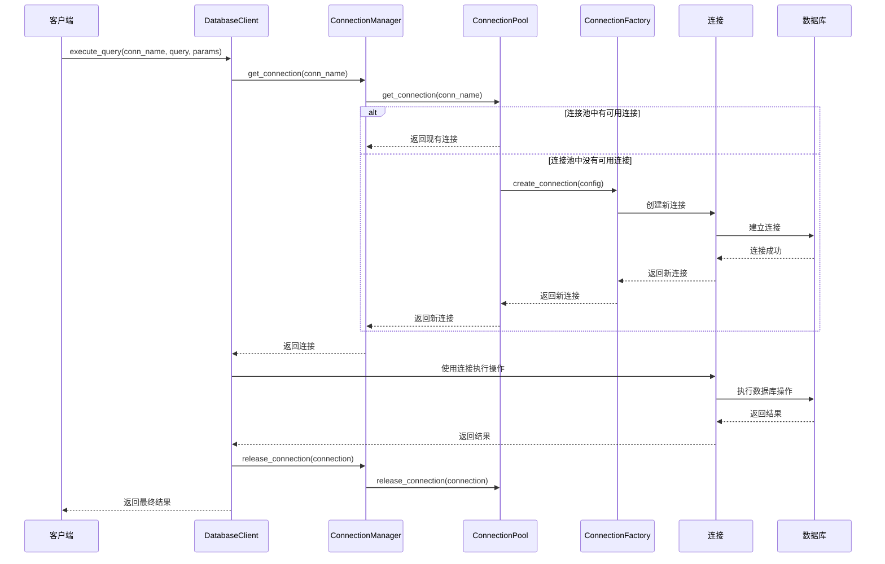
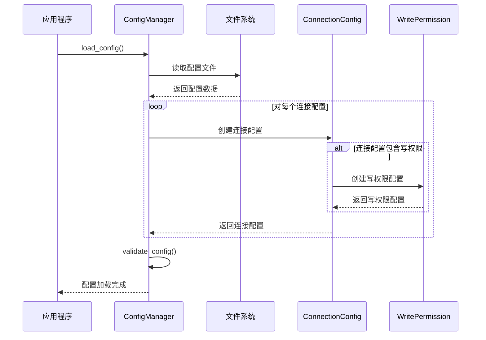
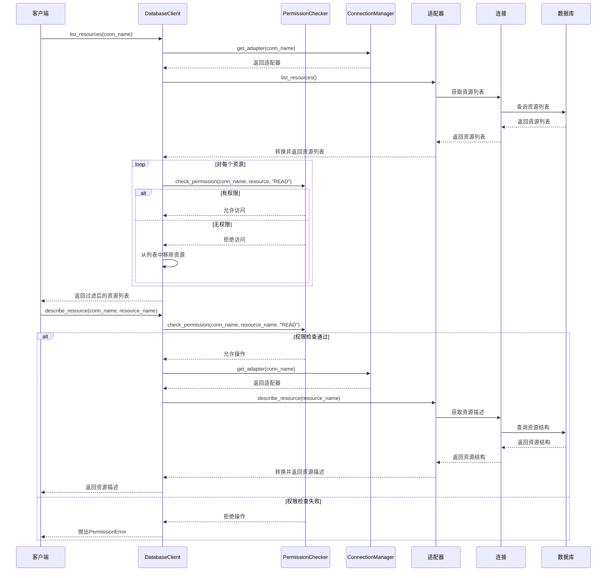

# 多数据库支持架构数据流图

## 1. 概述

本文档提供了多数据库支持架构的详细数据流图，展示了不同操作场景下数据如何在系统各组件之间流动。

## 2. 读操作数据流

### 2.1 基本读操作

### 2.2 使用查询构建器的读操作

## 3. 写操作数据流

### 3.1 基本写操作

### 3.2 使用查询构建器的写操作

## 4. 事务数据流

## 5. 错误处理和重试数据流

## 6. 连接池管理数据流

## 7. 配置加载数据流

## 8. 资源列表和描述数据流

## 9. 总结

以上数据流图展示了多数据库支持架构中不同操作场景下数据如何在系统各组件之间流动。这些数据流图有助于理解系统的运行机制，为实现提供指导。
