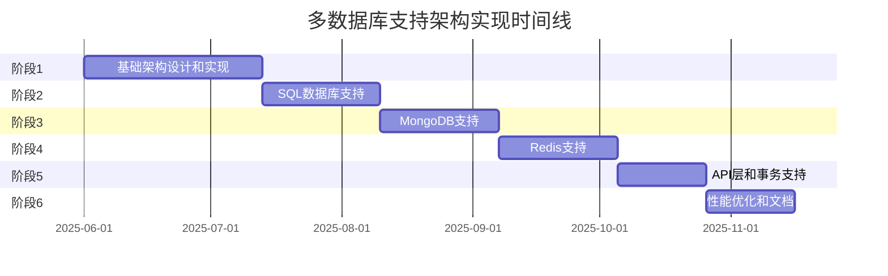

# 多数据库支持架构实现计划

## 1. 概述

本文档提供了多数据库支持架构的详细实现计划，包括各个阶段的任务、时间线和里程碑。

## 2. 实现阶段

多数据库支持架构的实现将分为以下几个阶段：

### 阶段1：基础架构设计和实现（4-6周）

**目标**：设计和实现基础架构，包括连接层、适配器层和基本的查询层。

**任务**：

1. 设计和实现连接层
   - 实现 `ConnectionBase` 抽象类
   - 实现 `ConnectionFactory` 类
   - 实现 `ConnectionPool` 类

2. 设计和实现适配器层
   - 实现 `AdapterBase` 抽象类
   - 实现 `AdapterFactory` 类

3. 设计和实现基本的查询层
   - 实现 `QueryBuilder` 抽象类
   - 实现 `Query` 抽象类
   - 实现 `QueryBuilderFactory` 类

4. 更新配置管理
   - 实现 `ConfigManager` 类
   - 实现 `ConnectionConfig` 类
   - 实现 `WritePermission` 类

5. 设计和实现错误处理机制
   - 实现 `DatabaseError` 抽象类及其子类
   - 实现 `RetryHandler` 类

**里程碑**：
- 基础架构设计完成
- 连接层实现完成
- 适配器层实现完成
- 基本查询层实现完成
- 配置管理更新完成
- 错误处理机制实现完成

### 阶段2：SQL数据库支持（3-4周）

**目标**：实现SQL数据库支持，包括连接、适配器、查询构建器和权限检查。

**任务**：

1. 实现SQL连接
   - 实现 `SQLConnection` 类
   - 实现连接池管理

2. 实现SQL适配器
   - 实现 `SQLAdapter` 类
   - 实现资源列表和描述功能
   - 实现查询执行功能

3. 实现SQL查询构建器
   - 实现 `SQLQueryBuilder` 类
   - 实现 `SQLQuery` 类
   - 实现各种SQL操作的构建

4. 实现SQL权限检查
   - 实现 `PermissionChecker` 类
   - 实现 `OperationValidator` 类
   - 实现 `AuditLogger` 类

5. 编写单元测试和集成测试

**里程碑**：
- SQL连接实现完成
- SQL适配器实现完成
- SQL查询构建器实现完成
- SQL权限检查实现完成
- 测试覆盖率达到80%以上

### 阶段3：MongoDB支持（3-4周）

**目标**：实现MongoDB支持，包括连接、适配器、查询构建器和权限检查。

**任务**：

1. 实现MongoDB连接
   - 实现 `MongoConnection` 类
   - 实现连接池管理

2. 实现MongoDB适配器
   - 实现 `MongoAdapter` 类
   - 实现集合列表和描述功能
   - 实现查询执行功能

3. 实现MongoDB查询构建器
   - 实现 `MongoQueryBuilder` 类
   - 实现 `MongoQuery` 类
   - 实现各种MongoDB操作的构建

4. 更新权限检查以支持MongoDB
   - 扩展 `PermissionChecker` 类
   - 扩展 `OperationValidator` 类
   - 更新 `AuditLogger` 类

5. 编写单元测试和集成测试

**里程碑**：
- MongoDB连接实现完成
- MongoDB适配器实现完成
- MongoDB查询构建器实现完成
- MongoDB权限检查实现完成
- 测试覆盖率达到80%以上

### 阶段4：Redis支持（3-4周）

**目标**：实现Redis支持，包括连接、适配器、命令构建器和权限检查。

**任务**：

1. 实现Redis连接
   - 实现 `RedisConnection` 类
   - 实现连接池管理

2. 实现Redis适配器
   - 实现 `RedisAdapter` 类
   - 实现键列表和描述功能
   - 实现命令执行功能

3. 实现Redis命令构建器
   - 实现 `RedisCommandBuilder` 类
   - 实现 `RedisCommand` 类
   - 实现各种Redis操作的构建

4. 更新权限检查以支持Redis
   - 扩展 `PermissionChecker` 类
   - 扩展 `OperationValidator` 类
   - 更新 `AuditLogger` 类

5. 编写单元测试和集成测试

**里程碑**：
- Redis连接实现完成
- Redis适配器实现完成
- Redis命令构建器实现完成
- Redis权限检查实现完成
- 测试覆盖率达到80%以上

### 阶段5：API层和事务支持（2-3周）

**目标**：实现统一的API层和事务支持。

**任务**：

1. 实现API层
   - 实现 `DatabaseClient` 类
   - 实现 `ConnectionManager` 类
   - 实现 `Result` 类

2. 实现事务支持
   - 实现 `TransactionManager` 类
   - 实现 `Transaction` 类
   - 实现各数据库类型的事务支持

3. 编写单元测试和集成测试

**里程碑**：
- API层实现完成
- 事务支持实现完成
- 测试覆盖率达到80%以上

### 阶段6：性能优化和文档（2-3周）

**目标**：优化性能，完善文档和示例。

**任务**：

1. 性能优化
   - 优化连接池管理
   - 优化查询执行
   - 优化内存使用

2. 完善文档
   - 编写架构文档
   - 编写API参考文档
   - 编写用户指南
   - 编写迁移指南

3. 创建示例和教程
   - 创建基本使用示例
   - 创建高级功能示例
   - 创建迁移示例

4. 进行性能测试和基准测试

**里程碑**：
- 性能优化完成
- 文档完善
- 示例和教程创建完成
- 性能测试和基准测试完成

## 3. 时间线

以下是多数据库支持架构实现的大致时间线：

## 4. 资源需求

### 4.1 人力资源

- 1名架构师：负责整体架构设计和技术决策
- 2-3名高级开发人员：负责核心组件的实现
- 1-2名测试人员：负责测试用例编写和测试执行
- 1名文档编写人员：负责文档编写和维护

### 4.2 技术资源

- 开发环境：Python 3.7+
- 测试环境：
  - MySQL/PostgreSQL数据库
  - MongoDB数据库
  - Redis服务器
- CI/CD环境：用于自动化测试和部署

## 5. 风险和缓解措施

| 风险 | 影响 | 可能性 | 缓解措施 |
|-----|-----|-------|---------|
| 不同数据库概念差异过大，难以统一 | 高 | 中 | 设计灵活的抽象层，允许特定数据库的特性透过抽象层暴露 |
| 抽象层引入性能开销 | 中 | 高 | 进行性能测试，优化关键路径，提供直接访问数据库的选项 |
| 事务支持在不同数据库中差异大 | 高 | 高 | 为不同数据库类型设计不同的事务实现，明确文档说明限制 |
| 测试覆盖不足，导致潜在bug | 高 | 中 | 制定严格的测试计划，确保高测试覆盖率，进行自动化测试 |
| 文档不完善，用户难以使用 | 中 | 中 | 同步编写文档，创建详细的示例和教程 |

## 6. 测试策略

### 6.1 单元测试

- 为每个组件编写单元测试
- 使用模拟对象隔离依赖
- 测试各种正常和异常情况
- 目标测试覆盖率：90%+

### 6.2 集成测试

- 测试组件之间的交互
- 使用内存数据库或容器化数据库进行测试
- 测试各种配置组合
- 目标测试覆盖率：80%+

### 6.3 端到端测试

- 测试完整的数据流
- 使用真实数据库进行测试
- 测试各种操作场景
- 目标测试覆盖率：70%+

### 6.4 性能测试

- 测试系统在不同负载下的性能
- 比较抽象层与直接访问的性能差异
- 识别和优化性能瓶颈
- 建立性能基准

### 6.5 兼容性测试

- 测试与不同数据库版本的兼容性
- 测试与不同Python版本的兼容性
- 测试与现有代码的兼容性

## 7. 文档计划

### 7.1 架构文档

- 架构概览
- 组件详细设计
- 数据流图
- 类图
- 配置说明

### 7.2 API参考文档

- 类和方法详细说明
- 参数和返回值说明
- 异常说明
- 代码示例

### 7.3 用户指南

- 安装和配置
- 基本使用
- 高级功能
- 最佳实践
- 常见问题解答

### 7.4 迁移指南

- 从旧版本迁移
- 迁移步骤
- 兼容性注意事项
- 迁移工具使用

### 7.5 示例和教程

- 基本使用示例
- 高级功能示例
- 特定数据库类型示例
- 完整应用示例

## 8. 兼容性和迁移

为了保持与现有代码的兼容性，我们将：

1. 保持现有API的向后兼容性
   - 现有的方法签名不变
   - 新功能通过新方法或可选参数添加

2. 提供迁移工具和指南
   - 创建迁移脚本
   - 提供详细的迁移文档

3. 在一段时间内同时支持旧API和新API
   - 旧API标记为弃用
   - 提供明确的迁移路径

4. 逐步弃用旧API
   - 在新版本中发出弃用警告
   - 在未来版本中移除弃用的API

## 9. 总结

多数据库支持架构的实现是一个复杂但可行的项目，通过分阶段实施，我们可以逐步构建一个灵活、可扩展的系统，支持不同类型的数据库，同时保持统一的接口和一致的用户体验。本实现计划提供了详细的任务、时间线和资源需求，为项目的成功实施提供了指导。
