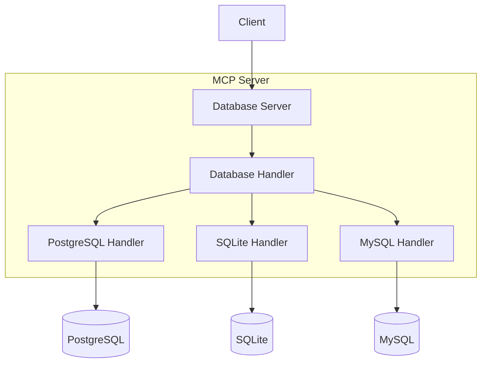

# Architecture

*English | [中文](../../zh/technical/architecture.md) | [Français](../../fr/technical/architecture.md) | [Español](../../es/technical/architecture.md) | [العربية](../../ar/technical/architecture.md) | [Русский](../../ru/technical/architecture.md)*

This document describes the technical architecture of MCP Database Utilities, explaining how the various components interact to provide secure database access for AI assistants.

## Architecture Overview

MCP Database Utilities is designed with a modular architecture that prioritizes security, isolation, and flexibility. The system consists of several distinct layers that work together to provide secure read-only access to databases.

## Core Concept: Abstraction Layer Design

The abstraction layer design is the core architectural concept of MCP Database Utilities. Like a universal remote control that can operate different devices, users only need to understand basic operations without dealing with underlying complexity.

### 1. Simplified User Interaction
- Users only need to know the database configuration name (e.g., "my_postgres")
- No need to handle connection parameters and implementation details
- MCP server automatically handles database connections and queries

### 2. Unified Interface Design
- DatabaseHandler abstract class defines a unified operation interface
- All specific database implementations (PostgreSQL/SQLite/MySQL) follow the same interface
- Users interact with different databases in the same way

### 3. Configuration and Implementation Separation
- Complex database configuration parameters are encapsulated in the configuration file
- Runtime access through simple database names
- Can easily manage and modify database configurations without affecting business code

## System Components
1. DatabaseServer
   - Core component of the MCP server
   - Handles resource and tool requests
   - Manages database connection lifecycle

2. DatabaseHandler
   - Abstract base class defining unified interface
   - Includes methods like get_tables(), get_schema(), execute_query()
   - Implemented by PostgreSQL, SQLite, and MySQL handlers

3. Configuration System
   - YAML-based configuration file
   - Support for multiple database configurations
   - Type-safe configuration validation

4. Error Handling and Logging
   - Unified error handling mechanism
   - Detailed log output
   - Sensitive information masking

## API Documentation

### DatabaseServer
Core server class providing:
- Resource list retrieval
- Tool call handling (list_tables, query, etc.)
- Database handler management

### MCP Tools

#### dbutils-list-tables
Lists all tables in the specified database.
- Parameters:
  * connection: Database connection name
- Returns: Text content containing list of table names

#### dbutils-run-query
Executes SQL query on the specified database.
- Parameters:
  * connection: Database connection name
  * sql: SQL query to execute (SELECT only)
- Returns: Query results in formatted text form

#### dbutils-get-stats
Gets table statistics.
- Parameters:
  * connection: Database connection name
  * table: Table name
- Returns: Statistics including row count, size, column statistics, etc.

#### dbutils-list-constraints
Lists table constraints (primary keys, foreign keys, etc.).
- Parameters:
  * connection: Database connection name
  * table: Table name
- Returns: Detailed constraint information

#### dbutils-explain-query
Gets query execution plan and cost estimates.
- Parameters:
  * connection: Database connection name
  * sql: SQL query to explain
- Returns: Formatted execution plan

#### dbutils-get-performance
Gets database performance statistics.
- Parameters:
  * connection: Database connection name
- Returns: Detailed performance statistics including query time, query types, error rates, and resource usage

#### dbutils-analyze-query
Analyzes SQL query performance and provides optimization suggestions.
- Parameters:
  * connection: Database connection name
  * sql: SQL query to analyze
- Returns: Query analysis including execution plan, timing information, and optimization suggestions

### DatabaseHandler
Abstract base class defining the interface:
- get_tables(): Get table resource list
- get_schema(): Get table structure
- execute_query(): Execute SQL query
- cleanup(): Resource cleanup

### PostgreSQL Implementation
Provides PostgreSQL-specific functionality:
- Remote connection support
- Table description information
- Constraint querying

### SQLite Implementation
Provides SQLite-specific functionality:
- File path handling
- URI scheme support
- Password protection support (optional)

### MySQL Implementation
Provides MySQL-specific functionality:
- Remote connection support
- Character set configuration
- SSL/TLS secure connections
- URL and standard connection methods

## Advanced Features

### Data Processors

Data processors are responsible for post-processing database query results, providing readable formats, and supporting various output options:

- Tabular format data
- Tree-structured data hierarchies
- Special resource type handling (binary data, images, etc.)

### Tool Definitions

MCP tools are defined in the `src/mcp_dbutils/tools.py` file, including:

- `list_resources`: List database resources
- `read_resource`: Read single table or view content
- `call_tool`: Execute custom SQL queries
- `get_schema`: Get table or view structure
- `get_info`: Get detailed resource information