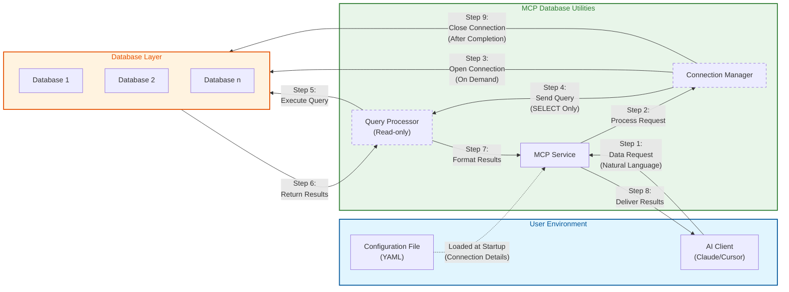

# Security Architecture

*English | [中文](../../zh/technical/security.md) | [Français](../../fr/technical/security.md) | [Español](../../es/technical/security.md) | [العربية](../../ar/technical/security.md) | [Русский](../../ru/technical/security.md)*

## Communication Pattern and Security Architecture

MCP Database Utilities implements a secure communication pattern designed to protect your data at every step. The following diagram illustrates how data flows between components while maintaining security:



## Core Security Features

1. **Isolated Access Flow**:
   - Your AI client never directly accesses your databases
   - All requests pass through the controlled MCP service environment

2. **Temporary Connections**:
   - Database connections are established only when needed
   - Connections are closed immediately after query execution
   - No persistent connections that could be exploited

3. **Read-Only Operations**:
   - Query processor enforces strict SELECT-only operations
   - No possibility of data modification (no INSERT, UPDATE, DELETE)

4. **Configuration Separation**:
   - Connection details are isolated in a separate configuration file
   - Credentials are never exposed to the AI model

5. **Multi-Database Support**:
   - Each database connection is managed separately
   - Databases are isolated from each other through the connection manager

This architecture ensures that even if you use the tool for multiple databases or purposes, each connection remains secure and isolated, minimizing data exposure.

## Troubleshooting Guide

When using MCP Database Utilities, you may encounter the following common issues. Here's a guide to diagnosing and resolving these problems.

### Connection Issues

1. **Unable to Connect to Database**
   - Confirm that your connection information in the configuration file is correct
   - Verify that your database server is running and accessible
   - Check if network firewalls allow the connection
   - For remote databases, confirm that hostname/IP address and port are correct

2. **Configuration File Errors**
   - Check YAML syntax is correct (indentation, colons, etc.)
   - Confirm all required fields are provided
   - Verify file paths are correct (especially for SQLite database files)

3. **Permission Issues**
   - Ensure the provided database user has SELECT permissions
   - Check if the user can access the required tables and views
   - For SQLite, verify file system permissions allow reading

### Tool and Query Issues

1. **Query Execution Failures**
   - Check for SQL syntax errors
   - Confirm table and column names are spelled correctly
   - Verify your query contains only SELECT operations
   - For complex queries, try breaking them into simpler parts

2. **Performance Issues**
   - Avoid querying large tables without WHERE conditions
   - Use LIMIT clauses to restrict result set size
   - For complex JOIN operations, consider simplifying the query
   - Use the dbutils-explain-query tool to analyze query performance

3. **MCP Client Integration Issues**
   - Confirm MCP configuration is correct (commands and parameters)
   - Check that paths are absolute rather than relative
   - Verify that uvx or docker can run directly from the command line

### Logging and Diagnostics

For advanced troubleshooting, you can enable verbose logging:

#### Command Line Debug Enabling

```bash
# Enable verbose logging
MCP_DEBUG=1 uvx mcp-dbutils --config your_config.yaml
```

#### MCP Client Configuration Debug Enabling

Add environment variables in MCP configuration:

**JSON Configuration Example**:
```json
{
  "dbutils": {
    "command": "uvx",
    "args": [
      "mcp-dbutils",
      "--config",
      "/path/to/your/config.yaml"
    ],
    "env": {
      "MCP_DEBUG": "1"
    }
  }
}
```

**Cursor MCP Configuration**:
Add environment variables in Cursor Settings → MCP → Edit Server Configuration.

#### Viewing Logs

MCP clients handle logs generated by the service. Different MCP clients may store logs in different locations:

- For Claude Desktop: Check Claude Desktop application logs
- For Cursor: Check Cursor's MCP logs section
- For other clients: Refer to the client's documentation on how to access MCP service logs

### Getting Help

If you encounter issues while using the tool, the following resources may be helpful:

1. **Project Documentation**: First check the latest [project documentation](https://github.com/donghao1393/mcp-dbutils) for usage guides and known issues

2. **GitHub Issues**: Search or [submit a new issue](https://github.com/donghao1393/mcp-dbutils/issues) to report bugs or request help

3. **GitHub Discussions**: Participate in the [discussions area](https://github.com/donghao1393/mcp-dbutils/discussions) to get community support or share your experiences