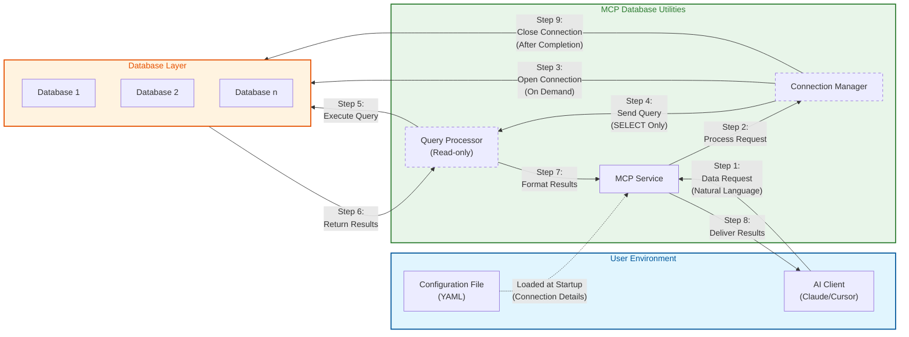

# Security Architecture

*English | [中文](../../zh/technical/security.md) | [Français](../../fr/technical/security.md) | [Español](../../es/technical/security.md) | [العربية](../../ar/technical/security.md) | [Русский](../../ru/technical/security.md)*

## Communication Pattern and Security Architecture

MCP Database Utilities implements a secure communication pattern designed to protect your data at every step. The following diagram illustrates how data flows between components while maintaining security:



## Core Security Features

1. **Isolated Access Flow**:
   - Your AI client never directly accesses your databases
   - All requests pass through the controlled MCP service environment

2. **Temporary Connections**:
   - Database connections are established only when needed
   - Connections are closed immediately after query execution
   - No persistent connections that could be exploited

3. **Read-Only Operations**:
   - Query processor enforces strict SELECT-only operations
   - No possibility of data modification (no INSERT, UPDATE, DELETE)

4. **Configuration Separation**:
   - Connection details are isolated in a separate configuration file
   - Credentials are never exposed to the AI model

5. **Multi-Database Support**:
   - Each database connection is managed separately
   - Databases are isolated from each other through the connection manager

6. **Automatic Timeouts**:
   - Query timeouts prevent long-running queries from consuming resources
   - Connection timeouts ensure database connections are properly managed
   - Idle timeouts automatically close inactive connections
   - Global timeouts limit the total session duration

This architecture ensures that even if you use the tool for multiple databases or purposes, each connection remains secure and isolated, minimizing data exposure.

## Troubleshooting Guide

When using MCP Database Utilities, you may encounter the following common issues. Here's a guide to diagnosing and resolving these problems.

### Connection Issues

1. **Unable to Connect to Database**
   - Confirm that your connection information in the configuration file is correct
   - Verify that your database server is running and accessible
   - Check if network firewalls allow the connection
   - For remote databases, confirm that hostname/IP address and port are correct

2. **Configuration File Errors**
   - Check YAML syntax is correct (indentation, colons, etc.)
   - Confirm all required fields are provided
   - Verify file paths are correct (especially for SQLite database files)

3. **Permission Issues**
   - Ensure the provided database user has SELECT permissions
   - Check if the user can access the required tables and views
   - For SQLite, verify file system permissions allow reading

### Tool and Query Issues

1. **Query Execution Failures**
   - Check for SQL syntax errors
   - Confirm table and column names are spelled correctly
   - Verify your query contains only SELECT operations
   - For complex queries, try breaking them into simpler parts

2. **Performance Issues**
   - Avoid querying large tables without WHERE conditions
   - Use LIMIT clauses to restrict result set size
   - For complex JOIN operations, consider simplifying the query
   - Use the dbutils-explain-query tool to analyze query performance

3. **MCP Client Integration Issues**
   - Confirm MCP configuration is correct (commands and parameters)
   - Check that paths are absolute rather than relative
   - Verify that uvx or docker can run directly from the command line

4. **Timeout Issues**
   - Queries taking too long may be terminated by timeout settings
   - Configure appropriate timeout values in your connection settings
   - For long-running analytical queries, increase query timeout values

### Logging and Diagnostics

For advanced troubleshooting, you can enable verbose logging:

#### Command Line Debug Enabling

```bash
# Enable verbose logging
MCP_DEBUG=1 uvx mcp-dbutils --config your_config.yaml
```

#### MCP Client Configuration Debug Enabling

Add environment variables in MCP configuration:

**JSON Configuration Example**:
```json
{
  "dbutils": {
    "command": "uvx",
    "args": [
      "mcp-dbutils",
      "--config",
      "/path/to/your/config.yaml"
    ],
    "env": {
      "MCP_DEBUG": "1"
    }
  }
}
```

**Cursor MCP Configuration**:
Add environment variables in Cursor Settings → MCP → Edit Server Configuration.

#### Viewing Logs

MCP clients handle logs generated by the service. Different MCP clients may store logs in different locations:

- For Claude Desktop: Check Claude Desktop application logs
- For Cursor: Check Cursor's MCP logs section
- For other clients: Refer to the client's documentation on how to access MCP service logs

### Security Best Practices

To ensure the highest level of security when using MCP Database Utilities:

1. **Use Read-Only Accounts**:
   ```sql
   -- Example for PostgreSQL
   CREATE ROLE readonly_user WITH LOGIN PASSWORD 'secure_password';
   GRANT CONNECT ON DATABASE analytics TO readonly_user;
   GRANT USAGE ON SCHEMA public TO readonly_user;
   GRANT SELECT ON ALL TABLES IN SCHEMA public TO readonly_user;
   ```

2. **Enable SSL/TLS**:
   ```yaml
   connections:
     secure-db:
       # ...
       ssl:
         mode: verify-full
         # ...
   ```

3. **Limit Table Access**:
   ```yaml
   connections:
     limited-access:
       # ...
       allowed_tables:
         - public.products
         - public.categories
         - analytics.sales
   ```

4. **Configure Appropriate Timeouts**:

   MCP Database Utilities provides three configurable timeout parameters to ensure database connection security and efficient resource utilization:

   **Query Timeout (query_timeout)**:
   - **Purpose**: Limits the maximum time a single SQL query can run. Queries exceeding this time will be automatically terminated.
   - **Unit**: Seconds
   - **Default**: 60 seconds
   - **Use Cases**: Prevents complex queries or large table queries from consuming excessive resources
   - **Recommendations**:
     - Regular queries: 30-60 seconds
     - Data analysis queries: 300-600 seconds
     - Report generation: Up to 1800 seconds

   **Connection Timeout (connection_timeout)**:
   - **Purpose**: Limits the maximum wait time for establishing a database connection. Connection errors will be returned if a connection cannot be established within this time.
   - **Unit**: Seconds
   - **Default**: 10 seconds
   - **Use Cases**: Useful in unstable network environments or when database load is high
   - **Recommendations**:
     - Local databases: 5-10 seconds
     - Remote databases: 15-30 seconds
     - High-load environments: Up to 60 seconds

   **Idle Timeout (idle_timeout)**:
   - **Purpose**: Defines how long a connection can remain idle before being automatically closed. This helps release unused connection resources.
   - **Unit**: Seconds
   - **Default**: 300 seconds (5 minutes)
   - **Use Cases**: Manages idle connections in the connection pool
   - **Recommendations**:
     - High-frequency usage: 600-1200 seconds
     - General usage: 300-600 seconds
     - Low-frequency usage: 60-180 seconds

   **Parameter Relationships**:
   - Typically idle_timeout > query_timeout > connection_timeout
   - If your queries need to run for a long time, ensure query_timeout is long enough
   - If idle_timeout is too short, it may cause frequent connection creation and destruction, affecting performance

   **Configuration Example**:
   ```yaml
   connections:
     analytics-db:
       type: postgres
       host: analytics.example.com
       port: 5432
       dbname: analytics
       user: analyst
       password: secure_password
       # Timeout configuration (all values in seconds)
       query_timeout: 300     # Allows long-running analytical queries
       connection_timeout: 15  # Wait time for remote database connection
       idle_timeout: 600      # Keep connections alive for frequent queries
   ```

   **Important Notes**:
   - Setting timeouts too short may interrupt legitimate queries
   - Setting timeouts too long may waste resources and create potential security risks
   - Adjust these values based on your specific use case and database performance

### Getting Help

If you encounter issues while using the tool, the following resources may be helpful:

1. **Project Documentation**: First check the latest [project documentation](https://github.com/donghao1393/mcp-dbutils) for usage guides and known issues

2. **GitHub Issues**: Search or [submit a new issue](https://github.com/donghao1393/mcp-dbutils/issues) to report bugs or request help

3. **GitHub Discussions**: Participate in the [discussions area](https://github.com/donghao1393/mcp-dbutils/discussions) to get community support or share your experiences