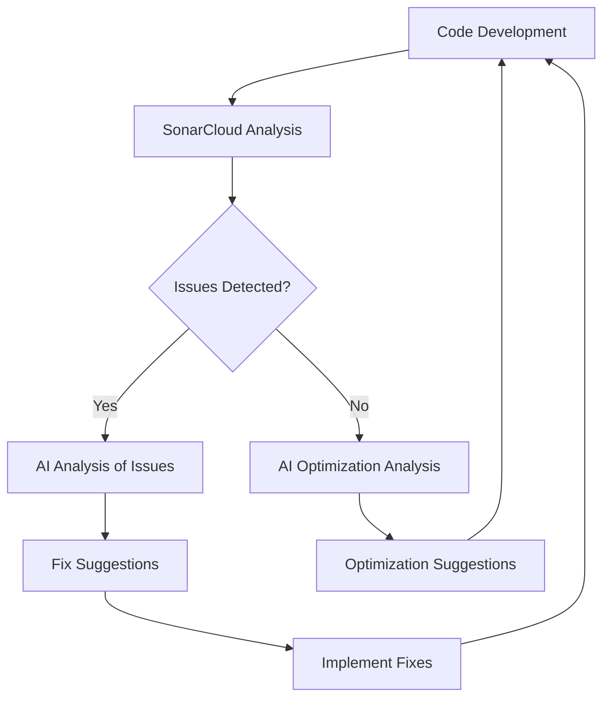

# SonarCloud AI Integration Guide

*English | [中文](../../zh/technical/sonarcloud-integration.md) | [Français](../../fr/technical/sonarcloud-integration.md) | [Español](../../es/technical/sonarcloud-integration.md) | [العربية](../../ar/technical/sonarcloud-integration.md) | [Русский](../../ru/technical/sonarcloud-integration.md)*

This document explains how to integrate SonarCloud analysis results with AI to automatically retrieve code quality issues and use AI to assist with fixes.

## Feature Overview

This integration works through the following steps:



1. GitHub Actions workflow runs SonarCloud analysis during the CI/CD process
2. After analysis is complete, the workflow extracts SonarCloud issues and generates reports in two formats:
   - JSON format: Contains complete raw data, suitable for in-depth AI analysis
   - Markdown format: Formatted human-readable report with issue summaries and details
3. These two reports are uploaded as workflow artifacts
4. Using the provided Fish function, you can easily download these reports and provide them to AI for analysis and fix suggestions

## Usage Instructions

### 1. Set Up the Fish Function

Add the `sonar-ai-fix` function to your Fish configuration:

```fish
# Add to ~/.config/fish/config.fish
source /path/to/mcp-dbutils/scripts/sonar-ai-fix.fish
```

Alternatively, you can run the script directly to load the function temporarily:

```bash
source scripts/sonar-ai-fix.fish
```

### 2. Download SonarCloud Analysis Reports

In the project root directory, run:

```bash
sonar-ai-fix
```

This will download the latest SonarCloud analysis reports and save them as two files:
- `sonar_report.md`: Markdown formatted report
- `sonar_issues.json`: Raw data in JSON format

### 3. Use AI to Analyze and Fix Issues

There are two ways to use these reports:

#### Option 1: Use the Markdown Report (Recommended)

1. Open the `sonar_report.md` file:
   ```bash
   bat sonar_report.md
   ```

2. Copy the content to an AI (like Claude) and request fix suggestions:
   ```
   This is the SonarCloud analysis report for my project. Please analyze these issues and provide fix suggestions.

   [Paste sonar_report.md content]
   ```

#### Option 2: Use JSON Data for In-Depth Analysis

For situations requiring more in-depth analysis, you can use the JSON data:

1. Open the JSON file:
   ```bash
   bat sonar_issues.json
   ```

2. Provide the content to AI for more detailed analysis:
   ```
   This is the raw SonarCloud analysis data for my project. Please perform an in-depth analysis of these issues and provide fix suggestions.

   [Paste sonar_issues.json content]
   ```

## How It Works

### GitHub Actions Workflow

In `.github/workflows/quality-assurance.yml`, we've added two key steps:

1. **Extract SonarCloud Issues**:
   - Uses the SonarCloud API to get unresolved issues
   - Formats issues into JSON and Markdown formats

2. **Upload Report Artifacts**:
   - Uploads the generated reports as workflow artifacts
   - Makes artifacts downloadable via GitHub CLI

### Fish Function

The `sonar-ai-fix.fish` script provides a convenient function that:

- Checks if the current directory is a project directory
- Gets the latest workflow run ID
- Downloads the SonarCloud issues report artifacts
- Saves the reports to the current directory
- Provides usage instructions

## Important Notes

- Ensure you have GitHub CLI (`gh`) installed and configured
- Ensure you have sufficient permissions to access the GitHub repository and workflows
- Issue links in the reports point to the SonarCloud website, which requires project access permissions
- This feature works best with local AI tools (like Claude Desktop)
