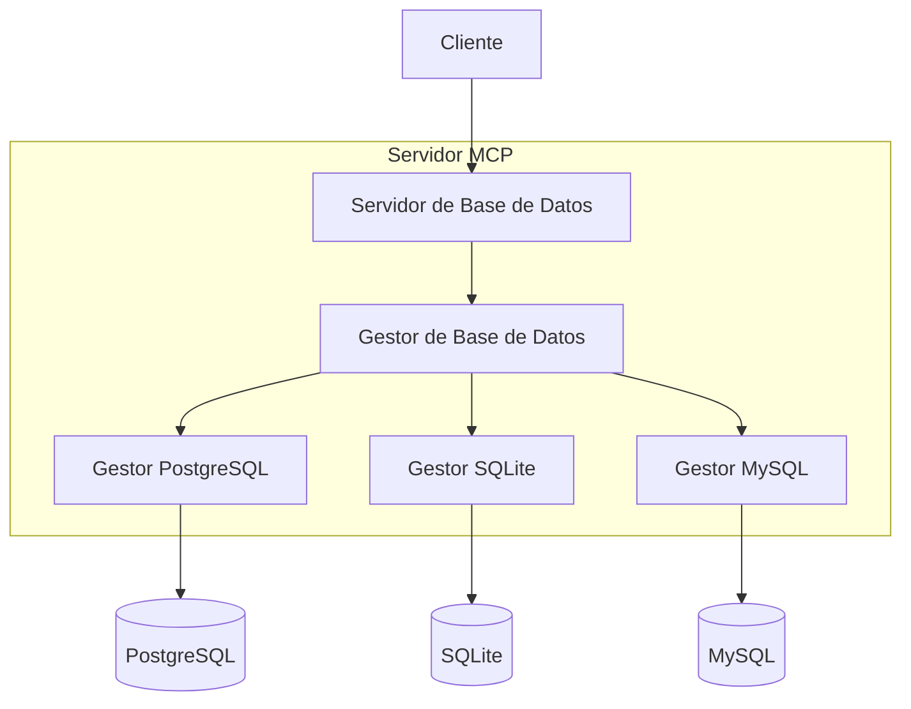

# Arquitectura

*[English](../../en/technical/architecture.md) | [中文](../../zh/technical/architecture.md) | [Français](../../fr/technical/architecture.md) | Español | [العربية](../../ar/technical/architecture.md) | [Русский](../../ru/technical/architecture.md)*

Este documento describe la arquitectura técnica de MCP Database Utilities, explicando cómo los diferentes componentes interactúan para proporcionar acceso seguro a bases de datos para asistentes de IA.

## Visión General de la Arquitectura

MCP Database Utilities está diseñado con una arquitectura modular que prioriza la seguridad, el aislamiento y la flexibilidad. El sistema está compuesto por varias capas distintas que trabajan juntas para proporcionar acceso seguro de solo lectura a bases de datos.

## Concepto Fundamental: Diseño de Capas de Abstracción

El diseño de capas de abstracción es un concepto fundamental en la arquitectura de MCP Database Utilities. Al igual que un mando a distancia universal puede controlar diferentes dispositivos, el usuario solo necesita conocer las operaciones básicas, sin entender la complejidad subyacente.

## Componentes Principales

### 1. Gestor MCP (API Tools)

Este componente es responsable de implementar el protocolo MCP y exponer las herramientas que la IA puede utilizar.

**Responsabilidades:**
- Implementar la interfaz MCP para la integración con clientes IA
- Exponer las herramientas disponibles (list-tables, run-query, etc.)
- Gestionar el ciclo de vida de las solicitudes MCP
- Validar entradas y formatear salidas

**Herramientas expuestas:**
- `dbutils-list-connections`: Lista las conexiones disponibles
- `dbutils-list-tables`: Lista las tablas en una base de datos
- `dbutils-run-query`: Ejecuta una consulta SQL (solo SELECT)
- `dbutils-get-stats`: Obtiene estadísticas sobre una tabla
- `dbutils-list-constraints`: Lista las restricciones de una tabla
- `dbutils-explain-query`: Obtiene el plan de ejecución de una consulta
- `dbutils-get-performance`: Obtiene métricas de rendimiento
- `dbutils-analyze-query`: Analiza consultas para optimización

### 2. Gestor de Consultas

Este componente procesa las consultas entrantes, las valida y las enruta a los adaptadores de base de datos apropiados.

**Responsabilidades:**
- Analizar y validar consultas SQL
- Aplicar restricciones de seguridad (solo SELECT)
- Limitar la complejidad de las consultas y el tamaño de los resultados
- Gestionar tiempos de espera y cancelaciones de consultas
- Optimizar consultas cuando sea posible

### 3. Gestor SQL

Este componente es responsable del análisis sintáctico y semántico de las consultas SQL.

**Responsabilidades:**
- Analizar la sintaxis SQL
- Validar la semántica de las consultas
- Detectar y bloquear operaciones no autorizadas (INSERT, UPDATE, DELETE, etc.)
- Identificar tablas y columnas referenciadas
- Optimizar consultas cuando sea posible

### 4. Gestor de Conexiones

Este componente gestiona las conexiones a bases de datos según la configuración.

**Responsabilidades:**
- Leer y validar la configuración de conexiones
- Establecer y mantener pools de conexiones
- Gestionar el ciclo de vida de las conexiones
- Aplicar parámetros de seguridad (SSL, timeout, etc.)
- Monitorear el estado de las conexiones

### 5. Gestor de Caché

Este componente almacena en caché los resultados de consultas frecuentes para mejorar el rendimiento.

**Responsabilidades:**
- Almacenar en caché los resultados de las consultas
- Invalidar la caché cuando sea necesario
- Gestionar el tamaño y la vida útil de la caché
- Optimizar el rendimiento para consultas repetidas

### 6. Adaptadores de Base de Datos

Estos componentes proporcionan una interfaz unificada para diferentes tipos de bases de datos.

**Adaptadores soportados:**
- SQLite
- PostgreSQL
- MySQL

**Responsabilidades:**
- Traducir consultas genéricas a consultas específicas de la base de datos
- Gestionar las peculiaridades de cada tipo de base de datos
- Optimizar consultas para cada motor de base de datos
- Gestionar errores específicos de cada base de datos

## Flujo de Datos

1. **Inicialización:**
   - El servicio lee el archivo de configuración YAML
   - Las conexiones a bases de datos se configuran pero no se establecen
   - Las herramientas MCP se registran y exponen

2. **Procesamiento de Consultas:**
   - La IA envía una solicitud a través del protocolo MCP
   - El Gestor MCP recibe la solicitud y la pasa al Gestor de Consultas
   - El Gestor de Consultas valida la consulta y la pasa al adaptador apropiado
   - El adaptador establece una conexión (o usa una conexión existente del pool)
   - La consulta se ejecuta y los resultados se devuelven
   - Los resultados se formatean y se devuelven a la IA

3. **Gestión de Errores:**
   - Los errores se capturan en cada nivel
   - Los mensajes de error se normalizan y se hacen comprensibles
   - Los errores de seguridad se registran y bloquean
   - Los tiempos de espera se gestionan para evitar consultas infinitas

## Consideraciones de Seguridad

La seguridad es una prioridad absoluta en la arquitectura de MCP Database Utilities:

1. **Acceso de Solo Lectura:**
   - Todas las consultas se analizan para garantizar que son de solo lectura
   - Las operaciones de modificación (INSERT, UPDATE, DELETE, etc.) se bloquean
   - Los comandos DDL (CREATE, ALTER, DROP, etc.) se bloquean

2. **Aislamiento:**
   - Cada conexión está aislada
   - Las transacciones son de solo lectura
   - Las conexiones se establecen bajo demanda y se cierran después de su uso

3. **Autenticación y Autorización:**
   - Las credenciales se almacenan de forma segura
   - Soporte para SSL/TLS para conexiones cifradas
   - Posibilidad de usar cuentas de base de datos de solo lectura

4. **Protección contra Inyecciones SQL:**
   - Todas las entradas se validan y escapan
   - Uso de consultas parametrizadas
   - Análisis sintáctico completo de las consultas SQL

5. **Limitación de Recursos:**
   - Tiempos de espera para todas las consultas
   - Limitación del tamaño de los resultados
   - Limitación de la complejidad de las consultas

## Extensibilidad

La arquitectura está diseñada para ser extensible:

1. **Nuevos Adaptadores:**
   - Se puede añadir soporte para otros tipos de bases de datos
   - Interfaz común para todos los adaptadores

2. **Nuevas Herramientas:**
   - Se pueden añadir nuevas herramientas MCP fácilmente
   - Interfaz coherente para todas las herramientas

3. **Funcionalidades Avanzadas:**
   - Soporte para vistas materializadas
   - Optimización automática de consultas
   - Análisis avanzado de rendimiento

## Dependencias Externas

MCP Database Utilities depende de las siguientes bibliotecas:

- **SQLAlchemy**: ORM y toolkit SQL para la interacción con bases de datos
- **PyYAML**: Parsing de archivos YAML para la configuración
- **Psycopg2**: Adaptador PostgreSQL
- **PyMySQL**: Adaptador MySQL
- **Pydantic**: Validación de datos y serialización

## Limitaciones Conocidas

- No hay soporte para procedimientos almacenados
- No hay soporte para transacciones complejas
- No hay soporte para bases de datos NoSQL (por ahora)
- No hay soporte para consultas distribuidas entre múltiples bases de datos

## Evoluciones Futuras

- Soporte para otros tipos de bases de datos (MongoDB, Oracle, SQL Server, etc.)
- Mejora de las capacidades de análisis y optimización de consultas
- Soporte para bases de datos federadas
- Interfaz de administración para la gestión de conexiones
- Métricas y monitoreo avanzados
