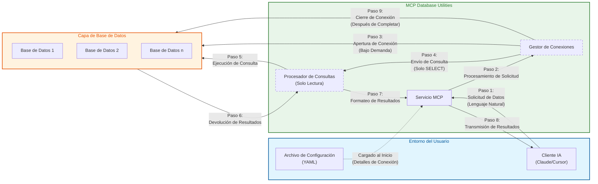

# Arquitectura de Seguridad

*[English](../../en/technical/security.md) | [中文](../../zh/technical/security.md) | [Français](../../fr/technical/security.md) | Español | [العربية](../../ar/technical/security.md) | [Русский](../../ru/technical/security.md)*

Este documento detalla la arquitectura de seguridad de MCP Database Utilities, explicando los mecanismos y principios que garantizan un acceso seguro a las bases de datos para los asistentes de IA.

## Modelo de Comunicación y Arquitectura de Seguridad

MCP Database Utilities implementa un modelo de comunicación seguro diseñado para proteger sus datos en cada paso. El siguiente diagrama ilustra cómo fluyen los datos entre los componentes mientras se mantiene la seguridad:



## Principios de Seguridad

MCP Database Utilities ha sido diseñado con la seguridad como prioridad absoluta, siguiendo estos principios fundamentales:

1. **Defensa en Profundidad**: Múltiples capas de seguridad para proteger los datos
2. **Principio de Menor Privilegio**: Acceso mínimo necesario para funcionar
3. **Seguridad por Diseño**: La seguridad está integrada desde el diseño, no añadida posteriormente
4. **Transparencia**: Arquitectura abierta y verificable
5. **Aislamiento**: Separación estricta de entornos y conexiones

## Mecanismos de Seguridad Clave

### 1. Operaciones Estrictamente de Solo Lectura

Todas las interacciones con las bases de datos están limitadas a operaciones de solo lectura:

- **Análisis Sintáctico Completo**: Cada consulta SQL es completamente analizada para garantizar que es de solo lectura
- **Bloqueo de Operaciones de Modificación**: Todos los comandos que modifican datos (INSERT, UPDATE, DELETE, etc.) son automáticamente bloqueados
- **Bloqueo de Comandos DDL**: Los comandos que modifican la estructura de la base de datos (CREATE, ALTER, DROP, etc.) son bloqueados
- **Validación en Múltiples Niveles**: Las consultas son validadas tanto por el analizador SQL como por verificaciones específicas para cada tipo de base de datos

```python
# Ejemplo de validación de consulta (pseudo-código)
def validate_query(query):
    # Análisis sintáctico de la consulta
    parsed_query = sql_parser.parse(query)

    # Verificación del tipo de consulta
    if not parsed_query.is_select():
        raise SecurityException("Solo se permiten consultas SELECT")

    # Verificación de cláusulas peligrosas
    if parsed_query.has_dangerous_clauses():
        raise SecurityException("Se detectaron cláusulas no permitidas")

    # Verificación específica de la base de datos
    db_adapter.validate_read_only(query)

    return parsed_query
```

### 2. Sin Acceso Directo a la Base de Datos

La arquitectura garantiza que la IA nunca tiene acceso directo a las bases de datos:

- **Capa de Abstracción**: Todas las consultas pasan por múltiples capas de abstracción
- **Validación de Entradas**: Todas las entradas son validadas y limpiadas
- **Consultas Parametrizadas**: Uso sistemático de consultas parametrizadas para prevenir inyecciones SQL
- **Aislamiento de Conexiones**: Cada conexión está aislada y gestionada por el servicio

### 3. Conexiones Aisladas

Las conexiones a las bases de datos están estrictamente aisladas:

- **Pool de Conexiones Dedicado**: Cada configuración de base de datos utiliza su propio pool de conexiones
- **Transacciones de Solo Lectura**: Todas las transacciones están explícitamente configuradas en modo de solo lectura
- **Tiempos de Espera Automáticos**: Las conexiones tienen tiempos de espera configurables para evitar conexiones persistentes
- **Cierre Adecuado**: Las conexiones se cierran correctamente después de su uso

```yaml
# Ejemplo de configuración con parámetros de seguridad
connections:
  secure-postgres:
    type: postgres
    host: db.example.com
    port: 5432
    dbname: analytics
    user: readonly_user
    password: "********"
    ssl:
      mode: verify-full
      cert: /path/to/cert.pem
      key: /path/to/key.pem
      root: /path/to/root.crt
    pool:
      max_size: 5
      timeout: 30
```

### 4. Conectividad Bajo Demanda

Las conexiones a las bases de datos se establecen únicamente cuando es necesario:

- **Conexión Tardía**: Las conexiones solo se establecen cuando una consulta se ejecuta efectivamente
- **Desconexión Rápida**: Las conexiones se devuelven al pool tan pronto como sea posible
- **Limitación de Conexiones**: Número máximo de conexiones simultáneas configurable
- **Monitoreo de Conexiones**: Todas las conexiones son monitoreadas para detectar anomalías

### 5. Tiempos de Espera Automáticos

Se aplican tiempos de espera en múltiples niveles para evitar abusos:

- **Tiempo de Espera de Consulta**: Límite de tiempo para la ejecución de una consulta
- **Tiempo de Espera de Conexión**: Límite de tiempo para el establecimiento de una conexión
- **Tiempo de Espera de Inactividad**: Cierre de conexiones inactivas después de un período configurable
- **Tiempo de Espera Global**: Límite de tiempo total para una sesión

### 6. Protección de Credenciales

Las credenciales de las bases de datos están protegidas:

- **Almacenamiento Seguro**: Las contraseñas nunca se almacenan en texto plano en la memoria
- **Enmascaramiento en Logs**: La información sensible se enmascara en todos los logs
- **Soporte para Gestores de Secretos**: Integración posible con soluciones como HashiCorp Vault, AWS Secrets Manager, etc.
- **Rotación de Credenciales**: Soporte para la rotación periódica de credenciales

### 7. Seguridad de Comunicaciones

Las comunicaciones con las bases de datos están aseguradas:

- **Soporte SSL/TLS**: Conexiones cifradas para todas las bases de datos soportadas
- **Verificación de Certificados**: Opción para verificar los certificados de los servidores de bases de datos
- **Configuraciones SSL Avanzadas**: Opciones para configurar precisamente los parámetros SSL/TLS
- **Protocolos Seguros**: Uso de versiones recientes y seguras de los protocolos

```yaml
# Ejemplo de configuración SSL para PostgreSQL
connections:
  postgres-ssl:
    type: postgres
    host: secure-db.example.com
    port: 5432
    dbname: analytics
    user: readonly_user
    password: "********"
    ssl:
      mode: verify-full  # Opciones: disable, allow, prefer, require, verify-ca, verify-full
      cert: /path/to/client-cert.pem
      key: /path/to/client-key.pem
      root: /path/to/root.crt
```

## Medidas de Protección de la Privacidad

### 1. Procesamiento Local

Todas las operaciones se realizan localmente:

- **Sin Transferencia de Datos**: Los datos nunca salen del entorno local
- **Sin Descarga de Esquema**: Los esquemas de base de datos no se envían a servicios externos
- **Sin Telemetría**: No se recopilan ni envían datos de uso

### 2. Exposición Mínima de Datos

El servicio está diseñado para minimizar la exposición de datos:

- **Limitación de Resultados**: Número máximo de filas devueltas configurable
- **Paginación Automática**: Los grandes conjuntos de resultados se paginan
- **Filtrado de Columnas Sensibles**: Posibilidad de configurar columnas a excluir de los resultados
- **Enmascaramiento de Datos**: Opción para enmascarar automáticamente datos sensibles (PII, etc.)

### 3. Protección de Credenciales

Las credenciales de conexión están protegidas:

- **Sin Exposición de Credenciales**: Las credenciales nunca se exponen a la IA
- **Abstracción de Conexiones**: La IA utiliza nombres lógicos de conexión, no los detalles reales
- **Validación de Permisos**: Verificación de que las cuentas utilizadas tienen permisos mínimos

### 4. Enmascaramiento de Datos Sensibles

Los datos sensibles pueden ser automáticamente enmascarados:

- **Detección de PII**: Opción para detectar y enmascarar automáticamente información personal identificable
- **Reglas de Enmascaramiento Configurables**: Posibilidad de definir reglas de enmascaramiento personalizadas
- **Registro Seguro**: Los datos sensibles se enmascaran en todos los logs

## Buenas Prácticas de Seguridad

### Configuración Segura

Recomendaciones para una configuración segura:

1. **Use Cuentas de Solo Lectura**:
   ```sql
   -- Ejemplo para PostgreSQL
   CREATE ROLE readonly_user WITH LOGIN PASSWORD 'secure_password';
   GRANT CONNECT ON DATABASE analytics TO readonly_user;
   GRANT USAGE ON SCHEMA public TO readonly_user;
   GRANT SELECT ON ALL TABLES IN SCHEMA public TO readonly_user;
   ```

2. **Active SSL/TLS**:
   ```yaml
   connections:
     secure-db:
       # ...
       ssl:
         mode: verify-full
         # ...
   ```

3. **Limite el Acceso a las Tablas**:
   ```yaml
   connections:
     limited-access:
       # ...
       allowed_tables:
         - public.products
         - public.categories
         - analytics.sales
   ```

4. **Configure Tiempos de Espera Apropiados**:

   MCP Database Utilities proporciona tres parámetros de tiempo de espera configurables para garantizar la seguridad de las conexiones a la base de datos y el uso eficiente de los recursos:

   **Tiempo de Espera de Consulta (query_timeout)**:
   - **Propósito**: Limita el tiempo máximo que puede ejecutarse una consulta SQL. Las consultas que excedan este tiempo se terminarán automáticamente.
   - **Unidad**: Segundos
   - **Valor predeterminado**: 60 segundos
   - **Casos de uso**: Evita que las consultas complejas o las consultas de tablas grandes consuman recursos excesivos
   - **Recomendaciones**:
     - Consultas regulares: 30-60 segundos
     - Consultas de análisis de datos: 300-600 segundos
     - Generación de informes: Hasta 1800 segundos

   **Tiempo de Espera de Conexión (connection_timeout)**:
   - **Propósito**: Limita el tiempo máximo de espera para establecer una conexión a la base de datos. Se devolverán errores de conexión si no se puede establecer una conexión dentro de este tiempo.
   - **Unidad**: Segundos
   - **Valor predeterminado**: 10 segundos
   - **Casos de uso**: Útil en entornos de red inestables o cuando la carga de la base de datos es alta
   - **Recomendaciones**:
     - Bases de datos locales: 5-10 segundos
     - Bases de datos remotas: 15-30 segundos
     - Entornos de alta carga: Hasta 60 segundos

   **Tiempo de Espera de Inactividad (idle_timeout)**:
   - **Propósito**: Define cuánto tiempo puede permanecer inactiva una conexión antes de cerrarse automáticamente. Esto ayuda a liberar recursos de conexión no utilizados.
   - **Unidad**: Segundos
   - **Valor predeterminado**: 300 segundos (5 minutos)
   - **Casos de uso**: Gestiona las conexiones inactivas en el pool de conexiones
   - **Recomendaciones**:
     - Uso de alta frecuencia: 600-1200 segundos
     - Uso general: 300-600 segundos
     - Uso de baja frecuencia: 60-180 segundos

   **Relaciones entre Parámetros**:
   - Típicamente idle_timeout > query_timeout > connection_timeout
   - Si sus consultas necesitan ejecutarse durante mucho tiempo, asegúrese de que query_timeout sea lo suficientemente largo
   - Si idle_timeout es demasiado corto, puede causar creación y destrucción frecuente de conexiones, afectando el rendimiento

   **Ejemplo de Configuración**:
   ```yaml
   connections:
     analytics-db:
       type: postgres
       host: analytics.example.com
       port: 5432
       dbname: analytics
       user: analyst
       password: secure_password
       # Configuración de tiempos de espera (todos los valores en segundos)
       query_timeout: 300     # Permite consultas analíticas de larga duración
       connection_timeout: 15  # Tiempo de espera para conexión a base de datos remota
       idle_timeout: 600      # Mantiene las conexiones activas para consultas frecuentes
   ```

   **Notas Importantes**:
   - Establecer tiempos de espera demasiado cortos puede interrumpir consultas legítimas
   - Establecer tiempos de espera demasiado largos puede desperdiciar recursos y crear riesgos potenciales de seguridad
   - Ajuste estos valores según su caso de uso específico y el rendimiento de su base de datos

### Monitoreo y Auditoría

Recomendaciones para el monitoreo y la auditoría:

1. **Active el Registro**:
   ```yaml
   logging:
     level: INFO  # Opciones: DEBUG, INFO, WARNING, ERROR
     file: /path/to/dbutils.log
     format: "%(asctime)s - %(name)s - %(levelname)s - %(message)s"
   ```

2. **Monitoree las Consultas**:
   ```yaml
   monitoring:
     log_queries: true
     log_slow_queries: true
     slow_query_threshold: 5  # segundos
   ```

3. **Configure Alertas**:
   ```yaml
   alerts:
     failed_connections:
       threshold: 5
       period: 60  # segundos
       action: "email:admin@example.com"
   ```

## Auditoría de Seguridad

MCP Database Utilities se somete regularmente a auditorías de seguridad:

1. **Análisis de Código Estático**: El código se analiza para detectar vulnerabilidades potenciales
2. **Pruebas de Penetración**: Se realizan pruebas de penetración para identificar fallos
3. **Revisión de Código**: El código es revisado por expertos en seguridad
4. **Análisis de Dependencias**: Las dependencias se analizan para detectar vulnerabilidades conocidas

## Gestión de Vulnerabilidades

Proceso de gestión de vulnerabilidades:

1. **Reporte**: Las vulnerabilidades pueden ser reportadas a través de GitHub o por email
2. **Evaluación**: Cada vulnerabilidad se evalúa para determinar su gravedad
3. **Corrección**: Las vulnerabilidades se corrigen lo antes posible
4. **Comunicación**: Los usuarios son informados de las vulnerabilidades y las correcciones

## Conclusión

La seguridad está en el núcleo de MCP Database Utilities. La arquitectura ha sido diseñada para garantizar que los asistentes de IA puedan acceder a los datos de las bases de datos de manera segura, sin comprometer la confidencialidad o la integridad de los datos. Las múltiples capas de protección, el acceso estrictamente de solo lectura y los mecanismos de aislamiento garantizan que los datos están protegidos en todo momento.
