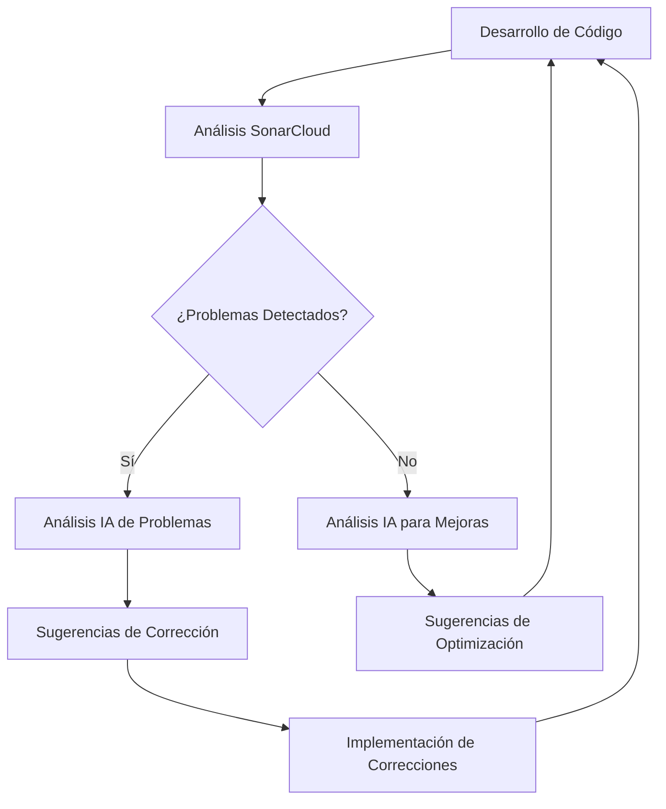

# Integración de SonarCloud e IA

*[English](../../en/technical/sonarcloud-integration.md) | [中文](../../zh/technical/sonarcloud-integration.md) | [Français](../../fr/technical/sonarcloud-integration.md) | Español | [العربية](../../ar/technical/sonarcloud-integration.md) | [Русский](../../ru/technical/sonarcloud-integration.md)*

Este documento explica cómo MCP Database Utilities utiliza SonarCloud para el análisis de código y cómo la IA está integrada en este proceso para mejorar la calidad del código.

## Introducción a SonarCloud

[SonarCloud](https://sonarcloud.io/) es una plataforma de análisis de código en línea que ayuda a los desarrolladores a detectar bugs, vulnerabilidades y "code smells" en su código. Soporta numerosos lenguajes de programación, incluyendo Python, y se integra fácilmente con flujos de trabajo de CI/CD.

## Configuración de SonarCloud para MCP Database Utilities

### Integración con GitHub

MCP Database Utilities utiliza SonarCloud integrándolo con GitHub:

1. El proyecto está configurado en SonarCloud con la organización `donghao1393`
2. El análisis se desencadena automáticamente con cada push o pull request
3. Los resultados se muestran en el dashboard de SonarCloud y en las pull requests de GitHub

### Configuración del Proyecto

La configuración de SonarCloud se define en el archivo `sonar-project.properties`:

```properties
# Identificador del proyecto y organización
sonar.projectKey=donghao1393_mcp-dbutils
sonar.organization=donghao1393

# Información del proyecto
sonar.projectName=MCP Database Utilities
sonar.projectVersion=1.0

# Ruta a las fuentes
sonar.sources=mcp_dbutils
sonar.python.coverage.reportPaths=coverage.xml
sonar.python.xunit.reportPath=test-results.xml

# Exclusiones
sonar.exclusions=tests/**/*,docs/**/*,examples/**/*

# Codificación del código fuente
sonar.sourceEncoding=UTF-8
```

### Flujo de Trabajo de GitHub Actions

El análisis de SonarCloud se ejecuta a través de GitHub Actions:

```yaml
# .github/workflows/sonarcloud.yml
name: SonarCloud Analysis

on:
  push:
    branches: [ main ]
  pull_request:
    branches: [ main ]

jobs:
  sonarcloud:
    name: SonarCloud
    runs-on: ubuntu-latest
    steps:
      - uses: actions/checkout@v3
        with:
          fetch-depth: 0  # Las clonaciones superficiales deben deshabilitarse para una mejor relevancia
      
      - name: Set up Python
        uses: actions/setup-python@v4
        with:
          python-version: '3.10'
      
      - name: Install dependencies
        run: |
          python -m pip install --upgrade pip
          pip install -e ".[dev,test]"
      
      - name: Run tests with coverage
        run: |
          pytest --cov=mcp_dbutils --cov-report=xml --junitxml=test-results.xml
      
      - name: SonarCloud Scan
        uses: SonarSource/sonarcloud-github-action@master
        env:
          GITHUB_TOKEN: ${{ secrets.GITHUB_TOKEN }}
          SONAR_TOKEN: ${{ secrets.SONAR_TOKEN }}
```

## Métricas Monitoreadas

SonarCloud monitorea varias métricas clave para MCP Database Utilities:

### 1. Calidad del Código

- **Bugs**: Problemas en el código que pueden causar comportamientos incorrectos
- **Vulnerabilidades**: Debilidades de seguridad potenciales
- **Code Smells**: Problemas de mantenibilidad que hacen que el código sea difícil de entender o modificar
- **Deuda Técnica**: Estimación del tiempo necesario para corregir todos los code smells

### 2. Cobertura de Pruebas

- **Cobertura de Línea**: Porcentaje de líneas de código ejecutadas por las pruebas
- **Cobertura de Rama**: Porcentaje de ramas de código (if/else, etc.) ejecutadas por las pruebas
- **Cobertura de Condición**: Porcentaje de condiciones booleanas probadas

### 3. Duplicación

- **Líneas Duplicadas**: Porcentaje de código duplicado en el proyecto
- **Bloques Duplicados**: Número de bloques de código duplicados

### 4. Complejidad

- **Complejidad Ciclomática**: Medida de la complejidad del código basada en el número de caminos de ejecución
- **Complejidad Cognitiva**: Medida de la dificultad para entender el código

## Integración de la IA en el Análisis de Código

MCP Database Utilities utiliza la IA para mejorar el análisis de código de varias maneras:

### 1. Análisis Automático de Pull Requests

Cuando se crea una pull request, un bot de IA analiza los resultados de SonarCloud y proporciona comentarios:

```python
def analyze_sonarcloud_results(pr_number):
    """Analiza los resultados de SonarCloud para una pull request y añade comentarios."""
    # Obtener los resultados de SonarCloud
    results = get_sonarcloud_results(pr_number)
    
    # Analizar los resultados con IA
    analysis = ai_analyze_results(results)
    
    # Añadir comentarios a la pull request
    add_pr_comments(pr_number, analysis)
```

El bot de IA puede:
- Explicar los problemas detectados en lenguaje natural
- Sugerir correcciones para problemas comunes
- Identificar patrones recurrentes en los problemas
- Priorizar los problemas según su impacto

### 2. Sugerencias de Refactorización

La IA puede sugerir refactorizaciones para mejorar la calidad del código:

```python
def suggest_refactoring(file_path, code_smells):
    """Sugiere refactorizaciones para resolver los code smells."""
    # Leer el archivo
    with open(file_path, 'r') as f:
        code = f.read()
    
    # Generar sugerencias de refactorización con IA
    suggestions = ai_generate_refactoring_suggestions(code, code_smells)
    
    return suggestions
```

Ejemplos de sugerencias:
- Extracción de métodos para reducir la complejidad
- Renombrado de variables para mejorar la legibilidad
- Reestructuración del código para eliminar la duplicación
- Aplicación de patrones de diseño apropiados

### 3. Análisis de Tendencias

La IA analiza las tendencias de calidad del código a lo largo del tiempo:

```python
def analyze_quality_trends():
    """Analiza las tendencias de calidad del código a lo largo del tiempo."""
    # Obtener el historial de métricas
    metrics_history = get_metrics_history()
    
    # Analizar las tendencias con IA
    trends_analysis = ai_analyze_trends(metrics_history)
    
    return trends_analysis
```

Este análisis puede:
- Identificar tendencias positivas o negativas
- Correlacionar cambios de calidad con eventos del proyecto
- Predecir problemas potenciales futuros
- Recomendar áreas de mejora

### 4. Generación de Pruebas

La IA puede generar pruebas para mejorar la cobertura:

```python
def generate_tests(file_path, coverage_gaps):
    """Genera pruebas para cubrir las brechas de cobertura."""
    # Leer el archivo
    with open(file_path, 'r') as f:
        code = f.read()
    
    # Generar pruebas con IA
    tests = ai_generate_tests(code, coverage_gaps)
    
    return tests
```

Las pruebas generadas:
- Se dirigen específicamente a las partes del código no cubiertas
- Siguen las convenciones de prueba del proyecto
- Incluyen aserciones relevantes
- Están acompañadas de documentación

## Flujo de Trabajo de Mejora Continua

La integración de SonarCloud y la IA forma parte de un flujo de trabajo de mejora continua:



1. **Desarrollo de Código**: Los desarrolladores escriben o modifican código
2. **Análisis SonarCloud**: El código es analizado automáticamente por SonarCloud
3. **Detección de Problemas**: SonarCloud identifica problemas potenciales
4. **Análisis IA**: La IA analiza los problemas o busca optimizaciones
5. **Sugerencias**: La IA proporciona sugerencias concretas
6. **Implementación**: Los desarrolladores implementan las correcciones u optimizaciones
7. **Ciclo Continuo**: El proceso se repite para una mejora continua

## Ejemplos Concretos

### Ejemplo 1: Corrección de un Bug Detectado

**Problema detectado por SonarCloud**:
```
Bug: "TypeError" will be raised when calling "execute_query" with None as "query" parameter.
```

**Análisis IA**:
```
Este bug ocurre porque el método execute_query() no tiene validación para el parámetro query.
Si se pasa None, se lanzará un TypeError al llamar a query.strip().
```

**Sugerencia de corrección**:
```python
# Antes
def execute_query(self, query):
    """Ejecuta una consulta SQL."""
    query = query.strip()
    # ...

# Después
def execute_query(self, query):
    """Ejecuta una consulta SQL."""
    if query is None:
        raise ValueError("La consulta no puede ser None")
    query = query.strip()
    # ...
```

### Ejemplo 2: Reducción de la Complejidad

**Problema detectado por SonarCloud**:
```
Code Smell: Cognitive Complexity of function "parse_config" is 25 which is greater than 15 authorized.
```

**Análisis IA**:
```
La función parse_config() es demasiado compleja con numerosas condiciones anidadas.
Se puede simplificar extrayendo funciones auxiliares para cada tipo de configuración.
```

**Sugerencia de refactorización**:
```python
# Antes
def parse_config(config_dict):
    """Analiza el diccionario de configuración."""
    result = {}
    if "connections" in config_dict:
        connections = {}
        for name, conn_config in config_dict["connections"].items():
            if "type" not in conn_config:
                raise ValueError(f"Tipo de conexión faltante para {name}")
            
            conn_type = conn_config["type"]
            if conn_type == "sqlite":
                # Lógica específica para SQLite
                if "path" not in conn_config:
                    raise ValueError(f"Ruta de base de datos faltante para {name}")
                # ...
            elif conn_type == "postgres":
                # Lógica específica para PostgreSQL
                # ...
            elif conn_type == "mysql":
                # Lógica específica para MySQL
                # ...
            else:
                raise ValueError(f"Tipo de conexión desconocido: {conn_type}")
            
            connections[name] = conn_config
        result["connections"] = connections
    # ...
    return result

# Después
def parse_sqlite_config(name, conn_config):
    """Analiza la configuración SQLite."""
    if "path" not in conn_config:
        raise ValueError(f"Ruta de base de datos faltante para {name}")
    # ...
    return conn_config

def parse_postgres_config(name, conn_config):
    """Analiza la configuración PostgreSQL."""
    # ...
    return conn_config

def parse_mysql_config(name, conn_config):
    """Analiza la configuración MySQL."""
    # ...
    return conn_config

def parse_config(config_dict):
    """Analiza el diccionario de configuración."""
    result = {}
    if "connections" in config_dict:
        connections = {}
        for name, conn_config in config_dict["connections"].items():
            if "type" not in conn_config:
                raise ValueError(f"Tipo de conexión faltante para {name}")
            
            conn_type = conn_config["type"]
            if conn_type == "sqlite":
                connections[name] = parse_sqlite_config(name, conn_config)
            elif conn_type == "postgres":
                connections[name] = parse_postgres_config(name, conn_config)
            elif conn_type == "mysql":
                connections[name] = parse_mysql_config(name, conn_config)
            else:
                raise ValueError(f"Tipo de conexión desconocido: {conn_type}")
        
        result["connections"] = connections
    # ...
    return result
```

### Ejemplo 3: Mejora de la Cobertura de Pruebas

**Problema detectado por SonarCloud**:
```
Coverage: Line coverage of file "mcp_dbutils/adapters/mysql.py" is 68.5% which is less than 80% required.
```

**Análisis IA**:
```
El archivo mysql.py carece de cobertura de pruebas, particularmente para los casos de error y las funcionalidades avanzadas.
Los métodos execute_query() y get_table_stats() tienen una cobertura particularmente baja.
```

**Pruebas generadas por la IA**:
```python
def test_mysql_adapter_execute_query_error():
    """Prueba que el adaptador MySQL maneja correctamente los errores de consulta."""
    # Configurar el mock
    mock_connection = MagicMock()
    mock_cursor = MagicMock()
    mock_connection.cursor.return_value = mock_cursor
    mock_cursor.execute.side_effect = pymysql.Error("Error de prueba")
    
    # Configurar el adaptador con el mock
    adapter = MySQLAdapter({"type": "mysql", "host": "localhost", "database": "test"})
    adapter._connection = mock_connection
    
    # Verificar que el error se propaga correctamente
    with pytest.raises(DatabaseError):
        adapter.execute_query("SELECT * FROM nonexistent_table")

def test_mysql_adapter_get_table_stats():
    """Prueba el método get_table_stats del adaptador MySQL."""
    # Configurar los mocks
    mock_connection = MagicMock()
    mock_cursor = MagicMock()
    mock_connection.cursor.return_value = mock_cursor
    
    # Configurar los resultados para las diferentes consultas
    mock_cursor.fetchall.side_effect = [
        [(1000,)],  # Número de filas
        [(1024 * 1024,)],  # Tamaño de la tabla
        [("id", "int", "PRI"), ("name", "varchar(100)", "")],  # Estructura
        [(10,), (5,)]  # Estadísticas de columna
    ]
    
    # Configurar el adaptador con el mock
    adapter = MySQLAdapter({"type": "mysql", "host": "localhost", "database": "test"})
    adapter._connection = mock_connection
    
    # Ejecutar el método
    stats = adapter.get_table_stats("test_table")
    
    # Verificar los resultados
    assert stats["row_count"] == 1000
    assert stats["size_bytes"] == 1024 * 1024
    assert len(stats["columns"]) == 2
    assert stats["columns"][0]["name"] == "id"
    assert stats["columns"][0]["type"] == "int"
    assert stats["columns"][0]["key"] == "PRI"
```

## Badges de SonarCloud

MCP Database Utilities muestra los badges de SonarCloud en su README para mostrar el estado actual de la calidad del código:

```markdown
[](https://sonarcloud.io/dashboard?id=donghao1393_mcp-dbutils)
[](https://sonarcloud.io/dashboard?id=donghao1393_mcp-dbutils)
[](https://sonarcloud.io/dashboard?id=donghao1393_mcp-dbutils)
[](https://sonarcloud.io/dashboard?id=donghao1393_mcp-dbutils)
[](https://sonarcloud.io/dashboard?id=donghao1393_mcp-dbutils)
```

## Conclusión

La integración de SonarCloud y la IA en el proceso de desarrollo de MCP Database Utilities permite:

1. **Detección Temprana de Problemas**: Los bugs, vulnerabilidades y code smells se detectan antes de que lleguen a producción
2. **Mejora Continua**: El código mejora constantemente gracias a las sugerencias de la IA
3. **Reducción de la Deuda Técnica**: Los problemas se resuelven sistemáticamente, reduciendo la deuda técnica
4. **Aumento de la Calidad**: La calidad global del código mejora con el tiempo
5. **Aprendizaje de los Desarrolladores**: Los desarrolladores aprenden de la IA y mejoran sus habilidades

Este enfoque garantiza que MCP Database Utilities mantiene un alto nivel de calidad, seguridad y mantenibilidad, lo cual es esencial para una herramienta que interactúa con bases de datos.
