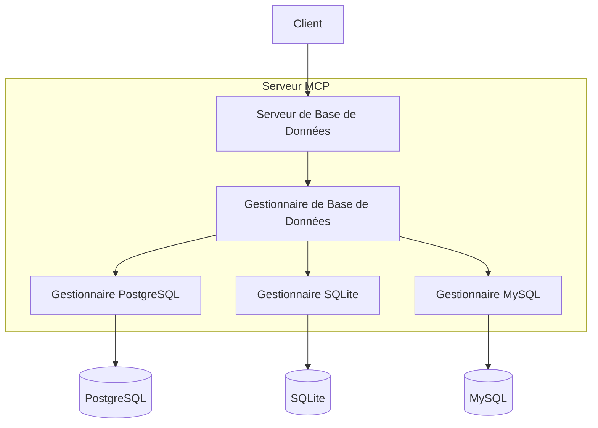

# Architecture

*[English](../../en/technical/architecture.md) | [中文](../../zh/technical/architecture.md) | Français | [Español](../../es/technical/architecture.md) | [العربية](../../ar/technical/architecture.md) | [Русский](../../ru/technical/architecture.md)*

Ce document décrit l'architecture technique de MCP Database Utilities, expliquant comment les différents composants interagissent pour fournir un accès sécurisé aux bases de données pour les assistants IA.

## Vue d'Ensemble de l'Architecture

MCP Database Utilities est conçu selon une architecture modulaire qui privilégie la sécurité, l'isolation et la flexibilité. Le système est composé de plusieurs couches distinctes qui travaillent ensemble pour fournir un accès sécurisé en lecture seule aux bases de données.

## Concept Fondamental: Conception en Couches d'Abstraction

La conception en couches d'abstraction est un concept fondamental de l'architecture de MCP Database Utilities. Tout comme une télécommande universelle peut contrôler différents appareils, l'utilisateur n'a besoin de connaître que les opérations de base, sans comprendre la complexité sous-jacente.

## Composants Principaux

### 1. Gestionnaire MCP (API Tools)

Ce composant est responsable de l'implémentation du protocole MCP et expose les outils que l'IA peut utiliser.

**Responsabilités:**
- Implémenter l'interface MCP pour l'intégration avec les clients IA
- Exposer les outils disponibles (list-tables, run-query, etc.)
- Gérer le cycle de vie des requêtes MCP
- Valider les entrées et formater les sorties

**Outils exposés:**
- `dbutils-list-connections`: Liste les connexions disponibles
- `dbutils-list-tables`: Liste les tables dans une base de données
- `dbutils-run-query`: Exécute une requête SQL (SELECT uniquement)
- `dbutils-get-stats`: Obtient des statistiques sur une table
- `dbutils-list-constraints`: Liste les contraintes d'une table
- `dbutils-explain-query`: Obtient le plan d'exécution d'une requête
- `dbutils-get-performance`: Obtient des métriques de performance
- `dbutils-analyze-query`: Analyse les requêtes pour optimisation

### 2. Gestionnaire de Requêtes

Ce composant traite les requêtes entrantes, les valide et les achemine vers les adaptateurs de base de données appropriés.

**Responsabilités:**
- Analyser et valider les requêtes SQL
- Appliquer des restrictions de sécurité (uniquement SELECT)
- Limiter la complexité des requêtes et la taille des résultats
- Gérer les timeouts et les annulations de requêtes
- Optimiser les requêtes lorsque possible

### 3. Gestionnaire SQL

Ce composant est responsable de l'analyse syntaxique et sémantique des requêtes SQL.

**Responsabilités:**
- Analyser la syntaxe SQL
- Valider la sémantique des requêtes
- Détecter et bloquer les opérations non autorisées (INSERT, UPDATE, DELETE, etc.)
- Identifier les tables et colonnes référencées
- Optimiser les requêtes lorsque possible

### 4. Gestionnaire de Connexions

Ce composant gère les connexions aux bases de données selon la configuration.

**Responsabilités:**
- Lire et valider la configuration des connexions
- Établir et maintenir les pools de connexions
- Gérer le cycle de vie des connexions
- Appliquer les paramètres de sécurité (SSL, timeout, etc.)
- Surveiller l'état des connexions

### 5. Gestionnaire de Cache

Ce composant met en cache les résultats des requêtes fréquentes pour améliorer les performances.

**Responsabilités:**
- Mettre en cache les résultats des requêtes
- Invalider le cache lorsque nécessaire
- Gérer la taille et la durée de vie du cache
- Optimiser les performances pour les requêtes répétées

### 6. Adaptateurs de Base de Données

Ces composants fournissent une interface unifiée pour différents types de bases de données.

**Adaptateurs supportés:**
- SQLite
- PostgreSQL
- MySQL

**Responsabilités:**
- Traduire les requêtes génériques en requêtes spécifiques à la base de données
- Gérer les spécificités de chaque type de base de données
- Optimiser les requêtes pour chaque moteur de base de données
- Gérer les erreurs spécifiques à chaque base de données

## Flux de Données

1. **Initialisation:**
   - Le service lit le fichier de configuration YAML
   - Les connexions aux bases de données sont configurées mais pas établies
   - Les outils MCP sont enregistrés et exposés

2. **Traitement des Requêtes:**
   - L'IA envoie une requête via le protocole MCP
   - Le Gestionnaire MCP reçoit la requête et la transmet au Gestionnaire de Requêtes
   - Le Gestionnaire de Requêtes valide la requête et la transmet à l'adaptateur approprié
   - L'adaptateur établit une connexion (ou utilise une connexion existante du pool)
   - La requête est exécutée et les résultats sont renvoyés
   - Les résultats sont formatés et renvoyés à l'IA

3. **Gestion des Erreurs:**
   - Les erreurs sont capturées à chaque niveau
   - Les messages d'erreur sont normalisés et rendus compréhensibles
   - Les erreurs de sécurité sont enregistrées et bloquées
   - Les timeouts sont gérés pour éviter les requêtes infinies

## Considérations de Sécurité

La sécurité est une priorité absolue dans l'architecture de MCP Database Utilities:

1. **Accès en Lecture Seule:**
   - Toutes les requêtes sont analysées pour garantir qu'elles sont en lecture seule
   - Les opérations de modification (INSERT, UPDATE, DELETE, etc.) sont bloquées
   - Les commandes DDL (CREATE, ALTER, DROP, etc.) sont bloquées

2. **Isolation:**
   - Chaque connexion est isolée
   - Les transactions sont en lecture seule
   - Les connexions sont établies à la demande et fermées après utilisation

3. **Authentification et Autorisation:**
   - Les informations d'identification sont stockées de manière sécurisée
   - Support pour SSL/TLS pour les connexions chiffrées
   - Possibilité d'utiliser des comptes de base de données en lecture seule

4. **Protection contre les Injections SQL:**
   - Toutes les entrées sont validées et échappées
   - Utilisation de requêtes paramétrées
   - Analyse syntaxique complète des requêtes SQL

5. **Limitation des Ressources:**
   - Timeouts pour toutes les requêtes
   - Limitation de la taille des résultats
   - Limitation de la complexité des requêtes

## Extensibilité

L'architecture est conçue pour être extensible:

1. **Nouveaux Adaptateurs:**
   - Support pour d'autres types de bases de données peut être ajouté
   - Interface commune pour tous les adaptateurs

2. **Nouveaux Outils:**
   - De nouveaux outils MCP peuvent être ajoutés facilement
   - Interface cohérente pour tous les outils

3. **Fonctionnalités Avancées:**
   - Support pour les vues matérialisées
   - Optimisation automatique des requêtes
   - Analyse avancée des performances

## Dépendances Externes

MCP Database Utilities dépend des bibliothèques suivantes:

- **SQLAlchemy**: ORM et toolkit SQL pour l'interaction avec les bases de données
- **PyYAML**: Parsing de fichiers YAML pour la configuration
- **Psycopg2**: Adaptateur PostgreSQL
- **PyMySQL**: Adaptateur MySQL
- **Pydantic**: Validation des données et sérialisation

## Limites Connues

- Pas de support pour les procédures stockées
- Pas de support pour les transactions complexes
- Pas de support pour les bases de données NoSQL (pour l'instant)
- Pas de support pour les requêtes distribuées entre plusieurs bases de données

## Évolutions Futures

- Support pour d'autres types de bases de données (MongoDB, Oracle, SQL Server, etc.)
- Amélioration des capacités d'analyse et d'optimisation des requêtes
- Support pour les bases de données fédérées
- Interface d'administration pour la gestion des connexions
- Métriques et monitoring avancés
