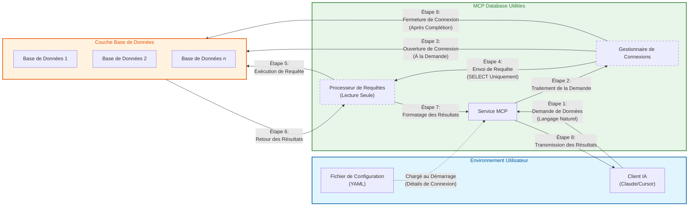

# Architecture de Sécurité

*[English](../../en/technical/security.md) | [中文](../../zh/technical/security.md) | Français | [Español](../../es/technical/security.md) | [العربية](../../ar/technical/security.md) | [Русский](../../ru/technical/security.md)*

Ce document détaille l'architecture de sécurité de MCP Database Utilities, expliquant les mécanismes et principes qui garantissent un accès sécurisé aux bases de données pour les assistants IA.

## Modèle de Communication et Architecture de Sécurité

MCP Database Utilities implémente un modèle de communication sécurisé conçu pour protéger vos données à chaque étape. Le diagramme suivant illustre comment les données circulent entre les composants tout en maintenant la sécurité:



## Principes de Sécurité

MCP Database Utilities a été conçu avec la sécurité comme priorité absolue, en suivant ces principes fondamentaux:

1. **Défense en Profondeur**: Multiples couches de sécurité pour protéger les données
2. **Principe du Moindre Privilège**: Accès minimal nécessaire pour fonctionner
3. **Sécurité par Conception**: La sécurité est intégrée dès la conception, pas ajoutée après coup
4. **Transparence**: Architecture ouverte et vérifiable
5. **Isolation**: Séparation stricte des environnements et des connexions

## Mécanismes de Sécurité Clés

### 1. Opérations Strictement en Lecture Seule

Toutes les interactions avec les bases de données sont limitées aux opérations de lecture seule:

- **Analyse Syntaxique Complète**: Chaque requête SQL est entièrement analysée pour garantir qu'elle est en lecture seule
- **Blocage des Opérations de Modification**: Toutes les commandes qui modifient des données (INSERT, UPDATE, DELETE, etc.) sont automatiquement bloquées
- **Blocage des Commandes DDL**: Les commandes qui modifient la structure de la base de données (CREATE, ALTER, DROP, etc.) sont bloquées
- **Validation à Plusieurs Niveaux**: Les requêtes sont validées à la fois par le parseur SQL et par des vérifications spécifiques à chaque type de base de données

```python
# Exemple de validation de requête (pseudo-code)
def validate_query(query):
    # Analyse syntaxique de la requête
    parsed_query = sql_parser.parse(query)

    # Vérification du type de requête
    if not parsed_query.is_select():
        raise SecurityException("Seules les requêtes SELECT sont autorisées")

    # Vérification des clauses dangereuses
    if parsed_query.has_dangerous_clauses():
        raise SecurityException("Clauses non autorisées détectées")

    # Vérification spécifique à la base de données
    db_adapter.validate_read_only(query)

    return parsed_query
```

### 2. Pas d'Accès Direct à la Base de Données

L'architecture garantit que l'IA n'a jamais d'accès direct aux bases de données:

- **Couche d'Abstraction**: Toutes les requêtes passent par plusieurs couches d'abstraction
- **Validation des Entrées**: Toutes les entrées sont validées et nettoyées
- **Requêtes Paramétrées**: Utilisation systématique de requêtes paramétrées pour prévenir les injections SQL
- **Isolation des Connexions**: Chaque connexion est isolée et gérée par le service

### 3. Connexions Isolées

Les connexions aux bases de données sont strictement isolées:

- **Pool de Connexions Dédié**: Chaque configuration de base de données utilise son propre pool de connexions
- **Transactions en Lecture Seule**: Toutes les transactions sont explicitement configurées en mode lecture seule
- **Timeouts Automatiques**: Les connexions ont des timeouts configurables pour éviter les connexions persistantes
- **Fermeture Propre**: Les connexions sont correctement fermées après utilisation

```yaml
# Exemple de configuration avec paramètres de sécurité
connections:
  secure-postgres:
    type: postgres
    host: db.example.com
    port: 5432
    dbname: analytics
    user: readonly_user
    password: "********"
    ssl:
      mode: verify-full
      cert: /path/to/cert.pem
      key: /path/to/key.pem
      root: /path/to/root.crt
    pool:
      max_size: 5
      timeout: 30
```

### 4. Connectivité à la Demande

Les connexions aux bases de données sont établies uniquement lorsque nécessaire:

- **Connexion Tardive**: Les connexions ne sont établies que lorsqu'une requête est effectivement exécutée
- **Déconnexion Rapide**: Les connexions sont remises dans le pool dès que possible
- **Limitation des Connexions**: Nombre maximal de connexions simultanées configurable
- **Surveillance des Connexions**: Toutes les connexions sont surveillées pour détecter les anomalies

### 5. Timeouts Automatiques

Des timeouts sont appliqués à plusieurs niveaux pour éviter les abus:

- **Timeout de Requête**: Limite de temps pour l'exécution d'une requête
- **Timeout de Connexion**: Limite de temps pour l'établissement d'une connexion
- **Timeout d'Inactivité**: Fermeture des connexions inactives après une période configurable
- **Timeout Global**: Limite de temps totale pour une session

### 6. Protection des Informations d'Identification

Les informations d'identification des bases de données sont protégées:

- **Stockage Sécurisé**: Les mots de passe ne sont jamais stockés en clair dans la mémoire
- **Masquage dans les Logs**: Les informations sensibles sont masquées dans tous les logs
- **Support pour les Gestionnaires de Secrets**: Intégration possible avec des solutions comme HashiCorp Vault, AWS Secrets Manager, etc.
- **Rotation des Identifiants**: Support pour la rotation périodique des identifiants

### 7. Sécurité des Communications

Les communications avec les bases de données sont sécurisées:

- **Support SSL/TLS**: Connexions chiffrées pour toutes les bases de données supportées
- **Vérification des Certificats**: Option pour vérifier les certificats des serveurs de base de données
- **Configurations SSL Avancées**: Options pour configurer précisément les paramètres SSL/TLS
- **Protocoles Sécurisés**: Utilisation des versions récentes et sécurisées des protocoles

```yaml
# Exemple de configuration SSL pour PostgreSQL
connections:
  postgres-ssl:
    type: postgres
    host: secure-db.example.com
    port: 5432
    dbname: analytics
    user: readonly_user
    password: "********"
    ssl:
      mode: verify-full  # Options: disable, allow, prefer, require, verify-ca, verify-full
      cert: /path/to/client-cert.pem
      key: /path/to/client-key.pem
      root: /path/to/root.crt
```

## Mesures de Protection de la Vie Privée

### 1. Traitement Local

Toutes les opérations sont effectuées localement:

- **Pas de Transfert de Données**: Les données ne quittent jamais l'environnement local
- **Pas de Téléchargement de Schéma**: Les schémas de base de données ne sont pas envoyés à des services externes
- **Pas de Télémétrie**: Aucune donnée d'utilisation n'est collectée ou envoyée

### 2. Exposition Minimale des Données

Le service est conçu pour minimiser l'exposition des données:

- **Limitation des Résultats**: Nombre maximal de lignes retournées configurable
- **Pagination Automatique**: Les grands ensembles de résultats sont paginés
- **Filtrage des Colonnes Sensibles**: Possibilité de configurer des colonnes à exclure des résultats
- **Masquage des Données**: Option pour masquer automatiquement les données sensibles (PII, etc.)

### 3. Protection des Identifiants

Les identifiants de connexion sont protégés:

- **Pas d'Exposition des Identifiants**: Les identifiants ne sont jamais exposés à l'IA
- **Abstraction des Connexions**: L'IA utilise des noms logiques de connexion, pas les détails réels
- **Validation des Permissions**: Vérification que les comptes utilisés ont des permissions minimales

### 4. Masquage des Données Sensibles

Les données sensibles peuvent être automatiquement masquées:

- **Détection de PII**: Option pour détecter et masquer automatiquement les informations personnelles identifiables
- **Règles de Masquage Configurables**: Possibilité de définir des règles de masquage personnalisées
- **Journalisation Sécurisée**: Les données sensibles sont masquées dans tous les logs

## Bonnes Pratiques de Sécurité

### Configuration Sécurisée

Recommandations pour une configuration sécurisée:

1. **Utilisez des Comptes en Lecture Seule**:
   ```sql
   -- Exemple pour PostgreSQL
   CREATE ROLE readonly_user WITH LOGIN PASSWORD 'secure_password';
   GRANT CONNECT ON DATABASE analytics TO readonly_user;
   GRANT USAGE ON SCHEMA public TO readonly_user;
   GRANT SELECT ON ALL TABLES IN SCHEMA public TO readonly_user;
   ```

2. **Activez SSL/TLS**:
   ```yaml
   connections:
     secure-db:
       # ...
       ssl:
         mode: verify-full
         # ...
   ```

3. **Limitez l'Accès aux Tables**:
   ```yaml
   connections:
     limited-access:
       # ...
       allowed_tables:
         - public.products
         - public.categories
         - analytics.sales
   ```

4. **Configurez des Timeouts Appropriés**:

   MCP Database Utilities fournit trois paramètres de timeout configurables pour assurer la sécurité des connexions à la base de données et une utilisation efficace des ressources:

   **Timeout de Requête (query_timeout)**:
   - **Objectif**: Limite le temps maximum d'exécution d'une requête SQL. Les requêtes dépassant ce délai seront automatiquement interrompues.
   - **Unité**: Secondes
   - **Valeur par défaut**: 60 secondes
   - **Cas d'utilisation**: Empêche les requêtes complexes ou les requêtes sur de grandes tables de consommer des ressources excessives
   - **Recommandations**:
     - Requêtes régulières: 30-60 secondes
     - Requêtes d'analyse de données: 300-600 secondes
     - Génération de rapports: Jusqu'à 1800 secondes

   **Timeout de Connexion (connection_timeout)**:
   - **Objectif**: Limite le temps d'attente maximum pour établir une connexion à la base de données. Des erreurs de connexion seront renvoyées si une connexion ne peut pas être établie dans ce délai.
   - **Unité**: Secondes
   - **Valeur par défaut**: 10 secondes
   - **Cas d'utilisation**: Utile dans des environnements réseau instables ou lorsque la charge de la base de données est élevée
   - **Recommandations**:
     - Bases de données locales: 5-10 secondes
     - Bases de données distantes: 15-30 secondes
     - Environnements à charge élevée: Jusqu'à 60 secondes

   **Timeout d'Inactivité (idle_timeout)**:
   - **Objectif**: Définit combien de temps une connexion peut rester inactive avant d'être automatiquement fermée. Cela aide à libérer les ressources de connexion inutilisées.
   - **Unité**: Secondes
   - **Valeur par défaut**: 300 secondes (5 minutes)
   - **Cas d'utilisation**: Gère les connexions inactives dans le pool de connexions
   - **Recommandations**:
     - Utilisation à haute fréquence: 600-1200 secondes
     - Utilisation générale: 300-600 secondes
     - Utilisation à basse fréquence: 60-180 secondes

   **Relations entre les Paramètres**:
   - Typiquement idle_timeout > query_timeout > connection_timeout
   - Si vos requêtes doivent s'exécuter pendant une longue période, assurez-vous que query_timeout est suffisamment long
   - Si idle_timeout est trop court, cela peut provoquer des créations et destructions fréquentes de connexions, affectant les performances

   **Exemple de Configuration**:
   ```yaml
   connections:
     analytics-db:
       type: postgres
       host: analytics.example.com
       port: 5432
       dbname: analytics
       user: analyst
       password: secure_password
       # Configuration des timeouts (toutes les valeurs en secondes)
       query_timeout: 300     # Permet des requêtes analytiques de longue durée
       connection_timeout: 15  # Temps d'attente pour la connexion à la base de données distante
       idle_timeout: 600      # Maintient les connexions actives pour des requêtes fréquentes
   ```

   **Remarques Importantes**:
   - Des timeouts trop courts peuvent interrompre des requêtes légitimes
   - Des timeouts trop longs peuvent gaspiller des ressources et créer des risques potentiels de sécurité
   - Ajustez ces valeurs en fonction de votre cas d'utilisation spécifique et des performances de votre base de données

### Surveillance et Audit

Recommandations pour la surveillance et l'audit:

1. **Activez la Journalisation**:
   ```yaml
   logging:
     level: INFO  # Options: DEBUG, INFO, WARNING, ERROR
     file: /path/to/dbutils.log
     format: "%(asctime)s - %(name)s - %(levelname)s - %(message)s"
   ```

2. **Surveillez les Requêtes**:
   ```yaml
   monitoring:
     log_queries: true
     log_slow_queries: true
     slow_query_threshold: 5  # secondes
   ```

3. **Configurez des Alertes**:
   ```yaml
   alerts:
     failed_connections:
       threshold: 5
       period: 60  # secondes
       action: "email:admin@example.com"
   ```

## Audit de Sécurité

MCP Database Utilities est régulièrement soumis à des audits de sécurité:

1. **Analyse de Code Statique**: Le code est analysé pour détecter les vulnérabilités potentielles
2. **Tests de Pénétration**: Des tests de pénétration sont effectués pour identifier les failles
3. **Revue de Code**: Le code est revu par des experts en sécurité
4. **Analyse des Dépendances**: Les dépendances sont analysées pour détecter les vulnérabilités connues

## Gestion des Vulnérabilités

Processus de gestion des vulnérabilités:

1. **Signalement**: Les vulnérabilités peuvent être signalées via GitHub ou par email
2. **Évaluation**: Chaque vulnérabilité est évaluée pour déterminer sa gravité
3. **Correction**: Les vulnérabilités sont corrigées dans les plus brefs délais
4. **Communication**: Les utilisateurs sont informés des vulnérabilités et des correctifs

## Conclusion

La sécurité est au cœur de MCP Database Utilities. L'architecture a été conçue pour garantir que les assistants IA peuvent accéder aux données des bases de données de manière sécurisée, sans compromettre la confidentialité ou l'intégrité des données. Les multiples couches de protection, l'accès strictement en lecture seule et les mécanismes d'isolation garantissent que les données sont protégées à tout moment.
