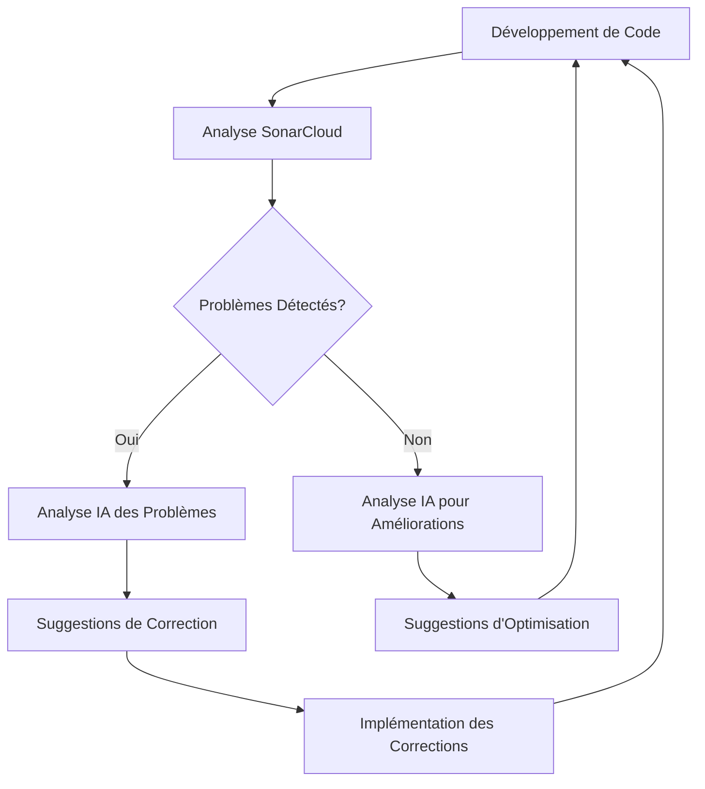

# Intégration SonarCloud et IA

*[English](../../en/technical/sonarcloud-integration.md) | [中文](../../zh/technical/sonarcloud-integration.md) | Français | [Español](../../es/technical/sonarcloud-integration.md) | [العربية](../../ar/technical/sonarcloud-integration.md) | [Русский](../../ru/technical/sonarcloud-integration.md)*

Ce document explique comment MCP Database Utilities utilise SonarCloud pour l'analyse de code et comment l'IA est intégrée dans ce processus pour améliorer la qualité du code.

## Introduction à SonarCloud

[SonarCloud](https://sonarcloud.io/) est une plateforme d'analyse de code en ligne qui aide les développeurs à détecter les bugs, les vulnérabilités et les "code smells" dans leur code. Elle prend en charge de nombreux langages de programmation, dont Python, et s'intègre facilement aux workflows CI/CD.

## Configuration de SonarCloud pour MCP Database Utilities

### Intégration GitHub

MCP Database Utilities utilise SonarCloud en l'intégrant à GitHub:

1. Le projet est configuré sur SonarCloud avec l'organisation `donghao1393`
2. L'analyse est déclenchée automatiquement à chaque push ou pull request
3. Les résultats sont affichés sur le tableau de bord SonarCloud et dans les pull requests GitHub

### Configuration du Projet

La configuration SonarCloud est définie dans le fichier `sonar-project.properties`:

```properties
# Identifiant du projet et organisation
sonar.projectKey=donghao1393_mcp-dbutils
sonar.organization=donghao1393

# Informations sur le projet
sonar.projectName=MCP Database Utilities
sonar.projectVersion=1.0

# Chemin vers les sources
sonar.sources=mcp_dbutils
sonar.python.coverage.reportPaths=coverage.xml
sonar.python.xunit.reportPath=test-results.xml

# Exclusions
sonar.exclusions=tests/**/*,docs/**/*,examples/**/*

# Encodage du code source
sonar.sourceEncoding=UTF-8
```

### Workflow GitHub Actions

L'analyse SonarCloud est exécutée via GitHub Actions:

```yaml
# .github/workflows/sonarcloud.yml
name: SonarCloud Analysis

on:
  push:
    branches: [ main ]
  pull_request:
    branches: [ main ]

jobs:
  sonarcloud:
    name: SonarCloud
    runs-on: ubuntu-latest
    steps:
      - uses: actions/checkout@v3
        with:
          fetch-depth: 0  # Shallow clones should be disabled for better relevancy
      
      - name: Set up Python
        uses: actions/setup-python@v4
        with:
          python-version: '3.10'
      
      - name: Install dependencies
        run: |
          python -m pip install --upgrade pip
          pip install -e ".[dev,test]"
      
      - name: Run tests with coverage
        run: |
          pytest --cov=mcp_dbutils --cov-report=xml --junitxml=test-results.xml
      
      - name: SonarCloud Scan
        uses: SonarSource/sonarcloud-github-action@master
        env:
          GITHUB_TOKEN: ${{ secrets.GITHUB_TOKEN }}
          SONAR_TOKEN: ${{ secrets.SONAR_TOKEN }}
```

## Métriques Surveillées

SonarCloud surveille plusieurs métriques clés pour MCP Database Utilities:

### 1. Qualité du Code

- **Bugs**: Problèmes dans le code qui peuvent causer des comportements incorrects
- **Vulnérabilités**: Faiblesses de sécurité potentielles
- **Code Smells**: Problèmes de maintenabilité qui rendent le code difficile à comprendre ou à modifier
- **Dette Technique**: Estimation du temps nécessaire pour corriger tous les code smells

### 2. Couverture de Tests

- **Couverture de Ligne**: Pourcentage de lignes de code exécutées par les tests
- **Couverture de Branche**: Pourcentage de branches de code (if/else, etc.) exécutées par les tests
- **Couverture de Condition**: Pourcentage de conditions booléennes testées

### 3. Duplication

- **Lignes Dupliquées**: Pourcentage de code dupliqué dans le projet
- **Blocs Dupliqués**: Nombre de blocs de code dupliqués

### 4. Complexité

- **Complexité Cyclomatique**: Mesure de la complexité du code basée sur le nombre de chemins d'exécution
- **Complexité Cognitive**: Mesure de la difficulté à comprendre le code

## Intégration de l'IA dans l'Analyse de Code

MCP Database Utilities utilise l'IA pour améliorer l'analyse de code de plusieurs façons:

### 1. Analyse Automatique des Pull Requests

Lorsqu'une pull request est créée, un bot IA analyse les résultats SonarCloud et fournit des commentaires:

```python
def analyze_sonarcloud_results(pr_number):
    """Analyse les résultats SonarCloud pour une pull request et ajoute des commentaires."""
    # Récupérer les résultats SonarCloud
    results = get_sonarcloud_results(pr_number)
    
    # Analyser les résultats avec l'IA
    analysis = ai_analyze_results(results)
    
    # Ajouter des commentaires à la pull request
    add_pr_comments(pr_number, analysis)
```

Le bot IA peut:
- Expliquer les problèmes détectés en langage naturel
- Suggérer des corrections pour les problèmes courants
- Identifier les modèles récurrents dans les problèmes
- Prioriser les problèmes en fonction de leur impact

### 2. Suggestions de Refactoring

L'IA peut suggérer des refactorings pour améliorer la qualité du code:

```python
def suggest_refactoring(file_path, code_smells):
    """Suggère des refactorings pour résoudre les code smells."""
    # Lire le fichier
    with open(file_path, 'r') as f:
        code = f.read()
    
    # Générer des suggestions de refactoring avec l'IA
    suggestions = ai_generate_refactoring_suggestions(code, code_smells)
    
    return suggestions
```

Exemples de suggestions:
- Extraction de méthodes pour réduire la complexité
- Renommage de variables pour améliorer la lisibilité
- Restructuration du code pour éliminer la duplication
- Application de design patterns appropriés

### 3. Analyse de Tendance

L'IA analyse les tendances de qualité du code au fil du temps:

```python
def analyze_quality_trends():
    """Analyse les tendances de qualité du code au fil du temps."""
    # Récupérer l'historique des métriques
    metrics_history = get_metrics_history()
    
    # Analyser les tendances avec l'IA
    trends_analysis = ai_analyze_trends(metrics_history)
    
    return trends_analysis
```

Cette analyse peut:
- Identifier les tendances positives ou négatives
- Corréler les changements de qualité avec des événements du projet
- Prédire les problèmes potentiels futurs
- Recommander des domaines d'amélioration

### 4. Génération de Tests

L'IA peut générer des tests pour améliorer la couverture:

```python
def generate_tests(file_path, coverage_gaps):
    """Génère des tests pour combler les lacunes de couverture."""
    # Lire le fichier
    with open(file_path, 'r') as f:
        code = f.read()
    
    # Générer des tests avec l'IA
    tests = ai_generate_tests(code, coverage_gaps)
    
    return tests
```

Les tests générés:
- Ciblent spécifiquement les parties du code non couvertes
- Suivent les conventions de test du projet
- Incluent des assertions pertinentes
- Sont accompagnés de documentation

## Workflow d'Amélioration Continue

L'intégration de SonarCloud et de l'IA s'inscrit dans un workflow d'amélioration continue:



1. **Développement de Code**: Les développeurs écrivent ou modifient du code
2. **Analyse SonarCloud**: Le code est analysé automatiquement par SonarCloud
3. **Détection de Problèmes**: SonarCloud identifie les problèmes potentiels
4. **Analyse IA**: L'IA analyse les problèmes ou cherche des optimisations
5. **Suggestions**: L'IA fournit des suggestions concrètes
6. **Implémentation**: Les développeurs implémentent les corrections ou optimisations
7. **Cycle Continu**: Le processus se répète pour une amélioration continue

## Exemples Concrets

### Exemple 1: Correction d'un Bug Détecté

**Problème détecté par SonarCloud**:
```
Bug: "TypeError" will be raised when calling "execute_query" with None as "query" parameter.
```

**Analyse IA**:
```
Ce bug se produit parce que la méthode execute_query() n'a pas de validation pour le paramètre query.
Si None est passé, une TypeError sera levée lors de l'appel à query.strip().
```

**Suggestion de correction**:
```python
# Avant
def execute_query(self, query):
    """Exécute une requête SQL."""
    query = query.strip()
    # ...

# Après
def execute_query(self, query):
    """Exécute une requête SQL."""
    if query is None:
        raise ValueError("La requête ne peut pas être None")
    query = query.strip()
    # ...
```

### Exemple 2: Réduction de la Complexité

**Problème détecté par SonarCloud**:
```
Code Smell: Cognitive Complexity of function "parse_config" is 25 which is greater than 15 authorized.
```

**Analyse IA**:
```
La fonction parse_config() est trop complexe avec de nombreuses conditions imbriquées.
Elle peut être simplifiée en extrayant des fonctions auxiliaires pour chaque type de configuration.
```

**Suggestion de refactoring**:
```python
# Avant
def parse_config(config_dict):
    """Parse le dictionnaire de configuration."""
    result = {}
    if "connections" in config_dict:
        connections = {}
        for name, conn_config in config_dict["connections"].items():
            if "type" not in conn_config:
                raise ValueError(f"Type de connexion manquant pour {name}")
            
            conn_type = conn_config["type"]
            if conn_type == "sqlite":
                # Logique spécifique à SQLite
                if "path" not in conn_config:
                    raise ValueError(f"Chemin de base de données manquant pour {name}")
                # ...
            elif conn_type == "postgres":
                # Logique spécifique à PostgreSQL
                # ...
            elif conn_type == "mysql":
                # Logique spécifique à MySQL
                # ...
            else:
                raise ValueError(f"Type de connexion inconnu: {conn_type}")
            
            connections[name] = conn_config
        result["connections"] = connections
    # ...
    return result

# Après
def parse_sqlite_config(name, conn_config):
    """Parse la configuration SQLite."""
    if "path" not in conn_config:
        raise ValueError(f"Chemin de base de données manquant pour {name}")
    # ...
    return conn_config

def parse_postgres_config(name, conn_config):
    """Parse la configuration PostgreSQL."""
    # ...
    return conn_config

def parse_mysql_config(name, conn_config):
    """Parse la configuration MySQL."""
    # ...
    return conn_config

def parse_config(config_dict):
    """Parse le dictionnaire de configuration."""
    result = {}
    if "connections" in config_dict:
        connections = {}
        for name, conn_config in config_dict["connections"].items():
            if "type" not in conn_config:
                raise ValueError(f"Type de connexion manquant pour {name}")
            
            conn_type = conn_config["type"]
            if conn_type == "sqlite":
                connections[name] = parse_sqlite_config(name, conn_config)
            elif conn_type == "postgres":
                connections[name] = parse_postgres_config(name, conn_config)
            elif conn_type == "mysql":
                connections[name] = parse_mysql_config(name, conn_config)
            else:
                raise ValueError(f"Type de connexion inconnu: {conn_type}")
        
        result["connections"] = connections
    # ...
    return result
```

### Exemple 3: Amélioration de la Couverture de Tests

**Problème détecté par SonarCloud**:
```
Coverage: Line coverage of file "mcp_dbutils/adapters/mysql.py" is 68.5% which is less than 80% required.
```

**Analyse IA**:
```
Le fichier mysql.py manque de couverture de test, particulièrement pour les cas d'erreur et les fonctionnalités avancées.
Les méthodes execute_query() et get_table_stats() ont une couverture particulièrement faible.
```

**Tests générés par l'IA**:
```python
def test_mysql_adapter_execute_query_error():
    """Teste que l'adaptateur MySQL gère correctement les erreurs de requête."""
    # Configurer le mock
    mock_connection = MagicMock()
    mock_cursor = MagicMock()
    mock_connection.cursor.return_value = mock_cursor
    mock_cursor.execute.side_effect = pymysql.Error("Erreur de test")
    
    # Configurer l'adaptateur avec le mock
    adapter = MySQLAdapter({"type": "mysql", "host": "localhost", "database": "test"})
    adapter._connection = mock_connection
    
    # Vérifier que l'erreur est correctement propagée
    with pytest.raises(DatabaseError):
        adapter.execute_query("SELECT * FROM nonexistent_table")

def test_mysql_adapter_get_table_stats():
    """Teste la méthode get_table_stats de l'adaptateur MySQL."""
    # Configurer les mocks
    mock_connection = MagicMock()
    mock_cursor = MagicMock()
    mock_connection.cursor.return_value = mock_cursor
    
    # Configurer les résultats pour les différentes requêtes
    mock_cursor.fetchall.side_effect = [
        [(1000,)],  # Nombre de lignes
        [(1024 * 1024,)],  # Taille de la table
        [("id", "int", "PRI"), ("name", "varchar(100)", "")],  # Structure
        [(10,), (5,)]  # Statistiques de colonne
    ]
    
    # Configurer l'adaptateur avec le mock
    adapter = MySQLAdapter({"type": "mysql", "host": "localhost", "database": "test"})
    adapter._connection = mock_connection
    
    # Exécuter la méthode
    stats = adapter.get_table_stats("test_table")
    
    # Vérifier les résultats
    assert stats["row_count"] == 1000
    assert stats["size_bytes"] == 1024 * 1024
    assert len(stats["columns"]) == 2
    assert stats["columns"][0]["name"] == "id"
    assert stats["columns"][0]["type"] == "int"
    assert stats["columns"][0]["key"] == "PRI"
```

## Badges SonarCloud

MCP Database Utilities affiche les badges SonarCloud dans son README pour montrer l'état actuel de la qualité du code:

```markdown
[](https://sonarcloud.io/dashboard?id=donghao1393_mcp-dbutils)
[](https://sonarcloud.io/dashboard?id=donghao1393_mcp-dbutils)
[](https://sonarcloud.io/dashboard?id=donghao1393_mcp-dbutils)
[](https://sonarcloud.io/dashboard?id=donghao1393_mcp-dbutils)
[](https://sonarcloud.io/dashboard?id=donghao1393_mcp-dbutils)
```

## Conclusion

L'intégration de SonarCloud et de l'IA dans le processus de développement de MCP Database Utilities permet:

1. **Détection Précoce des Problèmes**: Les bugs, vulnérabilités et code smells sont détectés avant qu'ils n'atteignent la production
2. **Amélioration Continue**: Le code s'améliore constamment grâce aux suggestions de l'IA
3. **Réduction de la Dette Technique**: Les problèmes sont résolus systématiquement, réduisant la dette technique
4. **Augmentation de la Qualité**: La qualité globale du code s'améliore au fil du temps
5. **Apprentissage des Développeurs**: Les développeurs apprennent de l'IA et améliorent leurs compétences

Cette approche garantit que MCP Database Utilities maintient un haut niveau de qualité, de sécurité et de maintenabilité, ce qui est essentiel pour un outil qui interagit avec des bases de données.
