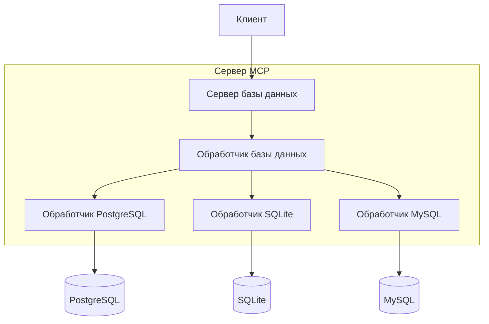

# Архитектура

*[English](../../en/technical/architecture.md) | [中文](../../zh/technical/architecture.md) | [Français](../../fr/technical/architecture.md) | [Español](../../es/technical/architecture.md) | [العربية](../../ar/technical/architecture.md) | Русский*

Этот документ описывает техническую архитектуру MCP Database Utilities, объясняя, как различные компоненты взаимодействуют для обеспечения безопасного доступа к базам данных для ИИ-ассистентов.

## Обзор архитектуры

MCP Database Utilities спроектирован с модульной архитектурой, которая отдает приоритет безопасности, изоляции и гибкости. Система состоит из нескольких отдельных слоев, которые работают вместе для обеспечения безопасного доступа только для чтения к базам данных.

## Фундаментальная концепция: Дизайн слоев абстракции

Дизайн слоев абстракции является фундаментальной концепцией в архитектуре MCP Database Utilities. Подобно универсальному пульту дистанционного управления, который может управлять различными устройствами, пользователю нужно знать только базовые операции, не понимая лежащей в основе сложности.

## Основные компоненты

### 1. MCP-менеджер (API-инструменты)

Этот компонент отвечает за реализацию протокола MCP и предоставление инструментов, которые может использовать ИИ.

**Обязанности:**
- Реализация MCP-интерфейса для интеграции с ИИ-клиентами
- Предоставление доступных инструментов (list-tables, run-query и т.д.)
- Управление жизненным циклом MCP-запросов
- Валидация входных данных и форматирование выходных данных

**Предоставляемые инструменты:**
- `dbutils-list-connections`: Перечисление доступных соединений
- `dbutils-list-tables`: Перечисление таблиц в базе данных
- `dbutils-run-query`: Выполнение SQL-запроса (только SELECT)
- `dbutils-get-stats`: Получение статистики по таблице
- `dbutils-list-constraints`: Перечисление ограничений таблицы
- `dbutils-explain-query`: Получение плана выполнения запроса
- `dbutils-get-performance`: Получение метрик производительности
- `dbutils-analyze-query`: Анализ запросов для оптимизации

### 2. Менеджер запросов

Этот компонент обрабатывает входящие запросы, валидирует их и направляет к соответствующим адаптерам баз данных.

**Обязанности:**
- Парсинг и валидация SQL-запросов
- Применение ограничений безопасности (только SELECT)
- Ограничение сложности запросов и размера результатов
- Управление таймаутами и отменой запросов
- Оптимизация запросов, где возможно

### 3. SQL-менеджер

Этот компонент отвечает за синтаксический и семантический анализ SQL-запросов.

**Обязанности:**
- Парсинг SQL-синтаксиса
- Валидация семантики запросов
- Обнаружение и блокировка неавторизованных операций (INSERT, UPDATE, DELETE и т.д.)
- Идентификация упоминаемых таблиц и столбцов
- Оптимизация запросов, где возможно

### 4. Менеджер соединений

Этот компонент управляет соединениями с базами данных согласно конфигурации.

**Обязанности:**
- Чтение и валидация конфигурации соединений
- Создание и поддержание пулов соединений
- Управление жизненным циклом соединений
- Применение параметров безопасности (SSL, таймауты и т.д.)
- Мониторинг состояния соединений

### 5. Менеджер кэширования

Этот компонент кэширует результаты повторяющихся запросов для улучшения производительности.

**Обязанности:**
- Кэширование результатов запросов
- Инвалидация кэша при необходимости
- Управление размером и временем жизни кэша
- Оптимизация производительности для повторяющихся запросов

### 6. Адаптеры баз данных

Эти компоненты предоставляют унифицированный интерфейс для различных типов баз данных.

**Поддерживаемые адаптеры:**
- SQLite
- PostgreSQL
- MySQL

**Обязанности:**
- Перевод общих запросов в запросы, специфичные для базы данных
- Управление особенностями каждого типа базы данных
- Оптимизация запросов для каждого движка базы данных
- Обработка ошибок, специфичных для каждой базы данных

## Поток данных

1. **Инициализация:**
   - Сервис читает YAML-файл конфигурации
   - Соединения с базами данных конфигурируются, но не создаются
   - MCP-инструменты регистрируются и предоставляются

2. **Обработка запросов:**
   - ИИ отправляет запрос через протокол MCP
   - MCP-менеджер получает запрос и передает его менеджеру запросов
   - Менеджер запросов валидирует запрос и передает его соответствующему адаптеру
   - Адаптер создает соединение (или использует существующее из пула)
   - Запрос выполняется и результаты возвращаются
   - Результаты форматируются и возвращаются ИИ

3. **Обработка ошибок:**
   - Ошибки перехватываются на каждом уровне
   - Сообщения об ошибках унифицируются и делаются понятными
   - Ошибки безопасности логируются и блокируются
   - Таймауты управляются для предотвращения бесконечных запросов

## Соображения безопасности

Безопасность является высшим приоритетом в архитектуре MCP Database Utilities:

1. **Строго только чтение:**
   - Все запросы анализируются, чтобы убедиться, что они только для чтения
   - Операции модификации (INSERT, UPDATE, DELETE и т.д.) блокируются
   - Команды DDL (CREATE, ALTER, DROP и т.д.) блокируются

2. **Изоляция:**
   - Каждое соединение изолировано
   - Транзакции только для чтения
   - Соединения создаются по запросу и закрываются после использования

3. **Аутентификация и авторизация:**
   - Учетные данные хранятся безопасно
   - Поддержка SSL/TLS для зашифрованных соединений
   - Возможность использования учетных записей баз данных только для чтения

4. **Защита от SQL-инъекций:**
   - Все входные данные валидируются и экранируются
   - Использование параметризованных запросов
   - Полный синтаксический анализ SQL-запросов

5. **Ограничение ресурсов:**
   - Таймауты для всех запросов
   - Ограничение размера результатов
   - Ограничение сложности запросов

## Масштабируемость

Архитектура спроектирована для масштабируемости:

1. **Новые адаптеры:**
   - Может быть добавлена поддержка других типов баз данных
   - Общий интерфейс для всех адаптеров

2. **Новые инструменты:**
   - Новые MCP-инструменты могут быть легко добавлены
   - Последовательный интерфейс для всех инструментов

3. **Продвинутые функции:**
   - Поддержка материализованных представлений
   - Автоматическая оптимизация запросов
   - Продвинутый анализ производительности

## Внешние зависимости

MCP Database Utilities зависит от следующих библиотек:

- **SQLAlchemy**: ORM и SQL-инструменты для взаимодействия с базами данных
- **PyYAML**: Парсинг YAML-файлов для конфигурации
- **Psycopg2**: Адаптер PostgreSQL
- **PyMySQL**: Адаптер MySQL
- **Pydantic**: Валидация и сериализация данных

## Известные ограничения

- Нет поддержки хранимых процедур
- Нет поддержки сложных транзакций
- Нет поддержки NoSQL баз данных (на данный момент)
- Нет поддержки распределенных запросов между несколькими базами данных

## Будущие разработки

- Поддержка других типов баз данных (MongoDB, Oracle, SQL Server и т.д.)
- Улучшение возможностей анализа и оптимизации запросов
- Поддержка федеративных баз данных
- Административный интерфейс для управления соединениями
- Продвинутые метрики и мониторинг
