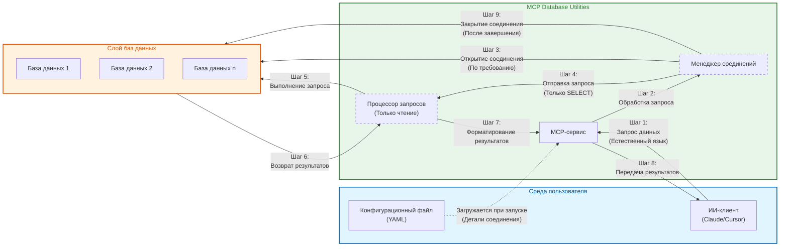

# Архитектура безопасности

*[English](../../en/technical/security.md) | [中文](../../zh/technical/security.md) | [Français](../../fr/technical/security.md) | [Español](../../es/technical/security.md) | [العربية](../../ar/technical/security.md) | Русский*

Этот документ детализирует архитектуру безопасности MCP Database Utilities, объясняя механизмы и принципы, обеспечивающие безопасный доступ к базам данных для ИИ-ассистентов.

## Модель коммуникации и архитектура безопасности

MCP Database Utilities реализует безопасную модель коммуникации, разработанную для защиты ваших данных на каждом этапе. Следующая диаграмма иллюстрирует, как данные перемещаются между компонентами с сохранением безопасности:



## Принципы безопасности

MCP Database Utilities спроектирован с безопасностью в качестве высшего приоритета, следуя этим основным принципам:

1. **Многоуровневая защита**: Множественные слои безопасности для защиты данных
2. **Принцип наименьших привилегий**: Минимальный доступ, необходимый для функционирования
3. **Безопасность по дизайну**: Безопасность встроена с самого начала, а не добавлена позже
4. **Прозрачность**: Открытая и проверяемая архитектура
5. **Изоляция**: Строгое разделение сред и соединений

## Ключевые механизмы безопасности

### 1. Строго только чтение

Все взаимодействия с базами данных строго ограничены операциями только для чтения:

- **Полный синтаксический анализ**: Каждый SQL-запрос полностью анализируется, чтобы убедиться, что он только для чтения
- **Блокировка операций модификации**: Все команды, модифицирующие данные (INSERT, UPDATE, DELETE и т.д.), автоматически блокируются
- **Блокировка DDL-команд**: Команды, модифицирующие структуру базы данных (CREATE, ALTER, DROP и т.д.), блокируются
- **Многоуровневая проверка**: Запросы проверяются через SQL-парсер и проверки, специфичные для каждого типа базы данных

```python
# Пример валидации запроса (псевдокод)
def validate_query(query):
    # Синтаксический анализ запроса
    parsed_query = sql_parser.parse(query)

    # Проверка типа запроса
    if not parsed_query.is_select():
        raise SecurityException("Разрешены только SELECT-запросы")

    # Проверка опасных конструкций
    if parsed_query.has_dangerous_clauses():
        raise SecurityException("Обнаружены неразрешенные конструкции")

    # Проверка, специфичная для базы данных
    db_adapter.validate_read_only(query)

    return parsed_query
```

### 2. Отсутствие прямого доступа к базе данных

Архитектура гарантирует, что ИИ никогда не имеет прямого доступа к базам данных:

- **Слой абстракции**: Все запросы проходят через несколько слоев абстракции
- **Валидация входных данных**: Все входные данные валидируются и очищаются
- **Параметризованные запросы**: Систематическое использование параметризованных запросов для предотвращения SQL-инъекций
- **Изоляция соединений**: Каждое соединение изолировано и управляется сервисом

### 3. Изолированные соединения

Соединения с базами данных строго изолированы:

- **Выделенный пул соединений**: Каждая конфигурация базы данных использует свой собственный пул соединений
- **Транзакции только для чтения**: Все транзакции явно настроены в режиме только для чтения
- **Автоматические таймауты**: Соединения имеют настраиваемые таймауты для предотвращения зависших соединений
- **Правильное закрытие**: Соединения правильно закрываются после использования

```yaml
# Пример конфигурации с параметрами безопасности
connections:
  secure-postgres:
    type: postgres
    host: db.example.com
    port: 5432
    dbname: analytics
    user: readonly_user
    password: "********"
    ssl:
      mode: verify-full
      cert: /path/to/cert.pem
      key: /path/to/key.pem
      root: /path/to/root.crt
    pool:
      max_size: 5
      timeout: 30
```

### 4. Соединение по требованию

Соединения с базами данных создаются только при необходимости:

- **Ленивое соединение**: Соединения создаются только при фактическом выполнении запроса
- **Быстрое отключение**: Соединения возвращаются в пул как можно скорее
- **Ограничение соединений**: Максимальное количество одновременных соединений настраиваемо
- **Мониторинг соединений**: Все соединения отслеживаются для обнаружения аномалий

### 5. Автоматические таймауты

Таймауты применяются на нескольких уровнях для предотвращения злоупотреблений:

- **Таймаут запроса**: Временное ограничение для выполнения запроса
- **Таймаут соединения**: Временное ограничение для создания соединения
- **Таймаут простоя**: Закрытие неактивных соединений после настраиваемого периода
- **Глобальный таймаут**: Общее временное ограничение для сессии

### 6. Защита учетных данных

Учетные данные баз данных защищены:

- **Безопасное хранение**: Пароли никогда не хранятся в виде открытого текста в памяти
- **Маскирование в логах**: Чувствительная информация маскируется во всех логах
- **Поддержка менеджеров секретов**: Возможна интеграция с решениями типа HashiCorp Vault, AWS Secrets Manager и т.д.
- **Ротация учетных данных**: Поддержка периодической ротации учетных данных

### 7. Безопасность соединений

Соединения с базами данных защищены:

- **Поддержка SSL/TLS**: Зашифрованные соединения для всех поддерживаемых баз данных
- **Верификация сертификатов**: Опция для верификации сертификатов серверов баз данных
- **Продвинутые SSL-конфигурации**: Опции для тонкой настройки параметров SSL/TLS
- **Безопасные протоколы**: Использование современных и безопасных версий протоколов

```yaml
# Пример SSL-конфигурации для PostgreSQL
connections:
  postgres-ssl:
    type: postgres
    host: secure-db.example.com
    port: 5432
    dbname: analytics
    user: readonly_user
    password: "********"
    ssl:
      mode: verify-full  # Опции: disable, allow, prefer, require, verify-ca, verify-full
      cert: /path/to/client-cert.pem
      key: /path/to/client-key.pem
      root: /path/to/root.crt
```

## Меры защиты приватности

### 1. Локальная обработка

Все операции выполняются локально:

- **Нет передачи данных**: Данные никогда не покидают локальную среду
- **Нет загрузки схемы**: Схемы баз данных не отправляются внешним сервисам
- **Нет телеметрии**: Никакие данные об использовании не собираются и не отправляются

### 2. Минимальное раскрытие данных

Сервис спроектирован для минимизации раскрытия данных:

- **Ограничение результатов**: Максимальное количество возвращаемых строк настраиваемо
- **Автоматическая пагинация**: Большие наборы результатов автоматически разбиваются на страницы
- **Фильтрация чувствительных столбцов**: Возможность настройки столбцов для исключения из результатов
- **Маскирование данных**: Опция для автоматического маскирования чувствительных данных (PII и т.д.)

### 3. Защита учетных данных

Учетные данные соединения защищены:

- **Нет раскрытия учетных данных**: Учетные данные никогда не раскрываются ИИ
- **Абстракция соединений**: ИИ использует логические имена соединений, а не фактические детали
- **Проверка разрешений**: Проверка, что используемые учетные записи имеют минимальные разрешения

### 4. Маскирование чувствительных данных

Чувствительные данные могут быть автоматически замаскированы:

- **Обнаружение PII**: Опция для автоматического обнаружения и маскирования персональной информации
- **Настраиваемые правила маскирования**: Возможность определения пользовательских правил маскирования
- **Безопасное логирование**: Чувствительные данные маскируются во всех логах

## Лучшие практики безопасности

### Безопасная конфигурация

Рекомендации для безопасной конфигурации:

1. **Используйте учетные записи только для чтения**:
   ```sql
   -- Пример для PostgreSQL
   CREATE ROLE readonly_user WITH LOGIN PASSWORD 'secure_password';
   GRANT CONNECT ON DATABASE analytics TO readonly_user;
   GRANT USAGE ON SCHEMA public TO readonly_user;
   GRANT SELECT ON ALL TABLES IN SCHEMA public TO readonly_user;
   ```

2. **Включите SSL/TLS**:
   ```yaml
   connections:
     secure-db:
       # ...
       ssl:
         mode: verify-full
         # ...
   ```

3. **Ограничьте доступ к таблицам**:
   ```yaml
   connections:
     limited-access:
       # ...
       allowed_tables:
         - public.products
         - public.categories
         - analytics.sales
   ```

4. **Настройте подходящие таймауты**:

   MCP Database Utilities предоставляет три настраиваемых параметра таймаута для обеспечения безопасности подключений к базе данных и эффективного использования ресурсов:

   **Таймаут запроса (query_timeout)**:
   - **Назначение**: Ограничивает максимальное время выполнения одного SQL-запроса. Запросы, превышающие это время, будут автоматически прерваны.
   - **Единица измерения**: Секунды
   - **Значение по умолчанию**: 60 секунд
   - **Случаи использования**: Предотвращает потребление чрезмерных ресурсов сложными запросами или запросами к большим таблицам
   - **Рекомендации**:
     - Обычные запросы: 30-60 секунд
     - Запросы для анализа данных: 300-600 секунд
     - Генерация отчетов: До 1800 секунд

   **Таймаут соединения (connection_timeout)**:
   - **Назначение**: Ограничивает максимальное время ожидания установления соединения с базой данных. Если соединение не может быть установлено в течение этого времени, будут возвращены ошибки соединения.
   - **Единица измерения**: Секунды
   - **Значение по умолчанию**: 10 секунд
   - **Случаи использования**: Полезно в нестабильных сетевых средах или при высокой нагрузке на базу данных
   - **Рекомендации**:
     - Локальные базы данных: 5-10 секунд
     - Удаленные базы данных: 15-30 секунд
     - Среды с высокой нагрузкой: До 60 секунд

   **Таймаут простоя (idle_timeout)**:
   - **Назначение**: Определяет, как долго соединение может оставаться неактивным перед автоматическим закрытием. Это помогает освободить неиспользуемые ресурсы соединения.
   - **Единица измерения**: Секунды
   - **Значение по умолчанию**: 300 секунд (5 минут)
   - **Случаи использования**: Управляет неактивными соединениями в пуле соединений
   - **Рекомендации**:
     - Высокочастотное использование: 600-1200 секунд
     - Общее использование: 300-600 секунд
     - Низкочастотное использование: 60-180 секунд

   **Взаимосвязь параметров**:
   - Обычно idle_timeout > query_timeout > connection_timeout
   - Если ваши запросы должны выполняться в течение длительного времени, убедитесь, что query_timeout достаточно длинный
   - Если idle_timeout слишком короткий, это может вызвать частое создание и уничтожение соединений, влияя на производительность

   **Пример конфигурации**:
   ```yaml
   connections:
     analytics-db:
       type: postgres
       host: analytics.example.com
       port: 5432
       dbname: analytics
       user: analyst
       password: secure_password
       # Конфигурация таймаутов (все значения в секундах)
       query_timeout: 300     # Позволяет выполнять длительные аналитические запросы
       connection_timeout: 15  # Время ожидания для подключения к удаленной базе данных
       idle_timeout: 600      # Поддерживает соединения активными для частых запросов
   ```

   **Важные примечания**:
   - Установка слишком коротких таймаутов может прервать легитимные запросы
   - Установка слишком длинных таймаутов может привести к растрате ресурсов и создать потенциальные риски безопасности
   - Настраивайте эти значения в зависимости от вашего конкретного случая использования и производительности базы данных

### Мониторинг и аудит

Рекомендации для мониторинга и аудита:

1. **Включите логирование**:
   ```yaml
   logging:
     level: INFO  # Опции: DEBUG, INFO, WARNING, ERROR
     file: /path/to/dbutils.log
     format: "%(asctime)s - %(name)s - %(levelname)s - %(message)s"
   ```

2. **Мониторьте запросы**:
   ```yaml
   monitoring:
     log_queries: true
     log_slow_queries: true
     slow_query_threshold: 5  # секунды
   ```

3. **Настройте оповещения**:
   ```yaml
   alerts:
     failed_connections:
       threshold: 5
       period: 60  # секунды
       action: "email:admin@example.com"
   ```

## Аудит безопасности

MCP Database Utilities регулярно подвергается аудитам безопасности:

1. **Статический анализ кода**: Код анализируется на предмет потенциальных уязвимостей
2. **Тесты на проникновение**: Проводятся тесты на проникновение для выявления слабых мест
3. **Обзор кода**: Код проверяется экспертами по безопасности
4. **Анализ зависимостей**: Зависимости анализируются на предмет известных уязвимостей

## Управление уязвимостями

Процесс управления уязвимостями:

1. **Отчетность**: Уязвимости могут быть сообщены через GitHub или электронную почту
2. **Оценка**: Каждая уязвимость оценивается для определения ее серьезности
3. **Исправление**: Уязвимости исправляются как можно скорее
4. **Коммуникация**: Пользователи информируются об уязвимостях и исправлениях

## Заключение

Безопасность является ядром MCP Database Utilities. Архитектура спроектирована для обеспечения того, чтобы ИИ-ассистенты могли получать доступ к данным баз данных безопасным способом, не компрометируя конфиденциальность или целостность данных. Множественные слои защиты, строгий режим только для чтения и механизмы изоляции гарантируют, что данные защищены в любое время.
