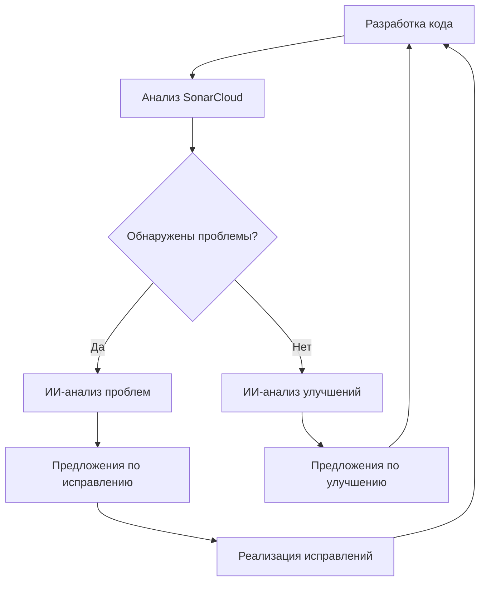

# Интеграция SonarCloud и ИИ

*[English](../../en/technical/sonarcloud-integration.md) | [中文](../../zh/technical/sonarcloud-integration.md) | [Français](../../fr/technical/sonarcloud-integration.md) | [Español](../../es/technical/sonarcloud-integration.md) | [العربية](../../ar/technical/sonarcloud-integration.md) | Русский*

Этот документ объясняет, как MCP Database Utilities использует SonarCloud для анализа кода и как искусственный интеллект интегрирован в этот процесс для улучшения качества кода.

## Введение в SonarCloud

[SonarCloud](https://sonarcloud.io/) — это онлайн-платформа анализа кода, которая помогает разработчикам обнаруживать ошибки, уязвимости и "запахи кода" в своем коде. Она поддерживает множество языков программирования, включая Python, и легко интегрируется с CI/CD-рабочими процессами.

## Настройка SonarCloud для MCP Database Utilities

### Интеграция с GitHub

MCP Database Utilities использует SonarCloud через интеграцию с GitHub:

1. Проект настроен на SonarCloud с организацией `donghao1393`
2. Анализ автоматически запускается с каждым пушем или пул-реквестом
3. Результаты отображаются на дашборде SonarCloud и в пул-реквестах на GitHub

### Конфигурация проекта

Конфигурация SonarCloud определена в файле `sonar-project.properties`:

```properties
# Идентификатор проекта и организации
sonar.projectKey=donghao1393_mcp-dbutils
sonar.organization=donghao1393

# Информация о проекте
sonar.projectName=MCP Database Utilities
sonar.projectVersion=1.0

# Путь к исходникам
sonar.sources=mcp_dbutils
sonar.python.coverage.reportPaths=coverage.xml
sonar.python.xunit.reportPath=test-results.xml

# Исключения
sonar.exclusions=tests/**/*,docs/**/*,examples/**/*

# Кодировка исходников
sonar.sourceEncoding=UTF-8
```

### Рабочий процесс GitHub Actions

Анализ SonarCloud выполняется через GitHub Actions:

```yaml
# .github/workflows/sonarcloud.yml
name: SonarCloud Analysis

on:
  push:
    branches: [ main ]
  pull_request:
    branches: [ main ]

jobs:
  sonarcloud:
    name: SonarCloud
    runs-on: ubuntu-latest
    steps:
      - uses: actions/checkout@v3
        with:
          fetch-depth: 0  # Неглубокое клонирование должно быть отключено для лучшей релевантности
      
      - name: Set up Python
        uses: actions/setup-python@v4
        with:
          python-version: '3.10'
      
      - name: Install dependencies
        run: |
          python -m pip install --upgrade pip
          pip install -e ".[dev,test]"
      
      - name: Run tests with coverage
        run: |
          pytest --cov=mcp_dbutils --cov-report=xml --junitxml=test-results.xml
      
      - name: SonarCloud Scan
        uses: SonarSource/sonarcloud-github-action@master
        env:
          GITHUB_TOKEN: ${{ secrets.GITHUB_TOKEN }}
          SONAR_TOKEN: ${{ secrets.SONAR_TOKEN }}
```

## Отслеживаемые метрики

SonarCloud отслеживает несколько ключевых метрик для MCP Database Utilities:

### 1. Качество кода

- **Ошибки**: Проблемы в коде, которые могут вызвать неправильное поведение
- **Уязвимости**: Потенциальные слабые места в безопасности
- **Запахи кода**: Проблемы с сопровождаемостью, которые делают код трудным для понимания или изменения
- **Технический долг**: Оценка времени, необходимого для исправления всех запахов кода

### 2. Покрытие тестами

- **Покрытие строк**: Процент строк кода, выполненных тестами
- **Покрытие ветвей**: Процент ветвей кода (if/else и т.д.), выполненных тестами
- **Покрытие условий**: Процент логических условий, протестированных тестами

### 3. Дублирование

- **Дублированные строки**: Процент дублированного кода в проекте
- **Дублированные блоки**: Количество дублированных блоков кода

### 4. Сложность

- **Цикломатическая сложность**: Мера сложности кода на основе количества путей выполнения
- **Когнитивная сложность**: Мера трудности понимания кода

## Интеграция ИИ в анализ кода

MCP Database Utilities использует ИИ для улучшения анализа кода несколькими способами:

### 1. Автоматический анализ пул-реквестов

Когда создается пул-реквест, ИИ-бот анализирует результаты SonarCloud и предоставляет комментарии:

```python
def analyze_sonarcloud_results(pr_number):
    """Анализ результатов SonarCloud для пул-реквеста и добавление комментариев."""
    # Получение результатов SonarCloud
    results = get_sonarcloud_results(pr_number)
    
    # Анализ результатов с использованием ИИ
    analysis = ai_analyze_results(results)
    
    # Добавление комментариев к пул-реквесту
    add_pr_comments(pr_number, analysis)
```

ИИ-бот может:
- Объяснять обнаруженные проблемы на естественном языке
- Предлагать исправления для распространенных проблем
- Выявлять повторяющиеся паттерны в проблемах
- Приоритизировать проблемы по их влиянию

### 2. Предложения по рефакторингу

ИИ может предлагать рефакторинг для улучшения качества кода:

```python
def suggest_refactoring(file_path, code_smells):
    """Предложение рефакторинга для решения запахов кода."""
    # Чтение файла
    with open(file_path, 'r') as f:
        code = f.read()
    
    # Генерация предложений по рефакторингу с использованием ИИ
    suggestions = ai_generate_refactoring_suggestions(code, code_smells)
    
    return suggestions
```

Примеры предложений:
- Извлечение методов для уменьшения сложности
- Переименование переменных для улучшения читаемости
- Рефакторинг кода для устранения дублирования
- Применение соответствующих паттернов проектирования

### 3. Анализ трендов

ИИ анализирует тренды качества кода со временем:

```python
def analyze_quality_trends():
    """Анализ трендов качества кода со временем."""
    # Получение истории метрик
    metrics_history = get_metrics_history()
    
    # Анализ трендов с использованием ИИ
    trends_analysis = ai_analyze_trends(metrics_history)
    
    return trends_analysis
```

Этот анализ может:
- Выявлять положительные или отрицательные тренды
- Связывать изменения качества с событиями проекта
- Прогнозировать потенциальные будущие проблемы
- Рекомендовать области для улучшения

### 4. Генерация тестов

ИИ может генерировать тесты для улучшения покрытия:

```python
def generate_tests(file_path, coverage_gaps):
    """Генерация тестов для заполнения пробелов в покрытии."""
    # Чтение файла
    with open(file_path, 'r') as f:
        code = f.read()
    
    # Генерация тестов с использованием ИИ
    tests = ai_generate_tests(code, coverage_gaps)
    
    return tests
```

Сгенерированные тесты:
- Целенаправленно нацелены на непокрытые части кода
- Следуют соглашениям о тестировании проекта
- Включают релевантные утверждения
- Сопровождаются документацией

## Рабочий процесс непрерывного улучшения

Интеграция SonarCloud и ИИ вписывается в рабочий процесс непрерывного улучшения:



1. **Разработка кода**: Разработчики пишут или модифицируют код
2. **Анализ SonarCloud**: Код автоматически анализируется SonarCloud
3. **Обнаружение проблем**: SonarCloud выявляет потенциальные проблемы
4. **ИИ-анализ**: ИИ анализирует проблемы или ищет улучшения
5. **Предложения**: ИИ предоставляет конкретные предложения
6. **Реализация**: Разработчики реализуют исправления или улучшения
7. **Непрерывный цикл**: Процесс повторяется для непрерывного улучшения

## Конкретные примеры

### Пример 1: Исправление обнаруженной ошибки

**Проблема, обнаруженная SonarCloud**:
```
Bug: "TypeError" will be raised when calling "execute_query" with None as "query" parameter.
```

**ИИ-анализ**:
```
Эта ошибка возникает, потому что метод execute_query() не имеет проверки параметра query.
Если передается None, будет вызван TypeError при вызове query.strip().
```

**Предложение по исправлению**:
```python
# До
def execute_query(self, query):
    """Выполнение SQL-запроса."""
    query = query.strip()
    # ...

# После
def execute_query(self, query):
    """Выполнение SQL-запроса."""
    if query is None:
        raise ValueError("Запрос не может быть None")
    query = query.strip()
    # ...
```

### Пример 2: Уменьшение сложности

**Проблема, обнаруженная SonarCloud**:
```
Code Smell: Cognitive Complexity of function "parse_config" is 25 which is greater than 15 authorized.
```

**ИИ-анализ**:
```
Функция parse_config() слишком сложная с множеством вложенных условий.
Её можно упростить, извлекая вспомогательные функции для каждого типа конфигурации.
```

**Предложение по рефакторингу**:
```python
# До
def parse_config(config_dict):
    """Парсинг словаря конфигурации."""
    result = {}
    if "connections" in config_dict:
        connections = {}
        for name, conn_config in config_dict["connections"].items():
            if "type" not in conn_config:
                raise ValueError(f"Тип соединения отсутствует для {name}")
            
            conn_type = conn_config["type"]
            if conn_type == "sqlite":
                # Логика, специфичная для SQLite
                if "path" not in conn_config:
                    raise ValueError(f"Путь к базе данных отсутствует для {name}")
                # ...
            elif conn_type == "postgres":
                # Логика, специфичная для PostgreSQL
                # ...
            elif conn_type == "mysql":
                # Логика, специфичная для MySQL
                # ...
            else:
                raise ValueError(f"Неизвестный тип соединения: {conn_type}")
            
            connections[name] = conn_config
        result["connections"] = connections
    # ...
    return result

# После
def parse_sqlite_config(name, conn_config):
    """Парсинг конфигурации SQLite."""
    if "path" not in conn_config:
        raise ValueError(f"Путь к базе данных отсутствует для {name}")
    # ...
    return conn_config

def parse_postgres_config(name, conn_config):
    """Парсинг конфигурации PostgreSQL."""
    # ...
    return conn_config

def parse_mysql_config(name, conn_config):
    """Парсинг конфигурации MySQL."""
    # ...
    return conn_config

def parse_config(config_dict):
    """Парсинг словаря конфигурации."""
    result = {}
    if "connections" in config_dict:
        connections = {}
        for name, conn_config in config_dict["connections"].items():
            if "type" not in conn_config:
                raise ValueError(f"Тип соединения отсутствует для {name}")
            
            conn_type = conn_config["type"]
            if conn_type == "sqlite":
                connections[name] = parse_sqlite_config(name, conn_config)
            elif conn_type == "postgres":
                connections[name] = parse_postgres_config(name, conn_config)
            elif conn_type == "mysql":
                connections[name] = parse_mysql_config(name, conn_config)
            else:
                raise ValueError(f"Неизвестный тип соединения: {conn_type}")
        
        result["connections"] = connections
    # ...
    return result
```

### Пример 3: Улучшение покрытия тестами

**Проблема, обнаруженная SonarCloud**:
```
Coverage: Line coverage of file "mcp_dbutils/adapters/mysql.py" is 68.5% which is less than 80% required.
```

**ИИ-анализ**:
```
Файл mysql.py не имеет достаточного покрытия тестами, особенно для случаев ошибок и продвинутых функций.
Методы execute_query() и get_table_stats() имеют особенно низкое покрытие.
```

**Тесты, сгенерированные ИИ**:
```python
def test_mysql_adapter_execute_query_error():
    """Тест, что MySQL-адаптер правильно обрабатывает ошибки запросов."""
    # Настройка моков
    mock_connection = MagicMock()
    mock_cursor = MagicMock()
    mock_connection.cursor.return_value = mock_cursor
    mock_cursor.execute.side_effect = pymysql.Error("Тестовая ошибка")
    
    # Настройка адаптера с моками
    adapter = MySQLAdapter({"type": "mysql", "host": "localhost", "database": "test"})
    adapter._connection = mock_connection
    
    # Проверка, что ошибка правильно распространяется
    with pytest.raises(DatabaseError):
        adapter.execute_query("SELECT * FROM nonexistent_table")

def test_mysql_adapter_get_table_stats():
    """Тест метода get_table_stats для MySQL-адаптера."""
    # Настройка моков
    mock_connection = MagicMock()
    mock_cursor = MagicMock()
    mock_connection.cursor.return_value = mock_cursor
    
    # Настройка результатов для различных запросов
    mock_cursor.fetchall.side_effect = [
        [(1000,)],  # Количество строк
        [(1024 * 1024,)],  # Размер таблицы
        [("id", "int", "PRI"), ("name", "varchar(100)", "")],  # Структура
        [(10,), (5,)]  # Статистика столбцов
    ]
    
    # Настройка адаптера с моками
    adapter = MySQLAdapter({"type": "mysql", "host": "localhost", "database": "test"})
    adapter._connection = mock_connection
    
    # Выполнение метода
    stats = adapter.get_table_stats("test_table")
    
    # Проверка результатов
    assert stats["row_count"] == 1000
    assert stats["size_bytes"] == 1024 * 1024
    assert len(stats["columns"]) == 2
    assert stats["columns"][0]["name"] == "id"
    assert stats["columns"][0]["type"] == "int"
    assert stats["columns"][0]["key"] == "PRI"
```

## Бейджи SonarCloud

MCP Database Utilities отображает бейджи SonarCloud в своем README для показа текущего состояния качества кода:

```markdown
[](https://sonarcloud.io/dashboard?id=donghao1393_mcp-dbutils)
[](https://sonarcloud.io/dashboard?id=donghao1393_mcp-dbutils)
[](https://sonarcloud.io/dashboard?id=donghao1393_mcp-dbutils)
[](https://sonarcloud.io/dashboard?id=donghao1393_mcp-dbutils)
[](https://sonarcloud.io/dashboard?id=donghao1393_mcp-dbutils)
```

## Заключение

Интеграция SonarCloud и ИИ в процесс разработки MCP Database Utilities позволяет:

1. **Раннее обнаружение проблем**: Ошибки, уязвимости и запахи кода обнаруживаются до того, как они попадут в продакшен
2. **Непрерывное улучшение**: Код постоянно улучшается благодаря предложениям ИИ
3. **Уменьшение технического долга**: Проблемы систематически решаются, уменьшая технический долг
4. **Повышение качества**: Общее качество кода улучшается со временем
5. **Обучение разработчиков**: Разработчики учатся у ИИ и улучшают свои навыки

Этот подход обеспечивает, что MCP Database Utilities поддерживает высокий уровень качества, безопасности и сопровождаемости, что критически важно для инструмента, взаимодействующего с базами данных.
