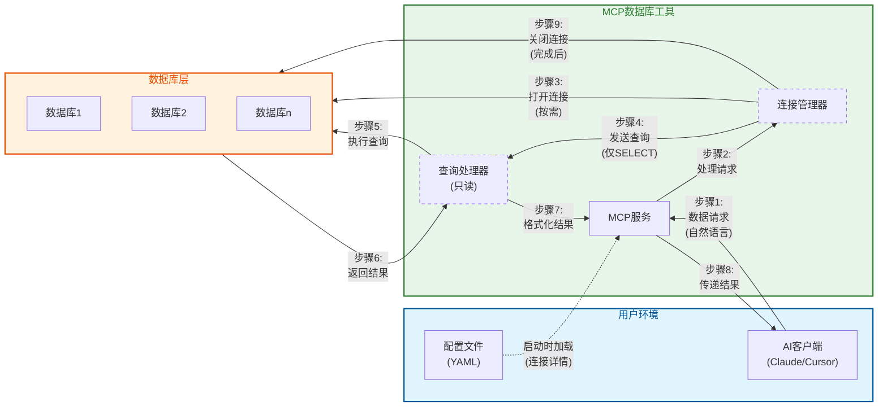

# MCP 数据库工具技术指南

## 通信模式与安全架构

MCP数据库工具服务实现了一套安全的通信模式，旨在每一步都保护您的数据安全。下图展示了数据在各组件之间的流动方式，同时保持安全性：



### 核心安全特性

1. **隔离访问流程**:
   - 您的AI客户端永远不会直接访问您的数据库
   - 所有请求都通过受控的MCP服务环境传递

2. **临时连接**:
   - 仅在需要时才建立数据库连接
   - 查询执行后立即关闭连接
   - 没有可被利用的持久连接

3. **只读操作**:
   - 查询处理器强制执行严格的仅SELECT操作
   - 不可能修改数据（无INSERT、UPDATE、DELETE）

4. **配置分离**:
   - 连接详情隔离在单独的配置文件中
   - 凭据永远不会暴露给AI模型

5. **多数据库支持**:
   - 每个数据库连接单独管理
   - 数据库通过连接管理器相互隔离

这种架构确保即使您将该工具用于多个数据库或用途，每个连接仍然保持安全和隔离，最大限度地减少数据暴露。

## 架构设计

### 核心概念：抽象层设计

```mermaid
graph TD
  Client[客户端] --> DatabaseServer[数据库服务器]
  subgraph MCP 服务器
    DatabaseServer
    DatabaseHandler[数据库处理器]
    PostgresHandler[PostgreSQL处理器]
    SQLiteHandler[SQLite处理器]
    MySQLHandler[MySQL处理器]
    DatabaseServer --> DatabaseHandler
    DatabaseHandler --> PostgresHandler
    DatabaseHandler --> SQLiteHandler
    DatabaseHandler --> MySQLHandler
  end
  PostgresHandler --> PostgreSQL[(PostgreSQL)]
  SQLiteHandler --> SQLite[(SQLite)]
  MySQLHandler --> MySQL[(MySQL)]
```



抽象层设计是MCP数据库工具的核心架构概念。就像通用遥控器可以控制不同设备一样，用户只需要了解基本操作，而无需理解底层复杂性。

#### 1. 简化用户交互
- 用户只需知道数据库配置名称（例如"my_postgres"）
- 无需处理连接参数和实现细节
- MCP服务器自动处理数据库连接和查询

#### 2. 统一接口设计
- DatabaseHandler抽象类定义了统一的操作接口
- 所有特定数据库实现（PostgreSQL/SQLite/MySQL）遵循相同的接口
- 用户以相同的方式与不同数据库交互

#### 3. 配置和实现分离
- 复杂的数据库配置参数封装在配置文件中
- 运行时通过简单的数据库名称访问
- 可以轻松管理和修改数据库配置，而不影响业务代码

### 系统组件
1. DatabaseServer
   - MCP服务器的核心组件
   - 处理资源和工具请求
   - 管理数据库连接生命周期

2. DatabaseHandler
   - 定义统一接口的抽象基类
   - 包括get_tables()、get_schema()、execute_query()等方法
   - 由PostgreSQL、SQLite和MySQL处理器实现

3. 配置系统
   - 基于YAML的配置文件
   - 支持多个数据库配置
   - 类型安全的配置验证

4. 错误处理和日志记录
   - 统一的错误处理机制
   - 详细的日志输出
   - 敏感信息掩码处理

## API文档

### DatabaseServer
核心服务器类，提供：
- 资源列表检索
- 工具调用处理（list_tables、query等）
- 数据库处理器管理

### MCP工具

#### dbutils-list-tables
列出指定数据库中的所有表。
- 参数：
  * connection: 数据库连接名称
- 返回：包含表名列表的文本内容

#### dbutils-run-query
在指定数据库上执行SQL查询。
- 参数：
  * connection: 数据库连接名称
  * sql: 要执行的SQL查询（仅SELECT）
- 返回：格式化文本形式的查询结果

#### dbutils-get-stats
获取表统计信息。
- 参数：
  * connection: 数据库连接名称
  * table: 表名
- 返回：包括行数、大小、列统计信息等

#### dbutils-list-constraints
列出表约束（主键、外键等）。
- 参数：
  * connection: 数据库连接名称
  * table: 表名
- 返回：详细的约束信息

#### dbutils-explain-query
获取查询执行计划和成本估算。
- 参数：
  * connection: 数据库连接名称
  * sql: 要解释的SQL查询
- 返回：格式化的执行计划

#### dbutils-get-performance
获取数据库性能统计信息。
- 参数：
  * connection: 数据库连接名称
- 返回：详细的性能统计信息，包括查询时间、查询类型、错误率和资源使用情况

#### dbutils-analyze-query
分析SQL查询的性能并提供优化建议。
- 参数：
  * connection: 数据库连接名称
  * sql: 要分析的SQL查询
- 返回：包含执行计划、时间信息和优化建议的查询分析

### DatabaseHandler
定义接口的抽象基类：
- get_tables()：获取表资源列表
- get_schema()：获取表结构
- execute_query()：执行SQL查询
- cleanup()：资源清理

### PostgreSQL实现
提供PostgreSQL特定功能：
- 远程连接支持
- 表描述信息
- 约束查询

### SQLite实现
提供SQLite特定功能：
- 文件路径处理
- URI方案支持
- 密码保护支持（可选）

### MySQL实现
提供MySQL特定功能：
- 远程连接支持
- 字符集配置
- SSL/TLS安全连接
- URL和标准连接方法

## 代码质量

### 质量门禁
我们使用SonarCloud维护高代码质量标准。所有拉取请求必须通过以下质量门禁：

- 代码覆盖率：≥ 80%
- 代码质量：
  * 无阻断或严重问题
  * 主要问题少于10个
  * 代码重复率 < 3%
- 安全性：
  * 无安全漏洞
  * 无安全热点

### 自动化检查
我们的CI/CD流程自动执行：
1. 完整测试套件执行
2. 代码覆盖率分析
3. SonarCloud静态代码分析
4. 质量门禁验证

不满足这些标准的拉取请求将自动被阻止合并。

### 代码风格
我们使用Ruff进行代码风格检查和格式化：

所有代码必须遵循我们的风格指南：
- 行长度：88个字符
- 缩进：4个空格
- 引号：双引号
- 命名：PEP8约定

有关详细指南，请参阅[STYLE_GUIDE.md](STYLE_GUIDE.md)。

### 本地开发
要在本地检查代码质量：
1. 运行带覆盖率的测试：
   ```bash
   pytest --cov=src/mcp_dbutils --cov-report=xml:coverage.xml tests/
   ```
2. 在IDE中使用SonarLint及早发现问题
3. 在PR评论中查看SonarCloud分析结果
4. 运行Ruff进行代码风格检查：
   ```bash
   # 安装Ruff
   uv pip install ruff
   
   # 检查代码风格
   ruff check .
   
   # 格式化代码
   ruff format .
   ```
5. 使用pre-commit钩子进行自动检查：
   ```bash
   # 安装pre-commit
   uv pip install pre-commit
   pre-commit install
   ```

## 配置系统详解

### 数据库配置选项

数据库SSL配置选项：

PostgreSQL SSL配置：
1. 使用URL参数：
   ```
   postgresql://host:port/dbname?sslmode=verify-full&sslcert=/path/to/cert.pem
   ```
2. 使用专用SSL配置部分：
   ```yaml
   ssl:
     mode: verify-full  # SSL验证模式
     cert: /path/to/cert.pem      # 客户端证书
     key: /path/to/key.pem        # 客户端私钥
     root: /path/to/root.crt      # CA证书
   ```

PostgreSQL SSL模式：
- disable: 不使用SSL
- require: 使用SSL但不验证证书
- verify-ca: 验证服务器证书由受信任的CA签名
- verify-full: 验证服务器证书和主机名匹配

MySQL SSL配置：
1. 使用URL参数：
   ```
   mysql://host:port/dbname?ssl-mode=verify_identity&ssl-ca=/path/to/ca.pem
   ```
2. 使用专用SSL配置部分：
   ```yaml
   ssl:
     mode: verify_identity  # SSL验证模式
     ca: /path/to/ca.pem         # CA证书
     cert: /path/to/cert.pem     # 客户端证书
     key: /path/to/key.pem       # 客户端私钥
   ```

MySQL SSL模式：
- disabled: 不使用SSL
- preferred: 如果可用则使用SSL，但允许非加密连接
- required: 始终使用SSL，但不验证服务器证书
- verify_ca: 验证服务器证书由受信任的CA签名
- verify_identity: 验证服务器证书和主机名匹配

SQLite配置选项：
1. 基本配置与路径：
   ```yaml
   type: sqlite
   path: /path/to/db.sqlite
   password: optional_password  # 可选加密
   ```
2. 使用URI参数：
   ```yaml
   type: sqlite
   path: /path/to/db.sqlite?mode=ro&cache=shared
   ```

## 安全注意事项
- 仅支持SELECT查询以保护数据库安全
- 自动掩盖日志中的敏感信息（如密码）
- 在只读事务中执行查询

## 故障排除指南

在使用MCP数据库工具时，您可能会遇到以下常见问题。以下是排查和解决这些问题的指南。

### 连接问题

1. **无法连接到数据库**
   - 确认您的配置文件中的连接信息是否正确
   - 验证您的数据库服务器是否运行并可访问
   - 检查网络防火墙是否允许连接
   - 对于远程数据库，确认主机名/IP地址和端口是否正确

2. **配置文件错误**
   - 检查YAML语法是否正确（缩进、冒号等）
   - 确认所有必需的字段都已提供
   - 验证文件路径是否正确（特别是SQLite数据库文件）

3. **权限问题**
   - 确保提供的数据库用户具有SELECT权限
   - 检查用户是否可以访问所需的表和视图
   - 对于SQLite，验证文件系统权限是允许读取的

### 工具和查询问题

1. **查询执行失败**
   - 检查SQL语法错误
   - 确认表名和列名拼写正确
   - 验证您的查询仅包含SELECT操作
   - 对于复杂查询，尝试拆分成更简单的部分

2. **性能问题**
   - 避免没有WHERE条件的大表查询
   - 使用LIMIT子句限制结果集大小
   - 对于复杂的JOIN操作，考虑简化查询
   - 使用dbutils-explain-query工具分析查询性能

3. **MCP客户端集成问题**
   - 确认MCP配置正确（命令和参数）
   - 检查路径是绝对路径而非相对路径
   - 验证uvx或docker能在命令行直接运行

### 日志和诊断

对于高级故障排除，您可以启用详细日志记录：

#### 命令行启用调试

```bash
# 启用详细日志
MCP_DEBUG=1 uvx mcp-dbutils --config your_config.yaml
```

#### MCP客户端配置中启用调试

在MCP配置中添加环境变量：

**JSON配置示例**：
```json
{
  "dbutils": {
    "command": "uvx",
    "args": [
      "mcp-dbutils",
      "--config",
      "/path/to/your/config.yaml"
    ],
    "env": {
      "MCP_DEBUG": "1"
    }
  }
}
```

**Cursor MCP配置**：
在Cursor设置 → MCP → 编辑服务器配置中添加环境变量。

#### 查看日志

MCP客户端会处理服务生成的日志。不同的MCP客户端可能在不同位置存储日志：

- 对于Claude Desktop：请查看Claude Desktop的应用日志
- 对于Cursor：请查看Cursor的MCP日志部分
- 对于其他客户端：请参考各自客户端的文档了解如何访问MCP服务日志

如果您在使用过程中遇到问题，以下资源可能会有所帮助：

1. **项目文档**：首先查看最新的[项目文档](https://github.com/donghao1393/mcp-dbutils)以获取使用指南和已知问题

2. **GitHub Issues**：搜索或[提交新issue](https://github.com/donghao1393/mcp-dbutils/issues)报告错误或请求帮助

3. **GitHub Discussions**：参与[讨论区](https://github.com/donghao1393/mcp-dbutils/discussions)获取社区支持或分享使用经验

## 版本更新

MCP数据库工具会定期发布更新，包含新功能、性能改进和错误修复。大多数情况下，更新过程由MCP客户端自动管理，您无需手动干预。

### 获取最新版本

- **使用MCP客户端**：大多数MCP客户端（如Claude Desktop、Cursor等）会自动更新到最新版本

- **手动检查更新**：
  - 访问[GitHub仓库](https://github.com/donghao1393/mcp-dbutils)查看最新版本
  - 阅读[发布说明](https://github.com/donghao1393/mcp-dbutils/releases)了解新功能和变更

- **问题报告**：
  - 如果您在更新后遇到问题，请[提交issue](https://github.com/donghao1393/mcp-dbutils/issues)