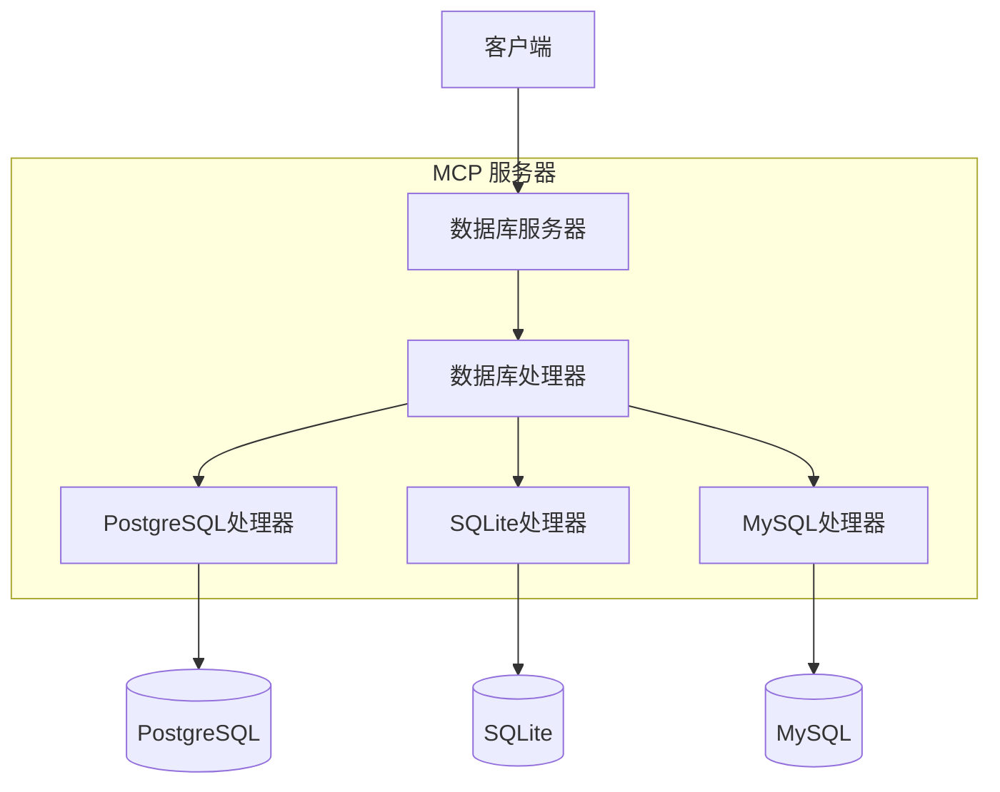

# 架构

*[English](../../en/technical/architecture.md) | 中文 | [Français](../../fr/technical/architecture.md) | [Español](../../es/technical/architecture.md) | [العربية](../../ar/technical/architecture.md) | [Русский](../../ru/technical/architecture.md)*

本文档描述了 MCP 数据库工具的技术架构，解释了各个组件如何交互以为 AI 助手提供安全的数据库访问。

## 架构概述

MCP 数据库工具采用模块化架构设计，优先考虑安全性、隔离性和灵活性。系统由几个不同的层组成，它们共同工作以提供对数据库的安全只读访问。

## 核心概念：抽象层设计

抽象层设计是MCP数据库工具的核心架构概念。就像通用遥控器可以控制不同设备一样，用户只需要了解基本操作，而无需理解底层复杂性。

### 1. 简化用户交互
- 用户只需知道数据库配置名称（例如"my_postgres"）
- 无需处理连接参数和实现细节
- MCP服务器自动处理数据库连接和查询

### 2. 统一接口设计
- DatabaseHandler抽象类定义了统一的操作接口
- 所有特定数据库实现（PostgreSQL/SQLite/MySQL）遵循相同的接口
- 用户以相同的方式与不同数据库交互

### 3. 配置和实现分离
- 复杂的数据库配置参数封装在配置文件中
- 运行时通过简单的数据库名称访问
- 可以轻松管理和修改数据库配置，而不影响业务代码

## 系统组件
1. DatabaseServer
   - MCP服务器的核心组件
   - 处理资源和工具请求
   - 管理数据库连接生命周期

2. DatabaseHandler
   - 定义统一接口的抽象基类
   - 包括get_tables()、get_schema()、execute_query()等方法
   - 由PostgreSQL、SQLite和MySQL处理器实现

3. 配置系统
   - 基于YAML的配置文件
   - 支持多个数据库配置
   - 类型安全的配置验证

4. 错误处理和日志记录
   - 统一的错误处理机制
   - 详细的日志输出
   - 敏感信息掩码处理

## API文档

### DatabaseServer
核心服务器类，提供：
- 资源列表检索
- 工具调用处理（list_tables、query等）
- 数据库处理器管理

### MCP工具

#### dbutils-list-tables
列出指定数据库中的所有表。
- 参数：
  * connection: 数据库连接名称
- 返回：包含表名列表的文本内容

#### dbutils-run-query
在指定数据库上执行SQL查询。
- 参数：
  * connection: 数据库连接名称
  * sql: 要执行的SQL查询（仅SELECT）
- 返回：格式化文本形式的查询结果

#### dbutils-get-stats
获取表统计信息。
- 参数：
  * connection: 数据库连接名称
  * table: 表名
- 返回：包括行数、大小、列统计信息等

#### dbutils-list-constraints
列出表约束（主键、外键等）。
- 参数：
  * connection: 数据库连接名称
  * table: 表名
- 返回：详细的约束信息

#### dbutils-explain-query
获取查询执行计划和成本估算。
- 参数：
  * connection: 数据库连接名称
  * sql: 要解释的SQL查询
- 返回：格式化的执行计划

#### dbutils-get-performance
获取数据库性能统计信息。
- 参数：
  * connection: 数据库连接名称
- 返回：详细的性能统计信息，包括查询时间、查询类型、错误率和资源使用情况

#### dbutils-analyze-query
分析SQL查询的性能并提供优化建议。
- 参数：
  * connection: 数据库连接名称
  * sql: 要分析的SQL查询
- 返回：包含执行计划、时间信息和优化建议的查询分析

### DatabaseHandler
定义接口的抽象基类：
- get_tables()：获取表资源列表
- get_schema()：获取表结构
- execute_query()：执行SQL查询
- cleanup()：资源清理

### PostgreSQL实现
提供PostgreSQL特定功能：
- 远程连接支持
- 表描述信息
- 约束查询

### SQLite实现
提供SQLite特定功能：
- 文件路径处理
- URI方案支持
- 密码保护支持（可选）

### MySQL实现
提供MySQL特定功能：
- 远程连接支持
- 字符集配置
- SSL/TLS安全连接
- URL和标准连接方法

## 高级功能

### 数据处理器

数据处理器负责后处理数据库查询结果，提供易读格式，并支持多种输出选项：

- 表格格式数据
- 树状数据层次结构
- 特殊资源类型处理（二进制数据、图像等）

### 工具定义

MCP工具定义在`src/mcp_dbutils/tools.py`文件中，包括：

- `list_resources`：列出数据库资源
- `read_resource`：读取单个表或视图内容
- `call_tool`：执行自定义SQL查询
- `get_schema`：获取表或视图结构
- `get_info`：获取资源详细信息