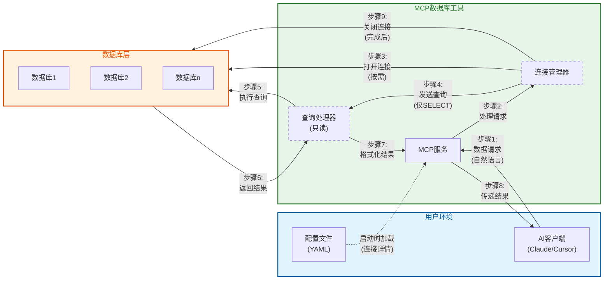

# 安全架构

*[English](../../en/technical/security.md) | 中文 | [Français](../../fr/technical/security.md) | [Español](../../es/technical/security.md) | [العربية](../../ar/technical/security.md) | [Русский](../../ru/technical/security.md)*

## 通信模式与安全架构

MCP数据库工具服务实现了一套安全的通信模式，旨在每一步都保护您的数据安全。下图展示了数据在各组件之间的流动方式，同时保持安全性：



## 核心安全特性

1. **隔离访问流程**:
   - 您的AI客户端永远不会直接访问您的数据库
   - 所有请求都通过受控的MCP服务环境传递

2. **临时连接**:
   - 仅在需要时才建立数据库连接
   - 查询执行后立即关闭连接
   - 没有可被利用的持久连接

3. **只读操作**:
   - 查询处理器强制执行严格的仅SELECT操作
   - 不可能修改数据（无INSERT、UPDATE、DELETE）

4. **配置分离**:
   - 连接详情隔离在单独的配置文件中
   - 凭据永远不会暴露给AI模型

5. **多数据库支持**:
   - 每个数据库连接单独管理
   - 数据库通过连接管理器相互隔离

6. **自动超时机制**:
   - 查询超时防止长时间运行的查询消耗资源
   - 连接超时确保数据库连接得到适当管理
   - 空闲超时自动关闭不活动的连接
   - 全局超时限制会话的总持续时间

这种架构确保即使您将该工具用于多个数据库或用途，每个连接仍然保持安全和隔离，最大限度地减少数据暴露。

## 故障排除指南

在使用MCP数据库工具时，您可能会遇到以下常见问题。以下是排查和解决这些问题的指南。

### 连接问题

1. **无法连接到数据库**
   - 确认您的配置文件中的连接信息是否正确
   - 验证您的数据库服务器是否运行并可访问
   - 检查网络防火墙是否允许连接
   - 对于远程数据库，确认主机名/IP地址和端口是否正确

2. **配置文件错误**
   - 检查YAML语法是否正确（缩进、冒号等）
   - 确认所有必需的字段都已提供
   - 验证文件路径是否正确（特别是SQLite数据库文件）

3. **权限问题**
   - 确保提供的数据库用户具有SELECT权限
   - 检查用户是否可以访问所需的表和视图
   - 对于SQLite，验证文件系统权限是允许读取的

### 工具和查询问题

1. **查询执行失败**
   - 检查SQL语法错误
   - 确认表名和列名拼写正确
   - 验证您的查询仅包含SELECT操作
   - 对于复杂查询，尝试拆分成更简单的部分

2. **性能问题**
   - 避免没有WHERE条件的大表查询
   - 使用LIMIT子句限制结果集大小
   - 对于复杂的JOIN操作，考虑简化查询
   - 使用dbutils-explain-query工具分析查询性能

3. **MCP客户端集成问题**
   - 确认MCP配置正确（命令和参数）
   - 检查路径是绝对路径而非相对路径
   - 验证uvx或docker能在命令行直接运行

4. **超时问题**
   - 运行时间过长的查询可能会被超时设置终止
   - 在连接设置中配置适当的超时值
   - 对于长时间运行的分析查询，请增加查询超时值

### 日志和诊断

对于高级故障排除，您可以启用详细日志记录：

#### 命令行启用调试

```bash
# 启用详细日志
MCP_DEBUG=1 uvx mcp-dbutils --config your_config.yaml
```

#### MCP客户端配置中启用调试

在MCP配置中添加环境变量：

**JSON配置示例**：
```json
{
  "dbutils": {
    "command": "uvx",
    "args": [
      "mcp-dbutils",
      "--config",
      "/path/to/your/config.yaml"
    ],
    "env": {
      "MCP_DEBUG": "1"
    }
  }
}
```

**Cursor MCP配置**：
在Cursor设置 → MCP → 编辑服务器配置中添加环境变量。

#### 查看日志

MCP客户端会处理服务生成的日志。不同的MCP客户端可能在不同位置存储日志：

- 对于Claude Desktop：请查看Claude Desktop的应用日志
- 对于Cursor：请查看Cursor的MCP日志部分
- 对于其他客户端：请参考各自客户端的文档了解如何访问MCP服务日志

### 安全最佳实践

为确保使用MCP数据库工具时的最高安全级别：

1. **使用只读账户**：
   ```sql
   -- PostgreSQL示例
   CREATE ROLE readonly_user WITH LOGIN PASSWORD 'secure_password';
   GRANT CONNECT ON DATABASE analytics TO readonly_user;
   GRANT USAGE ON SCHEMA public TO readonly_user;
   GRANT SELECT ON ALL TABLES IN SCHEMA public TO readonly_user;
   ```

2. **启用SSL/TLS**：
   ```yaml
   connections:
     secure-db:
       # ...
       ssl:
         mode: verify-full
         # ...
   ```

3. **限制表访问**：
   ```yaml
   connections:
     limited-access:
       # ...
       allowed_tables:
         - public.products
         - public.categories
         - analytics.sales
   ```

4. **配置适当的超时**：

   MCP数据库工具提供了三种可配置的超时参数，以确保数据库连接的安全性和资源的有效利用：

   **查询超时 (query_timeout)**：
   - **作用**：限制单个SQL查询执行的最大时间。如果查询执行时间超过此值，查询将被自动终止。
   - **单位**：秒
   - **默认值**：60秒
   - **适用场景**：防止复杂查询或大表查询消耗过多资源
   - **配置建议**：
     - 常规查询：30-60秒
     - 数据分析查询：300-600秒
     - 报表生成：最高1800秒

   **连接超时 (connection_timeout)**：
   - **作用**：限制建立数据库连接的最大等待时间。如果在此时间内无法建立连接，将返回连接错误。
   - **单位**：秒
   - **默认值**：10秒
   - **适用场景**：网络不稳定或数据库负载高的环境
   - **配置建议**：
     - 本地数据库：5-10秒
     - 远程数据库：15-30秒
     - 高负载环境：最高60秒

   **空闲超时 (idle_timeout)**：
   - **作用**：定义连接在空闲多长时间后自动关闭。这有助于释放未使用的连接资源。
   - **单位**：秒
   - **默认值**：300秒（5分钟）
   - **适用场景**：管理连接池中的空闲连接
   - **配置建议**：
     - 高频使用：600-1200秒
     - 一般使用：300-600秒
     - 低频使用：60-180秒

   **参数关系**：
   - 通常 idle_timeout > query_timeout > connection_timeout
   - 如果您的查询需要长时间运行，请确保 query_timeout 足够长
   - 如果 idle_timeout 太短，可能会导致频繁的连接创建和销毁，影响性能

   **配置示例**：
   ```yaml
   connections:
     analytics-db:
       type: postgres
       host: analytics.example.com
       port: 5432
       dbname: analytics
       user: analyst
       password: secure_password
       # 超时配置（所有值均为秒）
       query_timeout: 300     # 允许长时间运行的分析查询
       connection_timeout: 15  # 远程数据库连接等待时间
       idle_timeout: 600      # 保持连接活跃以便频繁查询
   ```

   **注意事项**：
   - 设置过短的超时可能导致合法查询被中断
   - 设置过长的超时可能导致资源浪费和潜在的安全风险
   - 根据您的具体使用场景和数据库性能调整这些值

### 获取帮助

如果您在使用过程中遇到问题，以下资源可能会有所帮助：

1. **项目文档**：首先查看最新的[项目文档](https://github.com/donghao1393/mcp-dbutils)以获取使用指南和已知问题

2. **GitHub Issues**：搜索或[提交新issue](https://github.com/donghao1393/mcp-dbutils/issues)报告错误或请求帮助

3. **GitHub Discussions**：参与[讨论区](https://github.com/donghao1393/mcp-dbutils/discussions)获取社区支持或分享使用经验