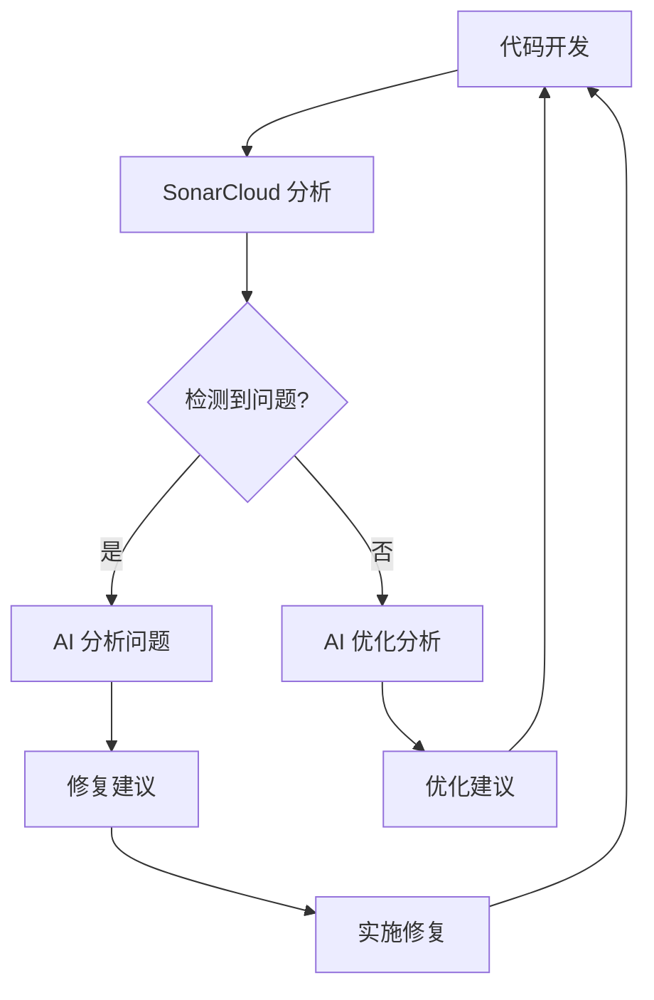

# SonarCloud AI 集成指南

*[English](../../en/technical/sonarcloud-integration.md) | 中文 | [Français](../../fr/technical/sonarcloud-integration.md) | [Español](../../es/technical/sonarcloud-integration.md) | [العربية](../../ar/technical/sonarcloud-integration.md) | [Русский](../../ru/technical/sonarcloud-integration.md)*

本文档介绍如何使用 SonarCloud 分析结果与 AI 集成，以便自动获取代码质量问题并使用 AI 辅助修复。

## 功能概述

该集成方案通过以下步骤工作：



1. GitHub Actions 工作流在 CI/CD 过程中运行 SonarCloud 分析
2. 分析完成后，工作流提取 SonarCloud 问题并生成两种格式的报告：
   - JSON 格式：包含完整的原始数据，适合 AI 深入分析
   - Markdown 格式：格式化的人类可读报告，包含问题摘要和详细信息
3. 这两个报告作为工作流构件（artifacts）上传
4. 使用提供的 Fish 函数，可以轻松下载这些报告并提供给 AI 进行分析和修复建议

## 使用方法

### 1. 设置 Fish 函数

将 `sonar-ai-fix` 函数添加到您的 Fish 配置中：

```fish
# 在 ~/.config/fish/config.fish 中添加
source /path/to/mcp-dbutils/scripts/sonar-ai-fix.fish
```

或者，您可以直接运行脚本来临时加载函数：

```bash
source scripts/sonar-ai-fix.fish
```

### 2. 下载 SonarCloud 分析报告

在项目根目录中运行：

```bash
sonar-ai-fix
```

这将下载最新的 SonarCloud 分析报告，并将其保存为两个文件：
- `sonar_report.md`：Markdown 格式的报告
- `sonar_issues.json`：JSON 格式的原始数据

### 3. 使用 AI 分析和修复问题

有两种方式使用这些报告：

#### 方式一：使用 Markdown 报告（推荐）

1. 打开 `sonar_report.md` 文件：
   ```bash
   bat sonar_report.md
   ```

2. 将内容复制给 AI（如 Claude），并请求修复建议：
   ```
   这是我项目的 SonarCloud 分析报告，请帮我分析这些问题并提供修复建议。

   [粘贴 sonar_report.md 内容]
   ```

#### 方式二：使用 JSON 数据进行深入分析

对于需要更深入分析的情况，可以使用 JSON 数据：

1. 打开 JSON 文件：
   ```bash
   bat sonar_issues.json
   ```

2. 将内容提供给 AI 进行更详细的分析：
   ```
   这是我项目的 SonarCloud 原始分析数据，请帮我深入分析这些问题并提供修复建议。

   [粘贴 sonar_issues.json 内容]
   ```

## 工作原理

### GitHub Actions 工作流

在 `.github/workflows/quality-assurance.yml` 中，我们添加了两个关键步骤：

1. **提取 SonarCloud 问题**：
   - 使用 SonarCloud API 获取未解决的问题
   - 将问题格式化为 JSON 和 Markdown 格式

2. **上传报告构件**：
   - 将生成的报告作为工作流构件上传
   - 使构件可以通过 GitHub CLI 下载

### Fish 函数

`sonar-ai-fix.fish` 脚本提供了一个方便的函数，用于：

- 检查当前目录是否是项目目录
- 获取最新的工作流运行 ID
- 下载 SonarCloud 问题报告构件
- 将报告保存到当前目录
- 提供使用说明

## 注意事项

- 确保您已安装并配置 GitHub CLI (`gh`)
- 确保您有足够的权限访问 GitHub 仓库和工作流
- 报告中的问题链接指向 SonarCloud 网站，需要有权限访问项目
- 此功能最适合与本地 AI 工具（如 Claude Desktop）配合使用
